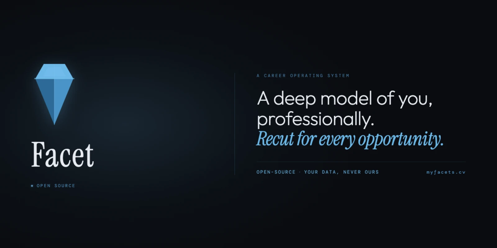

<p align="center">
  <picture>
    <source media="(prefers-color-scheme: dark)" srcset="brand/exports/readme/facet-readme-dark.webp" />
    <source media="(prefers-color-scheme: light)" srcset="brand/exports/readme/facet-readme-light.webp" />
    
  </picture>
</p>

<p align="center">
  <strong>A deep model of you, professionally.</strong><br />
  <em>Recut for every opportunity.</em>
</p>

<p align="center">
  <a href="https://github.com/NickCrew/Facet/actions"></a>
  <a href="LICENSE"></a>
  <a href="#"></a>
  <a href="#"></a>
  <a href="#"></a>
  <a href="CONTRIBUTING.md"></a>
</p>

---

## What is Facet?

Facet is a career operating system for senior engineers. You build a deep model of who you are professionally — captured as a six-item substrate of problems, solutions, metrics, technologies, background, and narrative — then *recut* that model for every opportunity. Resume, cover letter, LinkedIn presentation, recruiter card, interview prep: each is a face of the same model.

Same diamond, different face.

The methodology is **correction over creation**. Most AI tools start with a blank page and ask you to fill it. That works for tasks where the AI knows more than you about the topic. It works terribly when the topic is *you*. Facet's job is to extract what you already know, structure it, and let you correct what comes out wrong. Each pass surfaces what was already there. Each interview makes the model sharper.

Read the long-form positioning argument in [`brand/MANIFESTO.md`](brand/MANIFESTO.md).

## The model

The substrate is the part most career-search tools skip. They jump straight to generating an artifact, because generating an artifact demos well. Facet doesn't:

- **Identity is a model, not a document.** Roles, projects, skills, theses, philosophy — structured so the system can query and recompose, not just lay out.
- **Recutting is precise.** A vector (positioning angle like *Backend Engineering*, *Security Platform*, *Distributed Systems Lead*) selects which parts of the model surface for which opportunity. Page budget, priority tiers, and per-vector text variants do the trimming.
- **Each face flows from the model.** Resume today, recruiter card next week, cover letter the week after — same substrate, different presentation. No more rewriting yourself for every job.

## The cycle

```
   ┌─────────────────────────────────────────────────────────┐
   │                                                         │
   │   01 BUILD  →  02 SEARCH  →  03 INTERVIEW               │
   │                                                         │
   │   ↺ Debrief sharpens the model                          │
   │                                                         │
   └─────────────────────────────────────────────────────────┘
```

- **Build** — extract identity, refine in iterative passes, name the substrate
- **Search** — match against opportunities, recut for each, apply deliberately (not in bulk)
- **Interview** — prep against likely questions, run Live mode (open notebook, not a teleprompter), debrief as evidence
- **↺** — every debrief feeds the model. Every cycle is a deeper version of you.

The methodology one-pager lives at [`brand/exports/method/facet-method-dark.webp`](brand/exports/method/facet-method-dark.webp) if you want the visual.

## Features

- **Vector-based recutting** — define positioning angles and get purpose-built resumes per target
- **Priority system** — four-tier priority (`must` > `strong` > `optional` > `exclude`) with per-vector overrides
- **Text variants** — write vector-specific phrasing for any bullet or target line, with automatic fallback to default text
- **Live PDF preview** — WYSIWYG preview rendered via Typst with bundled fonts and downloadable output
- **Page budget engine** — heuristic page estimation with intelligent trimming (trims lowest-priority bullets from oldest roles)
- **Drag-and-drop ordering** — reorder bullets within roles, persisted independently per vector
- **Saved variants** — snapshot your override state and switch between configurations per vector
- **Multiple renderers** — PDF (Typst), plain text, and Markdown (clipboard)
- **Theme presets** — multiple typographic themes with full control over fonts, spacing, colors, and layout
- **Import / Export** — Build supports YAML/JSON replace or merge; Identity, Pipeline, and Prep expose focused JSON exports
- **Self-hostable** — open-source under AGPL-3.0; the model you build belongs to you, not the platform

## Screenshot

<p align="center">
  
</p>

## Getting started

### Prerequisites

- [Node.js](https://nodejs.org/) 20.19.0 or later
- [`pnpm`](https://pnpm.io/) 10 or later (enabled via Corepack)
- [Just](https://github.com/casey/just) (**optional** command runner for convenience)

```bash
# enable pnpm via Corepack (bundled with modern Node)
corepack enable

# macOS
brew install just

# cargo
cargo install just
```

For other platforms, see [https://github.com/casey/just#installation](https://github.com/casey/just#installation).

### Installation

```bash
git clone https://github.com/NickCrew/Facet.git
cd Facet

# optional if you use nvm
nvm use || nvm install
corepack enable
pnpm install

# optional: install dev convenience tooling
just install
```

### Development

```bash
pnpm run dev          # start the Vite dev server
pnpm run dev:all      # start app + AI proxy together

# optional just recipes
just dev
just dev-all
```

Open [http://localhost:5173](http://localhost:5173) in your browser.

### Build

```bash
pnpm run build
pnpm run preview

# optional
just build
just preview
```

### Available recipes

Run `just --list` to see all recipes. Common ones:

```
just dev         # Start Vite dev server
just dev-all     # Start app and AI proxy together
just build       # TypeScript check + Vite production build
just typecheck   # TypeScript type-check only
just test        # Run all Vitest tests
just lint        # ESLint
just ci          # Full CI check: typecheck + lint + test
just clean       # Clean build artifacts
```

There are also `brand-*` recipes for re-rendering the brand asset library — see [`brand/BRAND.md`](brand/BRAND.md).

## Usage

1. **Define your vectors** — positioning angles like "Backend Engineering" or "Security Platform"
2. **Build your model** — add target lines, profile summaries, roles with bullets, skill groups, and projects
3. **Tag priorities** — for each component, set its priority (`must` / `strong` / `optional` / `exclude`) per vector
4. **Recut** — select a vector and the assembler builds the optimal resume for that angle
5. **Refine** — manual overrides, text variants, and drag-and-drop polish the cut
6. **Export** — download as PDF, copy as plain text or Markdown, or export your data as YAML / JSON

## Tech stack

| Layer | Technology |
|-------|-----------|
| Framework | React 19 |
| Language | TypeScript (strict mode) |
| Build | Vite 7 |
| State | Zustand + snapshot coordinator (local and hosted persistence) |
| PDF rendering | Typst (via typst.ts WASM) |
| Drag & drop | @dnd-kit |
| Icons | Lucide React |
| Testing | Vitest + Testing Library |
| Linting | ESLint 9 |

## Project structure

```
src/
├── engine/          # Core assembly pipeline
│   ├── assembler.ts     # Vector-aware resume assembly
│   ├── pageBudget.ts    # Page estimation and trimming
│   ├── serializer.ts    # YAML/JSON parsing and validation
│   └── importMerge.ts   # Additive data merging
├── stores/          # Zustand state management
├── components/      # React UI components
├── templates/       # Resume template definitions
├── renderers/       # PDF, text, and Markdown output
├── utils/           # Shared utilities
├── types.ts         # Domain type system
└── test/            # Vitest test suites
brand/               # Brand library (visuals, copy, manifesto, bios)
docs/                # Project documentation
```

## Contributing

Contributions are welcome. See [`CONTRIBUTING.md`](CONTRIBUTING.md) for development setup, code style, the PR process, and the AGPL contribution stance.

```bash
just ci   # typecheck + lint + test in one shot
```

By participating in this project, you agree to abide by the [Code of Conduct](CODE_OF_CONDUCT.md).

## Security

If you've found a vulnerability, **please don't open a public issue**. See [`SECURITY.md`](SECURITY.md) for the disclosure flow, response expectations, and scope.

## License

[AGPL-3.0](LICENSE)

Facet — a career operating system for senior engineers
Copyright (C) 2026 Nicholas Ferguson

Open-source is the credibility; *your data, never ours* is the promise. Take it elsewhere when you want to. Self-host. Export. The model belongs to you.

## Documentation

- [`brand/MANIFESTO.md`](brand/MANIFESTO.md) — the long-form positioning argument
- [`brand/PRICING.md`](brand/PRICING.md) — pricing argument and 90-day-pass terms
- [`brand/BRAND.md`](brand/BRAND.md) — visual brand reference (marks, colors, typography, asset library)
- [`brand/COPY.md`](brand/COPY.md) — language reference (locked vocabulary, voice, asset → phrase index)
- [`brand/BIOS.md`](brand/BIOS.md) — reusable founder / company / social bios
- [`docs/`](docs/) — project documentation and architecture references

## Links

- **Repo:** [github.com/NickCrew/Facet](https://github.com/NickCrew/Facet)
- **Issues:** [github.com/NickCrew/Facet/issues](https://github.com/NickCrew/Facet/issues)
- **Contact:** nick@atlascrew.dev
