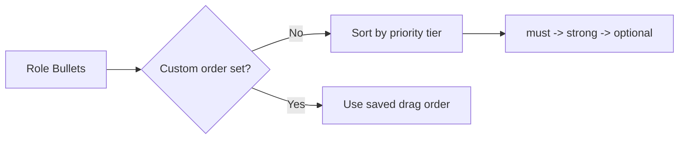
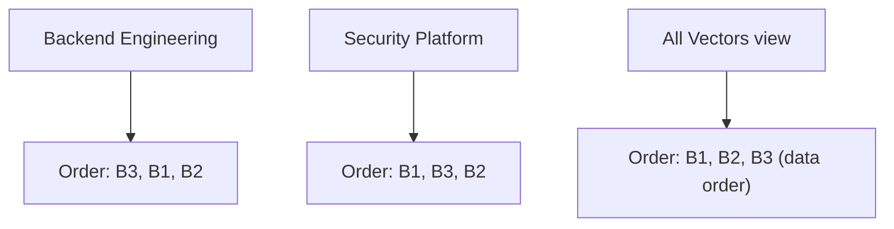
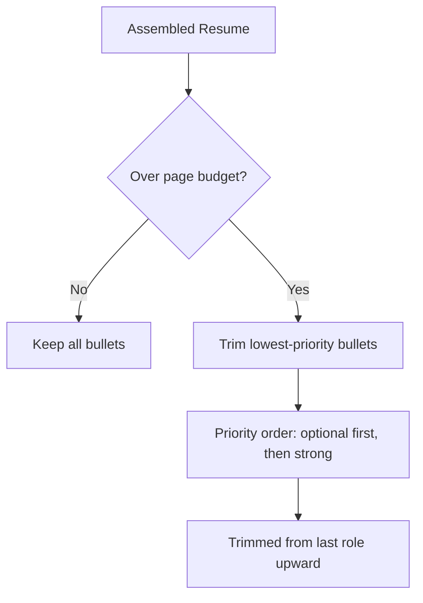

# Bullet Ordering

Control the visual order of bullets within each role to craft the strongest possible narrative for every vector.

## What You Will Learn

- How default priority-based ordering works
- How to reorder bullets with drag-and-drop
- Per-vector independence of bullet order
- How custom order badges and reset controls work
- How bullet ordering interacts with the page budget trimmer

## Prerequisites

- At least one role with multiple bullets defined in the Component Library
- At least one vector created in the Vector Bar
- Familiarity with the priority system (`must` > `strong` > `optional` > `exclude`)

---

## Default Ordering

When no custom order has been set, bullets within each role are displayed in **priority order** for the active vector:

1. `must` -- highest priority, displayed first
2. `strong` -- important but not essential
3. `optional` -- included if space allows
4. `exclude` -- hidden from the assembled resume

Within the same priority tier, bullets appear in the order they were originally defined (their natural data order). This default gives you a strong starting point: the most important accomplishments surface first without any manual intervention.

## Drag-and-Drop Reordering

Facet uses the `@dnd-kit` library for drag-and-drop, providing smooth animations, collision detection, and comprehensive accessibility support out of the box.

### The Grip Handle

Each bullet card displays a **grip handle** (a vertical dots icon) on its left edge. This is the sole drag target -- you cannot initiate a drag by grabbing other parts of the card. This is intentional: bullet cards contain editable text fields, priority toggles, and variant selectors that must remain clickable without triggering a reorder.

<!-- Screenshot: grip handle on a bullet card -->

### Performing a Reorder

1. **Select a vector** in the Vector Bar. Bullet ordering is per-vector, so choose the vector you want to customize.
2. **Grab the grip handle** on the bullet you want to move.
3. **Drag vertically** to the desired position within the role. A visual indicator shows the drop target.
4. **Release** to confirm the new position. The order is saved immediately.

The drag interaction uses a 6-pixel activation distance, meaning you must move the pointer at least 6 pixels before a drag begins. This prevents accidental reorders when clicking nearby controls.

### Keyboard Accessibility

Bullet reordering is fully keyboard accessible:

1. **Tab** to the grip handle button.
2. Press **Space** or **Enter** to pick up the bullet. A screen reader announcement confirms: "Picked up bullet N."
3. Use **Arrow Up** and **Arrow Down** to move the bullet.
4. Press **Space** or **Enter** to drop it. The announcement confirms: "Dropped bullet at position N."
5. Press **Escape** to cancel the move. The announcement confirms: "Bullet move canceled."

All announcements are delivered through an ARIA live region, so assistive technology users receive real-time feedback.

The keyboard interaction follows the WAI-ARIA Drag and Drop pattern, ensuring compatibility with major screen readers including VoiceOver, NVDA, and JAWS.

## Per-Vector Independence

Each vector maintains its own independent bullet order. Reordering bullets while viewing the "Backend Engineering" vector has no effect on the bullet order for "Security Platform" or any other vector.

This design reflects Facet's core philosophy: each vector is a distinct positioning angle that tells a different story. The order in which you present accomplishments is part of that story.

When viewing **All Vectors**, bullets display in their natural data order. Custom ordering only applies when a specific vector is selected.

### Switching Vectors

When you switch vectors, the bullet list immediately reflects that vector's saved order. If no custom order exists for the newly selected vector, bullets revert to priority-based default ordering for that vector.

### Example Scenario

Consider a role with five bullets. For a "Backend Engineering" vector, you might reorder them to lead with systems design and API work. For a "Security Platform" vector, you might lead with access control and audit logging bullets instead. Each vector's order is stored independently and recalled automatically when you switch.

### Storage

Bullet orders are stored as a map of role IDs to ordered bullet ID arrays, scoped by vector. The data structure is `Record<VectorId, Record<RoleId, string[]>>`. Only roles with custom orders have entries; roles using default ordering are omitted to keep the data sparse.

## Custom Order Badge

When a role has a custom bullet order for the active vector, a **custom order badge** appears in the role header. This badge serves as a visual reminder that the displayed order differs from the default priority sort.

<!-- Screenshot: custom order badge in role header -->

The badge text indicates that a manual arrangement is active. It appears only when:

- A specific vector is selected (not "All Vectors")
- At least one bullet has been moved from its default position

## Reset Controls

### Per-Role Reset

Each role header includes a **Reset Order** button. Clicking it clears the custom bullet order for that role under the active vector, reverting to the default priority-based sort.

The button is disabled (grayed out) when no custom order exists for the role, so you can tell at a glance whether an override is active.

### Global Reset

To reset all bullet orders across all roles for the active vector, use the global override reset controls. This is useful when you want to start fresh after experimenting with different arrangements.

### When to Reset

Consider resetting bullet orders when:

- You have significantly changed the priority assignments for a vector and want the default sort to reflect the new hierarchy.
- You imported new bullets into a role and want them to slot in at their natural priority position rather than appending to the end of a stale custom order.
- You are starting a new application cycle and want a clean slate before re-tuning.

## Interaction with Page Budget

An important distinction: **bullet ordering affects display position, not trimming decisions**.

The page budget system in Facet trims bullets based on **priority**, not on their visual position in the list. When the assembled resume exceeds the target page count, the trimmer removes the lowest-priority bullets from the bottom of the last role, regardless of where you placed them via drag-and-drop.

This means:

- A `must` bullet dragged to the bottom of the list will **never** be trimmed by the page budget.
- An `optional` bullet dragged to the top of the list will still be **the first candidate for trimming** if the resume exceeds the target.
- If all remaining bullets are `must` and the resume still overflows, Facet raises a `must_over_budget` warning rather than trimming essential content.

### Practical Implication

Use priority levels to control *what* appears on the resume. Use drag-and-drop ordering to control *where* it appears. These are independent concerns by design.

### Page Budget Warnings

When the page budget trimmer activates, the status bar displays a warning. If lower-priority bullets are removed, you will see "Estimated at 2+ pages; lower-priority bullets were trimmed." If only `must` bullets remain and the resume still overflows, the warning reads "Must-tagged content exceeds budget." In either case, the trimming decision is based purely on the priority hierarchy, not on the visual order you established.

## Presets and Bullet Orders

Custom bullet orders are captured as part of [preset snapshots](./presets.md). When you save a preset, the current bullet ordering for the active vector is included. Loading a preset restores that ordering. This means you can maintain different bullet arrangements for the same vector across multiple presets -- for example, one preset that leads with management accomplishments and another that leads with technical depth.

## Summary

| Concept | Behavior |
|---|---|
| Default order | Priority-based: must, strong, optional |
| Custom order | Drag-and-drop with grip handle |
| Scope | Per-vector, per-role |
| Visual indicator | Custom order badge in role header |
| Reset | Per-role button or global reset |
| Page trimming | Uses priority, ignores visual position |
| Accessibility | Full keyboard support with live announcements |

## Next Steps

- [Presets](./presets.md) -- Save your bullet order as part of a preset snapshot
- [Design and Themes](./design-and-themes.md) -- Control how bullets render visually
- [Navigator](../NAVIGATOR.md) -- Documentation index
