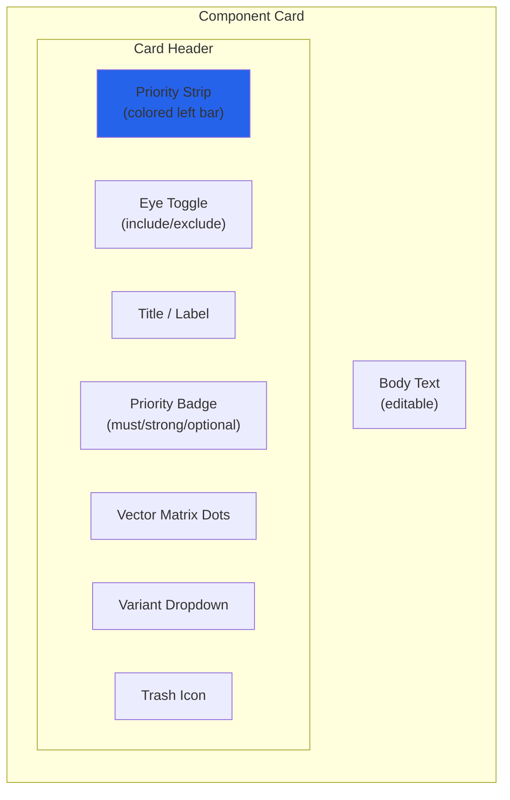

# Components

Components are the building blocks of your resume in Facet. Every piece of resume content
-- from your name and contact information to individual bullet points under a role -- is
a component. You define components once in the Component Library and assign per-vector
priorities to control which components appear in each assembled resume.

## What You Will Learn

- All seven component types and their purposes.
- How to add, edit, and remove components.
- The anatomy of a component card and its interactive controls.
- How priorities work across vectors.
- How text variants allow per-vector wording.
- How drag-and-drop ordering works.
- Section-specific behaviors and constraints.

## Prerequisites

- Familiarity with the [Facet interface](getting-started.md).
- Understanding of [vectors](vectors.md) and their role in assembly.

---

## Component Types

Facet organizes resume content into seven component types, each representing a standard
resume section.

### 1. Header (Meta)

The header contains your name, email, phone number, location, and links (portfolio,
LinkedIn, GitHub, etc.). There is exactly one header; it appears on every assembled
resume regardless of vector.

The header does not have per-vector priorities. It is always included.

### 2. Target Lines

A target line is a concise one-line positioning statement that appears near the top of
your resume. Examples: "Senior Backend Engineer" or "Security Platform Architect."

You can define multiple target lines, each with different per-vector priorities, so the
right positioning statement surfaces for each vector. Only one target line is included
in the final resume (the highest-priority one for the active vector).

### 3. Profiles

A profile is a short paragraph (typically 2-4 sentences) summarizing your experience and
value proposition. Like target lines, you can define multiple profiles with different
per-vector priorities.

Only one profile is included in the final resume. Profiles support text variants for
per-vector wording adjustments.

### 4. Roles

A role represents a position you have held. Each role has:

- **Company** name.
- **Title** (your job title).
- **Dates** (employment period).
- **Location** (optional).
- **Subtitle** (optional, e.g., a team or division name).
- **Bullets** -- individual accomplishment statements (see below).

Roles have per-vector priorities. When a role is excluded for a vector, all its bullets
are excluded as well.

### 5. Role Bullets

Bullets are the individual accomplishment statements within a role. Each bullet is a
component in its own right with:

- Its own per-vector priority map.
- Optional text variants for per-vector wording.
- An optional label for internal reference.

Bullets are the most granular unit of priority control. You can set a role to "must" but
individual bullets within it to "optional," allowing the page budget trimmer to remove
low-priority bullets while keeping the role visible.

### 6. Skill Groups

A skill group is a labeled collection of skills, such as "Languages: Go, Rust,
TypeScript, Python" or "Infrastructure: Kubernetes, Terraform, AWS."

Skill groups have a unique priority model. Instead of a simple `PriorityByVector` map,
each skill group carries a per-vector configuration that includes:

- **Priority** -- must, strong, optional, or exclude.
- **Order** -- the display order within the skill groups section.
- **Content override** -- alternate skill list text for specific vectors.

This allows you to reorder skill groups and adjust their content per vector. A "Backend
Eng" vector might foreground "Languages" and "Infrastructure," while a "Security" vector
might foreground "Security Tools" and "Compliance Frameworks."

### 7. Projects

A project is a standalone item (open source, side project, publication) with:

- **Name**.
- **URL** (optional).
- **Description text**.
- Per-vector priorities and text variants.

### 8. Education

An education entry includes school, location, degree, and an optional year. Education
entries do not have per-vector priorities; they are always included in the assembled
resume.

---

## Adding Components

Each section in the Component Library has an **+** button to add a new component of that
type. Click it to create a new empty component. The new component appears at the bottom
of its section with default values.

For roles, you can also add bullets by clicking the **+** button within a role card.

*Screenshot to be added*

---

## Editing Components

Click on a component card's text area to edit its content inline. Changes are saved
automatically and reflected immediately in the Live Preview.

For roles, you can edit the company name, title, dates, location, and subtitle fields
directly on the card. Bullets within a role are edited individually.

---

## Removing Components

Click the trash icon on a component card to remove it. The component is deleted from
the library entirely -- it is removed from all vectors, not just the active one.

---

## Component Card Anatomy

Every component card (except the header and education) shares a consistent layout with
interactive controls.

### Priority Strip

A thin colored bar on the left edge of the card. The color indicates the component's
priority for the active vector:

| Color | Priority |
|-------|----------|
| Blue | must |
| Green | strong |
| Amber | optional |
| None (dim) | exclude |

When the All view is active, the priority strip shows a neutral state.

### Eye Toggle

The eye icon toggles manual inclusion or exclusion of the component for the active
vector. When toggled:

- **Eye open** -- the component is forced into the assembly regardless of its priority.
- **Eye closed (with slash)** -- the component is forced out of the assembly.
- **Default state** -- the component follows its priority-based inclusion logic.

Manual overrides are per-vector. Toggling the eye icon for "Backend Eng" does not affect
the component's inclusion for "Security Platform."

Click **Reset to Auto** on the vector bar to clear all manual overrides for the active
vector.

### Priority Badge

A small label showing the component's resolved priority for the active vector: **must**,
**strong**, or **optional**. If the component is excluded, no badge is shown.

Click the priority badge to cycle through priority levels:
`must` -> `strong` -> `optional` -> `exclude` -> `must`.

Priority cycling is only available when a specific vector is selected (not in the All
view).

### Vector Matrix Dots

A row of small colored dots, one per defined vector. Each dot indicates the component's
priority for that vector using the same color scheme as the priority strip.

Click a dot to cycle the component's priority for that specific vector without switching
away from the current view. This is the fastest way to set priorities across multiple
vectors.

### Variant Dropdown

If the component has text variants defined, a dropdown appears allowing you to select
which variant to use for the active vector. Options include:

- **Default** -- use the component's base text.
- **[Vector name]** -- use the variant text written for that vector.

Variant selections are per-vector. See the text variants section below for details.

### Trash Icon

Click to permanently delete the component from the library.

---

## Priority by Vector

Every component (except header and education) carries a `PriorityByVector` map -- a
record that maps vector IDs to priority levels.

### Setting Priorities

There are two ways to set a component's priority for a vector:

1. **Priority badge click** -- with the target vector selected, click the priority badge
   on the component card to cycle through levels.
2. **Vector matrix dot click** -- click the dot corresponding to the target vector to
   cycle its priority directly.

### Resolution Order

When the assembler processes a component, it resolves the effective priority by looking
up the selected vector ID in the component's priority map. If no entry exists for that
vector, the component defaults to `exclude`.

The four priority levels, in descending order of importance:

| Level | Behavior |
|-------|----------|
| `must` | Always included. Never trimmed by the page budget engine. |
| `strong` | Included by default. Trimmed only after all optional content. |
| `optional` | Included if space permits. First to be trimmed when over budget. |
| `exclude` | Not assembled. Does not appear in the output. |

### Override Hierarchy for Bullets

Bullet overrides use a hierarchical key system. When the assembler resolves a manual
override for a bullet, it checks keys in this order:

1. `role:{roleId}:bullet:{bulletId}` -- most specific.
2. `role:{roleId}:{bulletId}` -- role-scoped.
3. `bullet:{bulletId}` -- bullet-only.
4. `{bulletId}` -- bare ID.

The first match wins. This hierarchy allows you to set broad overrides at the role level
and fine-tune individual bullets.

---

## Text Variants

Components that contain text (target lines, profiles, bullets, projects) can carry
per-vector text variants. A variant is an alternate wording of the component's text,
tailored for a specific vector.

For example, a bullet about building a deployment pipeline might read:

- **Default**: "Built zero-downtime deployment pipeline serving 200+ microservices."
- **Platform Eng variant**: "Designed and operated deployment infrastructure for 200+
  microservices with zero-downtime rollouts."
- **DX variant**: "Reduced deploy friction for 200+ services by building a self-service
  deployment pipeline with zero-downtime rollouts."

When the active vector has a variant defined, the variant text replaces the default in
the assembled output. Use the variant dropdown on the component card to select which
variant to display.

For a deeper treatment of variant workflows, see text-variants.md (forthcoming).

---

## Drag-and-Drop Ordering

Components within a section can be reordered by dragging. Facet uses drag-and-drop
for:

- **Bullet ordering within a role** -- drag bullets up or down to change their display
  order. Bullet order is per-vector, so reordering bullets for "Backend Eng" does not
  affect their order for "Security Platform."
- **Skill group ordering** -- drag skill groups to reorder them within the skills section.
  Like bullet order, skill group order can be set per-vector.

Drag a component by clicking and holding its drag handle, then move it to the desired
position. Release to drop.

---

## Section-Specific Notes

### Roles and Bullets

Roles are container components. A role card displays the role header (company, title,
dates) and contains its bullet components as nested cards. Key behaviors:

- If a role is set to `exclude` for a vector, all its bullets are excluded regardless of
  their individual priorities.
- If a role is set to `must` but a bullet within it is set to `optional`, the bullet can
  still be trimmed by the page budget engine while the role header remains.
- Bullets are the primary target of page budget trimming. The trimmer removes the
  lowest-priority bullets from the bottom of the last role first.

### Skill Groups

Skill groups differ from other components in that they support per-vector content
overrides, not just priority and order. Each vector can define a different skill list
for the same skill group label. This is useful when you want to foreground different
skills under the same category heading for different vectors.

Skill groups do not support text variants in the same way as bullets and profiles.
Instead, they use the per-vector `content` field in their vector configuration.

### Header and Education

The header (meta) and education entries do not participate in the per-vector priority
system. They are always included in the assembled resume.

- **Header**: one per resume. Edit fields directly in the header section.
- **Education**: add multiple entries. Each entry has school, location, degree, and an
  optional year. No priority controls; all entries are always included.

---

## Summary

Components are the atomic units of resume content in Facet. The seven component types
cover every standard resume section. Each component (except header and education) carries
per-vector priorities that control inclusion and trimming behavior. Component cards
provide a consistent set of controls -- priority strip, eye toggle, priority badge,
vector matrix dots, variant dropdown, and trash icon -- for efficient management.

## Next Steps

- [Vectors](vectors.md) -- learn how vectors drive assembly and how to manage them.
- [Getting Started](getting-started.md) -- return to the setup and first-use guide.
- [NAVIGATOR](../NAVIGATOR.md) -- return to the documentation index.
