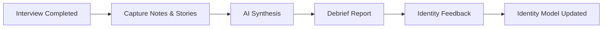
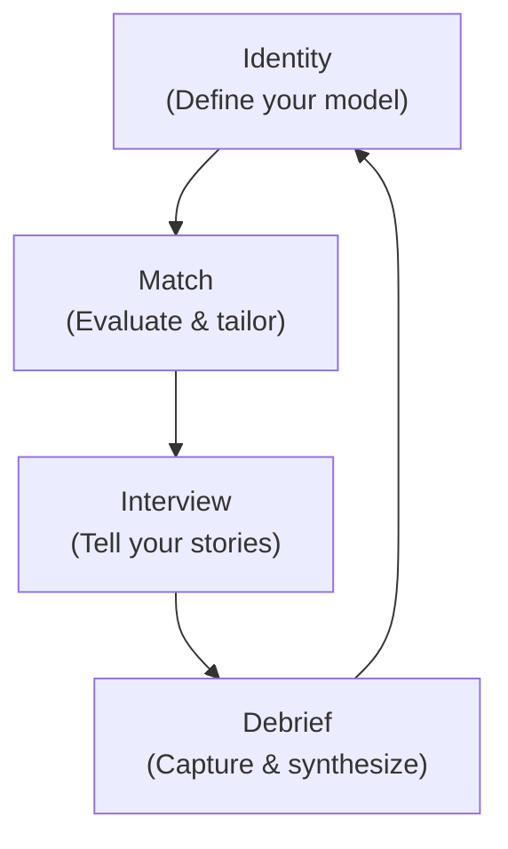

# Debrief Workspace

The Debrief workspace captures post-interview feedback, maps stories back to your identity model, identifies patterns across interviews, and feeds learnings back into Identity for continuous improvement. It closes the loop.

## What You Will Learn

- Understand the purpose of the Debrief workspace and how it closes the Facet feedback loop
- Create a new debrief session from a match report or pipeline entry
- Capture interview details: round name, date, outcome, and raw notes
- Record questions asked with per-question takeaways
- Document what worked and what did not during the interview
- Map stories you told back to specific identity bullets with outcome ratings
- Generate an AI-synthesized debrief report
- Review and act on the synthesized debrief
- Send findings back to the Identity workspace as correction notes and draft updates
- Track cross-session patterns: anchor stories, recurring gaps, and company-fit signals
- Export debrief sessions as plain text

## Prerequisites

- Familiarity with the [Identity workspace](./identity.md) and your identity model
- At least one completed interview, with either:
  - A **match report** generated in the [Match workspace](./match.md), or
  - A **pipeline entry** tracked in the [Pipeline workspace](./pipeline.md)
- The AI proxy configured

---

## Why Debrief Exists

Facet organizes your job search into three phases:

1. **Identity** -- define who you are as an engineer
2. **Match** -- evaluate opportunities against your identity and generate tailored resumes
3. **Debrief** -- capture what happened in interviews and feed learnings back into Identity

Without the third phase, your identity model is static. Debrief closes the loop. Every interview teaches you something about which stories land, which gaps keep surfacing, and which company types fit your strengths. Debrief captures that signal, synthesizes it with AI, and pushes concrete updates back to Identity so your model improves over time.

---

## The Full Facet Feedback Loop

Debrief is not a standalone tool. It is the return path in a cycle that starts and ends with Identity.

Each pass through this cycle sharpens your positioning. Stories that consistently land become anchor stories. Gaps that recur across interviews become priorities for your identity model. Company-fit signals help you focus your pipeline.

---

## Workspace Layout

The Debrief workspace is divided into four areas:

- **Sidebar** (left) -- lists all saved debrief sessions with delete actions
- **Generator section** -- the form where you enter interview details, notes, questions, and story mappings before generating a report
- **Active Debrief panel** -- displays the AI-synthesized report with export and send-to-identity actions
- **Pattern Summary** -- cross-session analysis showing anchor stories, recurring gaps, and best-fit company types

*Screenshot to be added*

---

## Starting a New Debrief Session

1. Navigate to the **Debrief** workspace from the sidebar icon.
2. In the generator section, locate the **source toggle** at the top. Choose one:
   - **Match** -- links this debrief to a match report, pulling in the company context, JD analysis, and tailored resume
   - **Pipeline** -- links to a pipeline entry, pulling in the company name, role, and any notes you recorded
3. If you selected **Pipeline**, pick the specific pipeline entry from the dropdown.

The source you choose determines what context the AI receives when synthesizing your debrief. Match-based sessions provide richer context because they include the full match analysis.

---

## Entering Interview Details

Fill in the following fields in the generator section:

| Field | Purpose |
|-------|---------|
| **Round** | The interview round name (e.g., "Phone Screen", "System Design", "Final Panel") |
| **Date** | The date the interview took place |
| **Outcome** | Your assessment: `advancing`, `rejected`, `offer`, or `pending` |

These fields are required before generation. They help the AI contextualize your notes and they structure the pattern analysis across sessions.

---

## Capturing Raw Notes

The **Raw Notes** text area accepts freeform text. Paste or type everything you remember from the interview:

- Topics discussed and questions asked by the interviewer
- Your answers and the stories you told
- Impressions of interviewer reactions
- Technical problems you solved or struggled with
- Cultural signals and team dynamics you observed

Do not worry about structure here. The AI synthesis step will organize your notes into a coherent report. More detail produces better synthesis.

---

## Recording Questions Asked

The **Questions Asked** section lets you add individual question entries. For each question:

1. Click **Add Question**.
2. Type the question as it was asked (or your best recollection).
3. Add a **takeaway** for that question -- what you learned from the exchange, how you would answer differently next time, or what signal it gave you about the role.

Questions and their takeaways are preserved in the debrief report and feed into cross-session pattern analysis.

---

## Documenting What Worked and What Did Not

Two separate sections capture your honest self-assessment:

- **What Worked** -- stories that landed, questions you answered well, rapport moments, technical demonstrations that impressed
- **What Didn't** -- gaps in your knowledge, stories that fell flat, questions you fumbled, areas where you lost the interviewer

Each section accepts multiple entries. Be specific. "My observability story landed well -- interviewer asked two follow-ups" is more useful than "Stories were good."

These entries are central to the pattern analysis. If the same item appears in "What Didn't" across three sessions, Debrief will surface it as a recurring gap.

---

## Story Mapping

Story mapping is the core differentiator of the Debrief workspace. It connects the stories you told in an interview back to specific bullets in your identity model.

### Adding a Story Mapping

1. In the **Stories** section of the generator, click **Add Story Mapping**.
2. **Select an identity bullet** -- browse or search your identity model to find the bullet that matches the story you told.
3. **Rate the outcome** -- choose one of three ratings:
   - **Strong** -- the story clearly landed; the interviewer responded positively, asked engaged follow-ups, or referenced it later
   - **Mixed** -- the story partially worked but did not fully connect; the interviewer seemed neutral or redirected
   - **Weak** -- the story did not land; the interviewer seemed uninterested, confused, or moved on quickly
4. **Note interviewer signals** -- describe the specific reactions or cues that informed your rating.

*Screenshot to be added*

### Why Story Mapping Matters

Over multiple debrief sessions, story mappings create a performance record for each identity bullet:

- Bullets rated **strong** across multiple interviews become your **anchor stories** -- reliable, proven narratives you should lead with
- Bullets consistently rated **weak** may need rewriting, reframing, or removal from your identity model
- Bullets never mapped to any story reveal positioning gaps -- parts of your identity you are not successfully deploying in interviews

---

## Generating the AI Debrief Report

Once you have filled in the interview details, raw notes, questions, what worked/didn't, and story mappings:

1. Click the **Generate** button at the bottom of the generator section.
2. The AI receives all your input along with the source context (match report or pipeline entry) and your identity model.
3. Generation takes a few seconds. A loading indicator appears while the AI processes.

The AI synthesizes your raw input into a structured debrief report. It does not invent information -- it organizes, connects, and highlights patterns in what you provided.

---

## Reviewing the Synthesized Debrief

The generated debrief appears in the **Active Debrief** panel. It includes:

- **Summary** -- a concise narrative of the interview, key themes, and overall assessment
- **Questions Asked** -- each question with your recorded takeaway, organized and contextualized
- **What Worked** -- your successes, potentially enriched with connections to your identity model
- **What Didn't Work** -- your struggles, with suggested areas for improvement
- **Identity Feedback** -- specific observations about how your identity model performed, including suggested corrections and draft updates

Review the report carefully. The AI identifies connections you may have missed -- for example, linking a gap in your interview to a bullet in your identity model that could be strengthened.

*Screenshot to be added*

---

## Sending Findings Back to Identity

The debrief report includes an **Identity Feedback** section with two outputs:

- **Correction notes** -- observations about identity bullets that need adjustment (e.g., "The distributed systems bullet consistently falls flat in platform-focused interviews; consider reframing around reliability engineering")
- **Draft updates** -- concrete suggested rewrites or additions to identity bullets

To push these findings to your identity model:

1. Review the identity feedback section in the active debrief.
2. Click **Send to Identity**.
3. Facet generates correction notes and draft updates, then writes them to the Identity workspace.

This does not overwrite your identity model. It creates suggested changes that you review and accept in the Identity workspace. You remain in control of your model.

This is the feedback loop in action. Interview experience becomes identity improvement.

---

## Cross-Session Patterns

The **Pattern Summary** panel aggregates data across all your debrief sessions. It surfaces three categories of insight:

### Anchor Stories

Identity bullets that consistently receive **strong** outcome ratings across multiple interviews. These are your proven narratives -- the stories interviewers respond to most positively. Lead with these.

### Recurring Gaps

Topics, skills, or story areas that repeatedly appear in "What Didn't Work" across sessions. If you struggle with system design estimation in three interviews, that is a recurring gap worth addressing -- either by building the skill or adding a stronger story to your identity model.

### Best-Fit Company Types

Signals about which types of companies, roles, or interview formats produce your best outcomes. Over time, patterns emerge: you may perform better in collaborative panel formats than adversarial whiteboard sessions, or your stories may resonate more at growth-stage companies than at large enterprises.

*Screenshot to be added*

The pattern summary updates automatically as you add more debrief sessions. Its value increases with volume -- three sessions produce hints, ten sessions produce actionable strategy.

---

## Exporting Sessions

To share or archive a debrief session:

1. Open the session in the Active Debrief panel.
2. Click **Export**.
3. The session is copied to your clipboard as formatted plain text.

Exported sessions include all sections: summary, questions, what worked/didn't, story mappings, and identity feedback. Use exports for personal records, sharing with a career coach, or archiving before clearing old sessions.

---

## Summary

The Debrief workspace transforms raw interview experiences into structured insights that improve your identity model over time. The workflow is:

1. **Capture** -- enter interview details, notes, questions, self-assessment, and story mappings
2. **Synthesize** -- AI generates a structured debrief report
3. **Learn** -- review patterns across sessions to identify anchor stories and gaps
4. **Improve** -- send findings back to Identity for continuous model refinement

Each debrief session makes your identity model more accurate and your interview performance more deliberate.

---

## Next Steps

- [Identity](./identity.md) -- Review and apply debrief feedback to your identity model
- [Match](./match.md) -- Generate match reports that provide rich context for future debriefs
- [Pipeline](./pipeline.md) -- Track interviews to provide pipeline-based context for debriefs
- [Getting Started](./getting-started.md) -- Return to the overview if you need orientation across all workspaces
