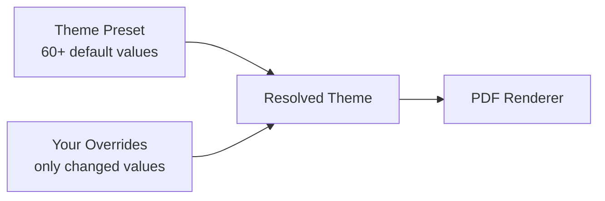

# Design and Themes

Control the visual presentation of your resume through theme presets, fine-grained overrides, density controls, and template layouts.

## What You Will Learn

- The 10 built-in theme presets and what they offer
- How the override model layers customizations on a base preset
- Fine-tuning typography, spacing, colors, and margins
- Using density controls to tighten or loosen layout
- Choosing between templates: classic, sidebar, and minimalist
- Section header styles and bullet characters
- The Design Health toggle for ATS and print safety

## Prerequisites

- A resume with content in the Component Library (roles, bullets, skill groups)
- Familiarity with the live preview panel on the right side of the interface

---

## Theme Presets

Facet ships with 10 theme presets, each providing a complete set of design tokens. Select a preset as your starting point, then override individual values as needed.

| Preset | Fonts | Character |
|---|---|---|
| **Ferguson v1.2** | Inter / Inter | Compact, professional. The default starting point with tight spacing and balanced proportions. |
| **Clean Modern** | DM Sans / DM Sans | Contemporary and open. Slightly larger body text with generous paragraph gaps. |
| **Classic Serif** | Source Serif 4 / Source Serif 4 | Traditional with serif typography. Suits industries that value formality. |
| **Minimal** | IBM Plex Sans / IBM Plex Sans | Stripped-back and quiet. Monochromatic color palette with understated section headers. |
| **Editorial** | Newsreader / DM Sans | Mixed serif headings with sans-serif body. A polished editorial feel. |
| **Executive Serif** | PT Serif / IBM Plex Serif | Authoritative serif pairing. Well-suited for leadership and executive roles. |
| **Modern Contrast** | IBM Plex Sans / IBM Plex Serif | Serif headings with sans-serif body. High visual contrast between hierarchy levels. |
| **Signal Clean** | DM Sans / PT Serif | Serif headings for warmth, sans-serif body for readability. Balanced and approachable. |
| **Creative Bold** | Nunito Sans / Outfit | Rounded, modern typefaces. Distinctive without sacrificing professionalism. |
| **Academic Dense** | Lora / Lora | Scholarly serif throughout. Designed for dense, content-heavy academic CVs. |

<!-- Screenshot: Theme Gallery showing all 10 preset cards -->

### Applying a Preset

Open the **Theme Editor** panel and navigate to the **Presets** tab. Click any preset card to apply it. The live preview updates immediately. Your previous overrides are cleared when switching presets.

The Theme Gallery at the bottom of the Presets tab shows a visual miniature of each theme, rendering a sample name, contact line, section header, role title, and bullet in the theme's actual fonts and colors.

## Override Model

Facet uses a **base preset + sparse overrides** model:

When you change a single value -- say, body font size from 9pt to 10pt -- only that override is stored. All other values continue to come from the base preset. This keeps your configuration minimal and makes it easy to switch presets: your sparse overrides layer on top of whichever base you select.

Overrides that match the preset's default value are automatically pruned. If you set body size to 10pt and then back to 9pt (the preset default), the override is removed entirely.

### Reset to Theme

The **Reset to Theme** button in the Theme Editor header clears all overrides, returning every value to the active preset's defaults.

## Fine-Tuning

The Theme Editor organizes its controls across tabbed sections.

### Typography

Control all font and size properties:

- **Body Font / Heading Font** -- Select from 11 available font families:
  - Sans-serif: Inter, DM Sans, Nunito Sans, Libre Franklin, IBM Plex Sans
  - Serif: Source Serif 4, PT Serif, Lora, IBM Plex Serif, Newsreader
  - Monospace: DM Mono
- **Size controls** for body text (7--14pt), name (10--28pt), section headers (8--16pt), role titles, company names, small text, contact info, and project URLs
- **Line height** (0.9--1.8)
- **Name letter spacing** (0--8pt)

### Spacing

Adjust vertical gaps between resume sections:

| Control | Range | Purpose |
|---|---|---|
| Section Gap Before | 0--24pt | Space above each section heading |
| Section Gap After | 0--12pt | Space below each section heading |
| Section Rule Gap | 0--8pt | Space between heading text and horizontal rule |
| Role Gap | 0--18pt | Space between role blocks |
| Role Header Gap | 0--8pt | Space between role header and first bullet |
| Role Line Gap After | 0--12pt | Space after the role header line |
| Bullet Gap | 0--12pt | Space between consecutive bullets |
| Paragraph Gap | 0--12pt | Space between paragraphs |
| Contact Gap After | 0--12pt | Space below contact information |
| Competency Gap | 0--8pt | Space between skill groups |
| Project Gap | 0--12pt | Space between project entries |

### Margins

Set page margins in inches (0.25--2.0 per side):

- Margin Top
- Margin Bottom
- Margin Left
- Margin Right

### Colors

Ten color controls for different text and decoration elements:

- Body, Heading, Section, Dim, Rule
- Role Title, Dates, Subtitle
- Competency Label, Project URL

Each color is specified as a hex value and edited through a native color picker.

## Density Controls

The Theme Editor header provides two quick-access density buttons:

- **Tighten** -- Decreases spacing and font sizes by one step across all density-sensitive properties
- **Loosen** -- Increases spacing and font sizes by one step

These buttons adjust a curated set of 18 properties simultaneously: all gap values, all margins, and the three smallest font sizes (body, small, contact). Each click applies one incremental step, allowing you to quickly compress or expand the layout without manually tuning individual values.

### Smart Density Optimizer

In the Spacing tab, the **Smart Density Optimizer** provides target-aware fitting:

- **Fit to 1 Page** -- Iteratively searches for the optimal balance of spacing and font size to compress the resume onto a single page
- **Fit to 2 Pages** -- Same optimization targeting a two-page layout

The optimizer adjusts multiple properties simultaneously through an iterative search. While running, the button displays "Working..." and disables interaction.

<!-- Screenshot: Tighten/Loosen buttons and Smart Density Optimizer -->

## Templates

Templates control the structural layout of the resume. Select a template from the **Layout** tab.

### Classic

The default single-column layout. All content flows vertically in a single stream. This is the most universally compatible format and works well with all ATS systems.

### Sidebar

A two-column layout with a colored sidebar for secondary content. When selected, three additional controls appear:

| Control | Default | Description |
|---|---|---|
| Sidebar Width | 2.2 inches | Width of the left sidebar column |
| Sidebar Color | #f8f9fa | Background color of the sidebar |
| Column Gap | 24pt | Space between sidebar and main columns |

The sidebar layout is effective for separating skills and education from work experience, but should be tested with target ATS systems.

### Minimalist

A clean single-column layout with reduced visual ornamentation. Uses minimal rules and spacing for a contemporary appearance.

## Section Header Styles

Four styles control how section headings (Experience, Skills, Education, etc.) are rendered:

| Style | Rendering | Example |
|---|---|---|
| `caps-rule` | Uppercase text with a horizontal rule below | EXPERIENCE ---- |
| `bold-rule` | Bold mixed-case text with a horizontal rule below | **Experience** ---- |
| `bold-only` | Bold mixed-case text, no rule | **Experience** |
| `underline` | Underlined text, no separate rule | <u>Experience</u> |

Additional controls for section headers:

- **Header Letter Spacing** (0--8pt) -- tracked spacing applied to section header text
- **Rule Weight** (0--3pt) -- thickness of the horizontal rule (for `caps-rule` and `bold-rule`)

## Bullet Characters

Choose the character used to prefix each bullet point:

| Option | Rendering |
|---|---|
| `bullet` | Bullet point |
| `dash` | En dash |
| `triangle` | Right-pointing triangle |
| `none` | No bullet character (clean indented text) |

Additional bullet controls:

- **Bullet Indent** (0--36pt) -- left indentation of the entire bullet block
- **Bullet Hanging** (0--24pt) -- hanging indent (distance the bullet character hangs left of the text)

## Layout Controls

The Layout tab provides additional formatting options:

- **Name Alignment** -- left, center, or right alignment for the resume name
- **Contact Alignment** -- left, center, or right alignment for contact information
- **Dates Alignment** -- `right-tab` (dates flush right) or `inline` (dates flow with text)
- **Boolean toggles** for typographic emphasis:
  - Name Bold
  - Company Bold
  - Role Title Italic
  - Subtitle Italic
  - Competency Label Bold
  - Project Name Bold
  - Education School Bold

## Design Health

The **Design Health** toggle in the Visual Aids tab activates a scoring system that evaluates your theme configuration for ATS compatibility and print safety.

### Health Score

The score ranges from 0 to 100 and is categorized as:

| Range | Rating |
|---|---|
| 90--100 | Good |
| 70--89 | Fair |
| 0--69 | Needs Work |

A progress bar and color-coded label provide at-a-glance status.

### Issue Reporting

When the score is below 100, the panel lists specific issues with severity indicators:

- **Error** (triangle icon) -- Critical issues that may cause ATS failures or print problems
- **Warning** (info icon) -- Suggestions for improvement that are not blocking

Common issues flagged include font sizes that are too small for reliable OCR parsing, margins that are too narrow for standard printers, and line heights that impair readability.

When all checks pass, the panel displays: "Your design looks ATS-safe and print-ready!"

### Density Heatmap

Also in the Visual Aids tab, the **Density Heatmap** toggle highlights sections in the live preview based on vertical space consumption. This helps you identify which sections consume the most real estate and where tightening would have the greatest impact.

## Summary

| Concept | Detail |
|---|---|
| Theme presets | 10 built-in starting points with complete design tokens |
| Override model | Base preset + sparse overrides, auto-pruned |
| Font families | 11 options (6 sans-serif, 4 serif, 1 monospace) |
| Templates | Classic (single-column), Sidebar (two-column), Minimalist |
| Section styles | caps-rule, bold-rule, bold-only, underline |
| Bullet characters | bullet, dash, triangle, none |
| Density controls | Tighten/Loosen buttons + Smart Density Optimizer |
| Design Health | ATS and print safety scoring with issue reporting |

## Next Steps

- [Presets](./presets.md) -- Theme state is captured in preset snapshots
- [Bullet Ordering](./bullet-ordering.md) -- Control content ordering independently of visual design
- [Navigator](../NAVIGATOR.md) -- Documentation index
