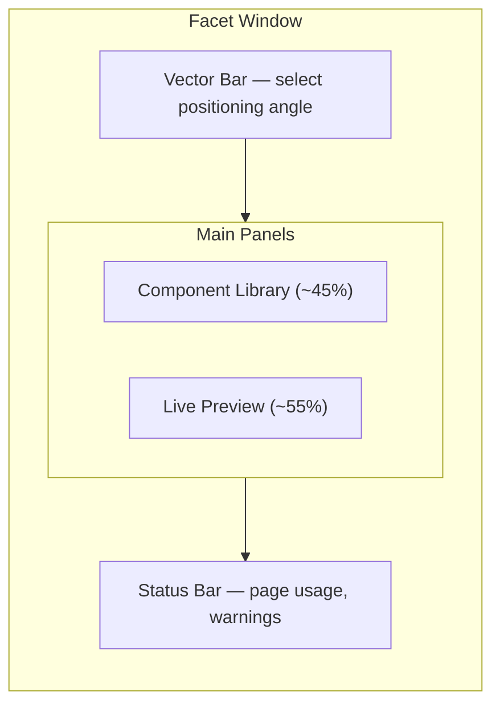

# Getting Started with Facet

Facet is a strategic resume assembly tool for senior engineers. Rather than maintaining
separate resume documents for each job application, you define your career as a library of
tagged, prioritized **components** and create **vectors** (positioning angles such as
"Backend Engineering" or "Security Platform"). The app assembles the optimal resume for
each angle, respecting page budgets.

For full project details, see the [README](../../README.md).

## What You Will Learn

- How to install and run Facet locally.
- The layout and terminology of the Facet interface.
- How to build your first resume in five minutes.
- Essential keyboard shortcuts for efficient navigation.

## Prerequisites

- Node.js 20.19.0 or later and pnpm.
- A modern browser (Chrome, Firefox, Safari, or Edge).

> **Self-hosted setup**: Facet is a client-side application. Clone the repository,
> install dependencies, and start the dev server:
>
> ```bash
> git clone <repo-url>
> cd Facet
> # optional if you use nvm
> nvm use || nvm install
> corepack enable
> pnpm install
> pnpm run dev
> ```
>
> The app will be available at `http://localhost:5173` by default.

---

## Interface Overview

Facet uses a route-based workspace with a persistent sidebar for the main surfaces:

- **Build** -- assemble and edit your resume.
- **Pipeline** -- track opportunities and statuses.
- **Research** -- infer a search profile, run AI-assisted job searches, and push matches into the pipeline.
- **Prep** -- generate or curate interview preparation decks.
- **Letters** -- draft and refine cover letters from pipeline context.

The Build route uses a two-panel layout with a vector selector bar at the top and a
status bar at the bottom.



### Vector Bar

The top bar displays a pill for each vector you have defined, plus an **All** pill that
shows every component regardless of vector. Click a pill or press a number key (1-9) to
switch vectors. Press **0** to return to the All view.

### Component Library (left panel)

All resume content is organized here by section: target lines, profiles, roles with
bullets, skill groups, projects, and education. Each piece of content is rendered as a
**component card** with priority controls and inclusion toggles.

The Component Library has two tabs:

- **Content** -- edit and organize resume components.
- **Design** -- customize typography, spacing, colors, and layout using theme presets or
  fine-grained controls.

### Live Preview (right panel)

Your assembled resume renders in real time as you make changes. Toggle between a
high-fidelity PDF view and an interactive Live view using the toggle in the panel header.

### Status Bar

The bottom bar reports the current page count, bullet count, and skill group count.
Warnings appear when the resume approaches or exceeds the configured page budget.

### Draggable Splitter

The divider between the Component Library and Live Preview is draggable. Adjust the split
ratio to your preference; the position is persisted across sessions.

---

## The In-App Tour

If this is your first time using Facet, click the **?** button in the top-right corner
to launch a guided tour. The tour walks through seven steps covering the vector bar,
component library, component cards, design tab, live preview, status bar, and the
download button.


*Screenshot to be added*

---

## Your First Resume in 5 Minutes

### Step 1: Create a Vector

Click the **+ New Vector** button on the vector bar. Enter a label that describes the
positioning angle you are targeting -- for example, "Backend Engineering." Choose a color
to visually distinguish this vector from others.

Once created, the vector pill appears in the bar. Click it to select it as the active
vector.

### Step 2: Review Components

Switch to the Component Library (left panel). You will see your resume content organized
by section. If default data is loaded, review the existing components. Otherwise, use the
section-level **+** buttons to add new target lines, profiles, roles, skill groups,
projects, and education entries.

Each component card displays:

- A **colored priority strip** on the left edge indicating the component's priority for
  the active vector.
- An **eye icon** toggle to manually include or exclude the component.
- A **priority badge** showing the current priority level (must, strong, optional).
- **Vector matrix dots** for at-a-glance priority across all vectors.

### Step 3: Adjust Priorities

With your new vector selected, set priorities on each component:

- **must** -- always included, never trimmed.
- **strong** -- included and trimmed only under pressure.
- **optional** -- included if space permits; trimmed first.
- **exclude** -- omitted entirely for this vector.

Click the priority badge on a component card to cycle through priority levels. Click
individual vector matrix dots to set priorities for other vectors without switching away
from the current view.

### Step 4: Preview

Look at the Live Preview panel on the right. The assembled resume updates in real time as
you adjust priorities and toggle components. The status bar at the bottom shows page
usage relative to your target page count.

If the resume exceeds the page budget, the assembler automatically trims the
lowest-priority bullets from the bottom of the last role. Warnings appear in the status
bar when must-priority content alone exceeds the budget.

### Step 5: Download PDF

When you are satisfied with the result, click the **Download** button in the preview
panel header to save your resume as a PDF file. You can also use the keyboard shortcut
below.


*Screenshot to be added*

---

## Importing and Exporting Data

Facet stores all resume data in browser localStorage. To back up your data or transfer it
between machines:

- **Export**: Use the File menu or press **Command+E** to export your configuration as
  YAML or JSON.
- **Import**: Use the File menu or press **Command+I** to import a previously exported
  configuration. Imports are additive -- they merge with existing data by ID and never
  replace existing items.

---

## Keyboard Shortcuts

| Shortcut | Action |
|----------|--------|
| `1` - `9` | Select vector 1 through 9 |
| `0` | Select All view |
| `Command+I` | Import configuration |
| `Command+E` | Export configuration |
| `Command+P` | Download PDF |

---

## Summary

Facet separates resume content from resume strategy. By defining components once and
assigning per-vector priorities, you can produce tailored resumes for different
positioning angles without duplicating work. The real-time preview and page budget
enforcement ensure the result fits within your target length.

## Next Steps

- [Hosted Accounts](hosted-accounts.md) -- hosted beta setup, migration, upgrade, and recovery guidance.
- [Vectors](vectors.md) -- learn how vectors control assembly and how to manage them.
- [Components](components.md) -- understand all seven component types and their controls.
- [NAVIGATOR](../NAVIGATOR.md) -- return to the documentation index.
