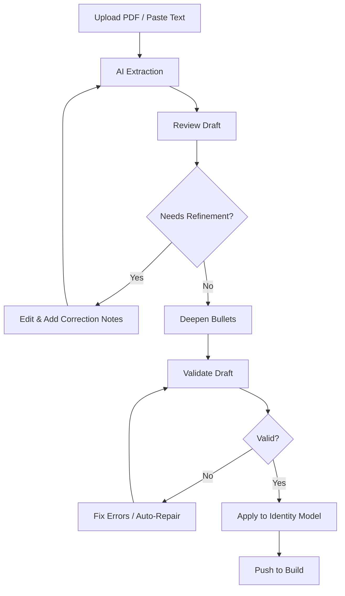
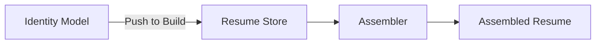
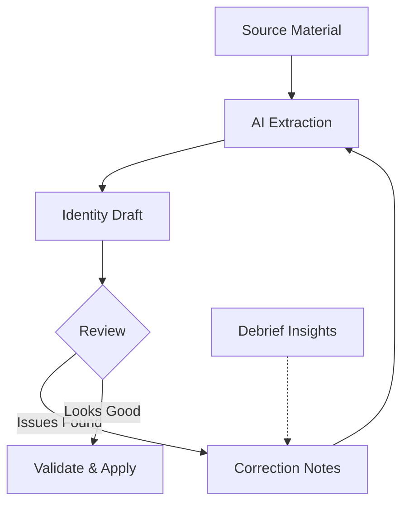

# Identity Workspace

The Identity workspace is **Phase 0** of the Facet workflow. Before you can assemble targeted resumes, you need a structured model of your professional identity — your roles, accomplishments, skills, projects, and education. This workspace turns unstructured career information into a validated identity model that feeds every downstream workspace.

## What You Will Learn

- Understand why identity modeling is the foundation of Facet's workflow
- Upload a PDF resume and extract structured data from it
- Paste raw text as an alternative intake method
- Review and edit extracted roles, bullets, skills, projects, and education
- Deepen individual bullets or bulk-deepen all bullets with AI analysis
- Validate your identity draft and apply it to the identity model
- Push your validated identity to the Build workspace
- Import and export identity JSON files for backup or transfer
- Use correction notes to refine extraction results

## Prerequisites

- Facet is running locally or via the hosted app
- You have a resume PDF or can paste your career information as text
- The AI proxy is configured (required for extraction and deepening features)
- You have read the [Getting Started](./getting-started.md) guide

---

## Why Identity Is Phase 0

Facet's core premise is that a resume should be assembled from a complete inventory of your career, not written from scratch for each application. The Identity workspace is where that inventory is created.

Without a structured identity model, the Build workspace has nothing to work with. Identity captures:

- **Roles** with companies, titles, dates, and categorized bullets
- **Skills** organized by category
- **Projects** with descriptions and technologies
- **Education** entries
- **Summary / headline** content

Once your identity model is populated and validated, every other Facet workspace — Build, Match, Letters, Prep — draws from it.

---

## Workspace Layout

The Identity workspace is organized as a responsive card grid with four primary sections:

| Card | Purpose |
| --- | --- |
| **Extraction Agent** | Upload or paste source material, add correction notes, trigger AI extraction |
| **Identity Model Builder** | Edit the structured identity JSON, validate, apply, push to Build |
| **Bullet Confidence** | View confidence scores and tags for extracted bullets |
| **Draft Summary** | Read AI-generated summaries and follow-up questions about your draft |

*Screenshot to be added*

---

## The Identity Workflow

The typical flow through the Identity workspace follows a linear progression from raw input to validated model:

You can enter this workflow at any point. If you already have an `identity.json` file from a previous session, import it directly into the Identity Model Builder and skip extraction entirely.

---

## Starting from a Resume PDF

The fastest way to populate your identity is to upload an existing resume.

1. Navigate to the **Identity** workspace using the sidebar.
2. In the **Extraction Agent** card, confirm the intake mode is set to **Upload** (the default).
3. Drag and drop your PDF onto the upload zone, or click the zone to open a file picker.
4. Facet extracts text from the PDF locally in your browser — the file is not sent to any server.
5. Once extraction completes, the raw text appears in the source panel and AI processing begins automatically.

*Screenshot to be added*

**Supported formats:** PDF files only. The scanner uses `pdfjs-dist` to extract text locally. Scanned-image PDFs (without embedded text) will produce empty or poor results — use the paste mode instead.

**What happens during upload:**

1. The PDF is read and text is extracted page by page in the browser.
2. The extracted text is sent to the AI proxy with a structured prompt.
3. The AI returns a structured identity draft with roles, bullets, skills, projects, and education.
4. The draft populates the Identity Model Builder card for review.

---

## Starting from Pasted Text

If you do not have a PDF, or if your PDF contains scanned images, use paste mode.

1. In the **Extraction Agent** card, switch the intake mode from **Upload** to **Paste**.
2. A text area appears. Paste your resume content, LinkedIn profile text, or any career narrative.
3. Optionally add **correction notes** in the notes input — these guide the AI on what to emphasize, fix, or restructure (more on this below).
4. Click the generate button to trigger AI extraction.
5. The structured draft appears in the Identity Model Builder card.

Paste mode accepts any freeform text. The AI is instructed to identify roles, companies, dates, accomplishments, skills, and education from whatever you provide.

---

## How AI Extraction Works

When you trigger extraction (via upload or paste), Facet sends your source text to an AI model through a configured proxy. The AI is prompted to:

- Identify distinct roles with company names, titles, and date ranges
- Categorize bullets under each role by type (accomplishment, responsibility, impact)
- Extract skills grouped by category (languages, frameworks, infrastructure, etc.)
- Identify projects with descriptions and associated technologies
- Capture education entries
- Assign **confidence scores** to each extracted bullet

The AI returns a structured JSON object that conforms to Facet's identity schema. If the response is malformed, the draft validator attempts auto-repair before presenting results.

**Correction notes** allow you to influence extraction. For example:

- "Focus on leadership and architecture work, downplay ops tasks"
- "The dates at Company X should be 2019-2022, not 2018-2021"
- "Add the Kubernetes migration project that isn't on this resume"

Correction notes are appended to the AI prompt alongside the source text, so the extraction incorporates your guidance from the start.

---

## Reviewing the Extracted Identity

After extraction, the **Identity Model Builder** card displays the structured draft as editable JSON. This is where you review and refine what the AI produced.

The identity model contains these top-level sections:

| Section | Contents |
| --- | --- |
| `roles` | Array of positions with company, title, dates, and bullet arrays |
| `bullets` | Individual accomplishments/responsibilities nested under roles |
| `skills` | Skills grouped by category |
| `projects` | Side projects, open-source work, or notable initiatives |
| `education` | Degrees, certifications, relevant coursework |
| `summary` | Professional summary or headline text |

The JSON editor provides real-time editing. You can:

- **Add** missing roles, bullets, skills, or projects directly in the JSON
- **Remove** irrelevant entries
- **Reword** bullets to better reflect your experience
- **Reorganize** bullets between roles
- **Correct** dates, titles, or company names

*Screenshot to be added*

---

## Bullet Confidence Scores

The **Bullet Confidence** card displays confidence metadata for each extracted bullet. During AI extraction, the model assigns each bullet:

- A **confidence score** indicating how certain the AI is about the bullet's accuracy and completeness
- **Tags** categorizing the bullet (e.g., leadership, technical, impact, process)

Use confidence scores to prioritize your review effort. Low-confidence bullets are the ones most likely to need editing or deepening.

*Screenshot to be added*

---

## Deepening Bullets

Extracted bullets are often thin — they capture *what* you did but miss *how* and *why it mattered*. Bullet deepening uses AI to enrich bullets with additional context.

### Single-Bullet Deepen

To deepen one bullet at a time:

1. In the **Bullet Confidence** card or the **Bullet Deepen Panel**, select a specific bullet.
2. Click the deepen action for that bullet.
3. The AI analyzes the bullet and returns enriched metadata:
   - **Confidence assessment** — how well the bullet communicates impact
   - **Assumptions** — what the AI inferred that you should verify
   - **Impact analysis** — quantified or clarified impact statements
   - **Suggested rewrites** — alternative phrasings with stronger specificity
4. Review the suggestions and incorporate what fits into your identity model.

### Bulk Deepen

To deepen all bullets at once:

1. Click the **Bulk Deepen** action (available when the identity model has bullets that haven't been deepened).
2. Facet queues every eligible bullet and processes them sequentially through the AI.
3. A **progress bar** tracks completion across the queue.
4. You can **cancel** the bulk operation at any time — bullets already deepened retain their results.
5. Once complete, all bullet confidence scores and metadata are updated.

Bulk deepen is useful after initial extraction when you want to enrich the entire identity model before pushing to Build. Individual deepen is better for targeted refinement after reviewing confidence scores.

*Screenshot to be added*

---

## Draft Validation

Before applying a draft to your identity model, Facet validates it against the expected JSON schema.

The **Draft Summary** card shows:

- An **AI-generated summary** of your identity draft — a quick narrative of what the model contains
- **Follow-up questions** the AI suggests you consider (gaps it noticed, ambiguities, missing context)
- **Validation status** — whether the draft conforms to the identity schema

If validation fails, Facet attempts **auto-repair**:

- Missing required fields are populated with sensible defaults
- Malformed JSON is corrected where possible
- Type mismatches are coerced (e.g., string dates normalized)

If auto-repair succeeds, the corrected draft replaces the invalid one. If it fails, the validation errors are displayed so you can fix them manually in the JSON editor.

---

## Applying the Draft

Once your draft is validated, you apply it to the identity model. The **Identity Model Builder** card offers two apply modes:

| Mode | Behavior |
| --- | --- |
| **Merge** | Adds new entries from the draft to the existing identity model. Existing entries (matched by ID) are preserved. Use this when iterating — you keep what you have and layer in new extractions. |
| **Replace** | Overwrites the entire identity model with the draft. Use this for a fresh start or when the draft represents a complete rewrite. |

Choose the appropriate mode and click **Apply**. The identity model in the builder updates immediately.

---

## Pushing to Build

When your identity model is complete and validated, push it to the Build workspace.

1. Confirm the identity model looks correct in the Identity Model Builder.
2. Click **Push to Build**.
3. Facet converts the identity structure into the `ResumeData` format that the Build workspace expects:
   - Roles become role components with bullets
   - Skills are mapped to skill line components
   - Projects become project components
   - Education maps to education components
4. The Build workspace's resume store is populated with the converted data.
5. Navigate to the **Build** workspace to begin assembling targeted resumes.

Pushing to Build is a one-way data flow. Changes you make in the Build workspace (priorities, vector assignments, overrides) do not propagate back to the Identity workspace. If you need to update your identity model later, return to the Identity workspace, make changes, and push again.

---

## Import and Export

You can save and load identity models as JSON files for backup, version control, or transfer between machines.

### Exporting

1. In the **Identity Model Builder** card, click the **Export** action.
2. Facet downloads an `identity.json` file containing your current identity model.
3. Store this file wherever you keep career documents.

### Importing

1. Click the **Import** action in the Identity Model Builder card.
2. Select an `identity.json` file from your file system.
3. The file is validated against the identity schema.
4. If valid, the imported data populates the builder. You can then choose to **merge** or **replace** as with any draft.

Import/export is useful for:

- **Backup** before making large changes
- **Sharing** a base identity model across devices
- **Version control** by saving snapshots at key milestones

---

## The Correction Notes Feedback Loop

The Identity workspace supports an iterative refinement cycle through correction notes.

1. **Initial extraction** produces a draft from your uploaded or pasted source material.
2. You review the draft and identify issues — missing context, wrong dates, emphasis problems.
3. Add **correction notes** describing what needs to change.
4. Re-run extraction. The AI incorporates your notes alongside the original source material.
5. Review the new draft. Repeat as needed.

This loop also connects to the **Debrief** workspace. After interviews or resume reviews, Debrief can surface insights that feed back as correction notes to Identity, keeping your professional model current with real-world feedback.

---

## Summary

The Identity workspace transforms unstructured career information into a validated, structured identity model. It supports two intake methods (PDF upload and text paste), AI-powered extraction with correction note guidance, confidence-scored bullet deepening, schema validation with auto-repair, and flexible apply modes (merge or replace). The validated identity model is pushed to the Build workspace where it becomes the foundation for targeted resume assembly.

Key points to remember:

- Identity is Phase 0 — nothing downstream works without it
- PDF text extraction happens locally in your browser
- Correction notes let you guide and iterate on AI extraction
- Bullet deepening (single or bulk) enriches thin bullets with impact and specificity
- Always validate before applying a draft
- Use merge mode to layer incremental changes; use replace for fresh starts
- Export regularly to maintain backups of your identity model

---

## Next Steps

- [Getting Started](./getting-started.md) — Return to the basics if you need to set up Facet
- [Vectors](./vectors.md) — Learn how to define positioning angles for your resumes
- [Match](./match.md) — Compare your identity against job descriptions
