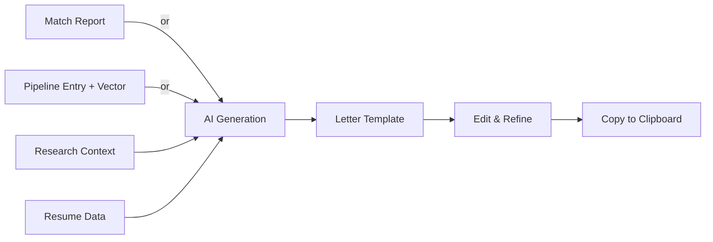
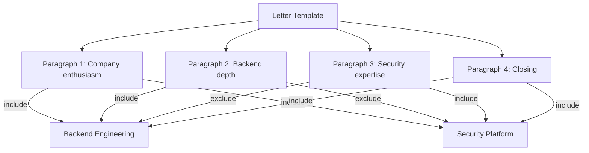

# Letters Workspace

The Letters workspace generates targeted cover letter drafts from match reports or pipeline opportunities, then refines them into reusable, vector-aware templates.

## What You Will Learn

- Navigate the Letters workspace layout
- Choose between match report and pipeline entry as a generation source
- Provide company research context to improve generation quality
- Generate a cover letter draft with AI
- Understand and edit the template structure (header, greeting, paragraphs, sign-off)
- Use the vector priority system to include or exclude paragraphs per vector
- Manage multiple templates in the sidebar
- Copy a finished letter to the clipboard

## Prerequisites

- A Facet configuration file loaded with at least one vector defined (see [Getting Started](./getting-started.md))
- Familiarity with vectors and how they represent positioning angles (see [Vectors](./vectors.md))
- For match-source generation: a completed match report in the Match workspace
- For pipeline-source generation: at least one entry in the Pipeline workspace

---

## Workspace Overview

Open the Letters workspace by clicking the **Letters** icon in the sidebar or navigating to `/letters`.

The workspace is divided into three areas:

| Area | Purpose |
| --- | --- |
| **Sidebar** (left) | Lists saved templates. Create new templates or delete existing ones. |
| **Generator** (center-top) | Configure a generation source, add research context, and trigger AI generation. |
| **Editor** (center-bottom) | Edit the active template's name, header, greeting, paragraphs, sign-off, and vector inclusions. |

When no template is selected, the editor area displays a prompt to either generate a new letter or create a blank template.

*Screenshot to be added*

---

## Generation Flow

The Letters workspace produces cover letter templates through a pipeline that combines your resume context, a generation source, and optional research notes.

You choose one of two generation sources, optionally attach research context, and the AI produces a structured template that you can edit and reuse.

---

## Choosing a Generation Source

The generator section offers a **source toggle** at the top with two modes:

### Match Report Source

Uses the most recent match report from the Match workspace. This mode is ideal when you have already analyzed a job description and want the cover letter to align with the match findings, including identified strengths, gaps, and recommended positioning.

Select **Match** in the source toggle. The generator displays the match report summary. If no match report exists, this option is disabled.

### Pipeline Entry Source

Uses a specific pipeline opportunity as context. This mode is useful when you are applying to a tracked opportunity and want the letter to reflect that company and role.

Select **Pipeline** in the source toggle, then:

1. Choose a **pipeline entry** from the dropdown (lists all entries from the Pipeline workspace).
2. Choose a **vector** from the vector dropdown to set the positioning angle for the letter.

The generator pulls the job description, company name, and role details from the selected pipeline entry.

---

## Adding Research Context

Below the source toggle, the generator provides a **Research Notes** text area. Use this field to paste any additional context that should inform the generated letter:

- Company mission statement or values
- Hiring manager name and background
- Recent company news or product launches
- Team-specific details from the job posting
- Notes from informational interviews

The research notes are prepended to the generation prompt, so the AI can weave company-specific details into the letter. More specific research produces more targeted output.

> **Tip:** Even a few sentences of company research dramatically improves the relevance of the generated letter. A generic letter and a targeted letter often differ by just two minutes of research.

---

## Generating a Cover Letter Draft

1. Select your **generation source** (Match or Pipeline).
2. If using Pipeline source, select the **pipeline entry** and **vector**.
3. Optionally add **research notes**.
4. Click the **Generate** button.

The AI processes your resume data, the selected source context, and your research notes to produce a structured cover letter template. Generation typically takes a few seconds.

Once complete, the template appears in the **editor** section and is saved to the sidebar. You can generate multiple templates and switch between them.

> **Note:** Generation requires a configured AI proxy. If the proxy URL is not set, the generate button is disabled.

---

## Understanding Template Structure

A generated (or blank) template consists of five sections:

| Section | Description |
| --- | --- |
| **Name** | A label for the template (e.g., "Acme Corp -- Backend Engineer"). Used in the sidebar list. |
| **Header** | Your contact information block at the top of the letter. |
| **Greeting** | The salutation line (e.g., "Dear Hiring Manager,"). |
| **Paragraphs** | The body of the letter. Each paragraph is an independent block with its own text and vector inclusions. |
| **Sign-off** | The closing line and signature (e.g., "Sincerely, ..."). |

All five sections are editable directly in the editor panel.

---

## Editing Paragraphs

Paragraphs are the core content blocks of the letter. Each paragraph is displayed as an editable text area in the editor.

You can:

- **Edit text** -- Click into any paragraph to modify its content.
- **Add a paragraph** -- Click the **Add Paragraph** button below the existing paragraphs to insert a new blank block.
- **Remove a paragraph** -- Click the delete button on any paragraph to remove it from the template.
- **Reorder paragraphs** -- Paragraphs are displayed in order. Rearrange them by removing and re-adding, or by editing in place.

Each paragraph also carries **vector inclusion** settings, described in the next section.

---

## Vector Priority System

The vector priority system is the key feature that makes a single template serve multiple positioning angles. Instead of writing a separate cover letter for each vector, you mark which paragraphs belong to which vectors.

In this example, Paragraphs 1 and 4 appear in both vectors. Paragraph 2 only appears when targeting Backend Engineering. Paragraph 3 only appears when targeting Security Platform. One template, two distinct letters.

### Setting Vector Inclusions

Each paragraph has a **vector priority editor** that lists all defined vectors. For each vector, toggle between:

- **Include** -- The paragraph appears when exporting for that vector.
- **Exclude** -- The paragraph is omitted when exporting for that vector.

By default, newly generated paragraphs are included for all vectors. Narrow the inclusions as you refine the template.

### When to Use Vector Inclusions

- **Opening paragraphs** that reference a specific technical domain should be included only for the matching vector.
- **General enthusiasm** or **company culture** paragraphs typically stay included for all vectors.
- **Technical depth** paragraphs should be included for the vector where that depth is most relevant.
- **Closing paragraphs** usually apply to all vectors.

---

## Managing Multiple Templates

The sidebar lists all saved templates by name. Use it to:

- **Select a template** -- Click any template name to load it in the editor.
- **Create a blank template** -- Click the **New** button in the sidebar to start from scratch.
- **Delete a template** -- Click the delete action next to a template name to remove it permanently.

Templates are persisted in local storage. They survive page refreshes but are local to the browser.

> **Tip:** Name templates after the company and role (e.g., "Stripe -- Platform Eng") so they are easy to find when you have multiple in progress.

---

## Copying a Letter to the Clipboard

When the template is ready, use the **Copy** button in the editor toolbar to copy the full letter text to your clipboard. The exported text includes the header, greeting, all included paragraphs (respecting the current vector selection if applicable), and the sign-off.

Paste the result directly into an email, application form, or document.

---

## Tips for Better Letters

1. **Invest in research context.** The single highest-impact action is pasting 3-5 sentences of company-specific research into the Research Notes field before generating.

2. **Start from a match report when possible.** Match-source generation produces letters that are naturally aligned with the job requirements the analysis identified.

3. **Use vector inclusions aggressively.** A well-tagged template with 6 paragraphs can produce 3 distinct letters for 3 vectors. This saves significant time across multiple applications.

4. **Edit the AI output.** Generated text is a strong starting draft, not a finished letter. Adjust tone, add personal anecdotes, and remove any phrasing that does not sound like you.

5. **Keep templates lean.** Three to four paragraphs is the sweet spot. Hiring managers skim; make every paragraph count.

6. **Re-generate rather than over-edit.** If a template drifts too far from its original intent, generate a fresh draft with updated research notes rather than patching.

---

## Summary

The Letters workspace turns your resume data and job research into targeted cover letter drafts. The dual-source generator pulls context from match reports or pipeline entries, while the vector priority system lets a single template produce different letters for different positioning angles. Edit the structured template sections, tag paragraphs with vector inclusions, and copy the result when ready.

---

## Next Steps

- [Getting Started](./getting-started.md) -- Set up your resume data and configuration
- [Vectors](./vectors.md) -- Define the positioning angles that drive paragraph inclusions
- [Pipeline](./pipeline.md) -- Track job opportunities that feed into letter generation
- [Match](./match.md) -- Analyze job descriptions to produce match reports
