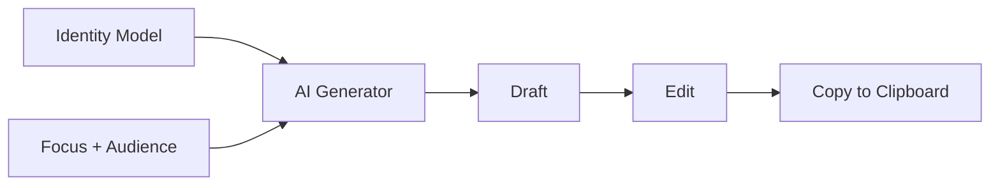

# LinkedIn Profile Generator

The LinkedIn workspace generates polished LinkedIn profile content -- headline, about section, top skills, and featured highlights -- directly from your identity model. You control the angle and audience, and AI handles the first draft. Everything is editable afterward.

## What You Will Learn

- Navigate the LinkedIn workspace layout
- Set a focus area and target audience for generation
- Generate a LinkedIn profile draft from your identity model
- Edit the headline, about section, skills, and highlights
- Manage multiple drafts for different campaigns
- Copy a finished draft to your clipboard

## Prerequisites

- An **applied identity model** in the Identity workspace. The generator reads your roles, bullets, skills, and other identity data to produce content. If no identity model is applied, the generator will have nothing to work from.
- The **AI proxy** configured. Without it, generation is unavailable -- but you can still create and edit blank drafts manually.

---

## Workspace Layout

The LinkedIn workspace is divided into three panels.

**Sidebar** (left) -- Lists your saved drafts. Click a draft to select it. Use the buttons at the top to create a new blank draft or delete the selected one.

**Generator** (center) -- Where you configure and launch AI generation. Contains the focus area input, audience input, an identity context card showing what data the generator will draw from, and the Generate button.

**Editor** (right) -- Displays the selected draft's fields: name, headline, about, top skills, and featured highlights. All fields are directly editable.

*Screenshot to be added*

---

## Setting Focus Area and Audience

Before generating, tell the AI what angle to take and who the content is for.

**Focus area** describes your positioning. Examples:

- "Staff platform engineer"
- "Backend leadership"
- "Security architecture"
- "Full-stack product engineer"

**Target audience** describes who will read the profile. Examples:

- "Recruiters at large tech companies"
- "Hiring managers"
- "Startup founders"
- "Engineering peers"

These two inputs shape the tone, emphasis, and vocabulary of the generated content. A "security architecture" focus aimed at "startup founders" produces different output than the same focus aimed at "recruiters."

> Leave either field empty and the generator will use a general-purpose default. But specific inputs produce better results.

---

## Generating a Draft

1. Enter your **focus area** in the focus input field.
2. Enter your **target audience** in the audience input field.
3. Review the **identity context card** below the inputs. It shows counts of roles, bullets, skills, and other data from your applied identity model. If the counts are zero, apply an identity model first.
4. Click **Generate**.
5. The AI produces a complete draft with headline, about section, top skills, and featured highlights. The draft appears in the editor panel and is saved to the sidebar automatically.

Generation takes a few seconds. The button shows a loading state while the AI is working.

---

## Editing the Headline

The headline field appears at the top of the editor. LinkedIn headlines are short (up to ~220 characters) and serve as your positioning statement.

Click the field and type directly. The draft saves automatically as you edit.

Tips for headlines:

- Lead with your strongest title or capability
- Include the domain or specialization from your focus area
- Keep it scannable -- recruiters skim

---

## Writing the About Section

The about field is a multi-line text area below the headline. This is your narrative pitch -- the longest piece of content the generator produces.

Edit it like any text field. Line breaks are preserved. The generator typically produces 3-5 paragraphs covering your experience arc, core strengths, and what you are looking for.

Refinement suggestions:

- Read it aloud -- LinkedIn "about" sections should feel conversational but professional
- Front-load the most important information; many readers only see the first few lines before "see more"
- Add a call-to-action at the end if appropriate ("Open to staff+ platform roles in...")

---

## Managing Top Skills

Top skills are displayed as a line-separated list. Each line is one skill.

- Add a skill by typing on a new line
- Remove a skill by deleting its line
- Reorder by cutting and pasting lines

The generator populates this from the skills in your identity model, filtered and ranked by relevance to your focus area. Edit freely -- LinkedIn profiles typically show 5-10 top skills.

---

## Managing Featured Highlights

Featured highlights work the same way as top skills: one highlight per line.

These represent achievements, projects, or talking points you would feature on your LinkedIn profile. The generator pulls these from your identity model's bullets and roles, selecting the most impactful items for your focus area.

Edit, add, or remove lines as needed.

---

## Managing Multiple Drafts

You can maintain several drafts simultaneously -- one per campaign, audience, or positioning angle.

**Create a blank draft:** Click the **+** button in the sidebar. A new untitled draft appears with empty fields.

**Switch between drafts:** Click any draft in the sidebar to load it into the editor.

**Delete a draft:** Select the draft in the sidebar, then click the delete button. This is immediate and cannot be undone.

**Rename a draft:** Edit the name field at the top of the editor panel.

A practical pattern: generate a draft focused on "platform engineering" for "recruiters," then generate a second draft focused on "engineering leadership" for "hiring managers." Keep both and use whichever fits the opportunity.

---

## Copying to Clipboard

When a draft is ready, use the **Copy** button in the editor toolbar to copy the full draft as formatted text. Paste it directly into LinkedIn's profile editor.

The export includes all four sections (headline, about, top skills, featured highlights), clearly labeled and separated.

---

## Tips

**Match focus to campaign phase.** Early in a job search, use a broad focus ("senior backend engineer") to cast a wide net. As you target specific roles, narrow the focus ("distributed systems tech lead") and regenerate.

**Vary audience by channel.** If you are networking with peers, generate with audience "engineering peers" for a more technical tone. Switch to "recruiters" when you are optimizing for inbound recruiter traffic.

**Use drafts as versions, not replacements.** Keep your previous drafts around. If a new angle does not land, you can switch back without regenerating.

**Edit after generating.** The AI gives you a strong starting point, but your voice matters. Rewrite phrases that do not sound like you. Add specific numbers, project names, or outcomes the AI could not know.

---

## Summary

The LinkedIn workspace turns your identity model into ready-to-use LinkedIn profile content. Set a focus area and audience, generate with AI, then refine the headline, about section, skills, and highlights. Maintain multiple drafts for different campaigns and copy the finished result to your clipboard.

---

## Next Steps

- [Getting Started](getting-started.md) -- Initial setup and core concepts
- [Identity](identity.md) -- Build the identity model that feeds the LinkedIn generator
- [Vectors](vectors.md) -- Define positioning angles for your resume (the same thinking applies to LinkedIn focus areas)
