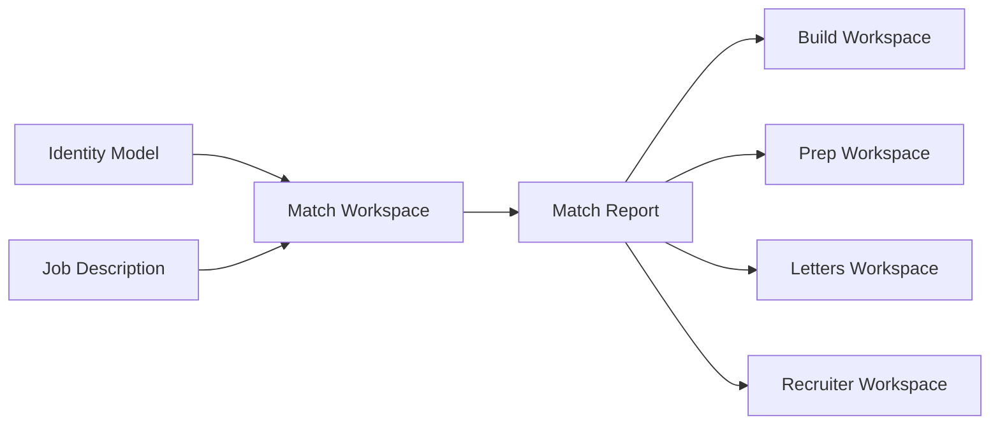
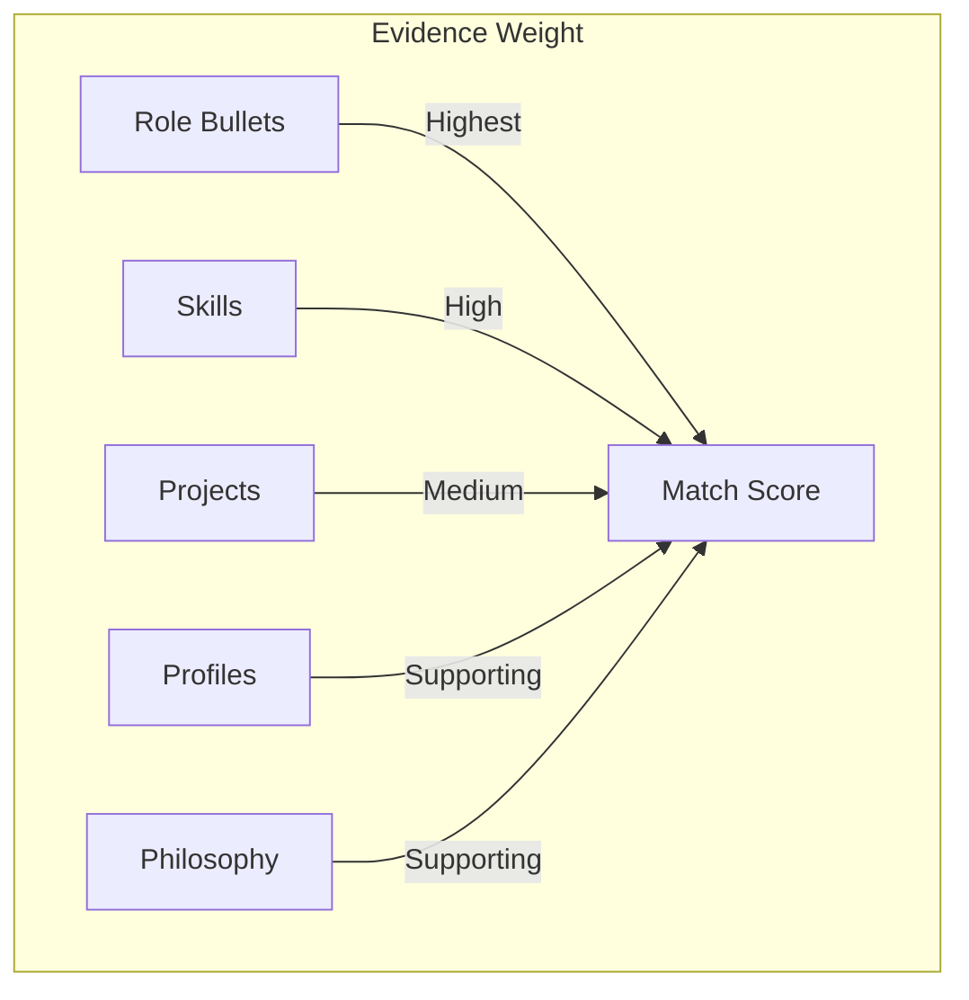

# Match Workspace

The Match workspace is Phase 1 of the Facet job-targeting pipeline. It compares your professional identity model against a specific job description, producing a comprehensive match report that quantifies fit, surfaces your strongest evidence, and identifies gaps before you invest time assembling a resume.

## What You Will Learn

- Understand the purpose of the Match workspace in the Facet pipeline
- Prepare your identity model as a prerequisite for match analysis
- Paste a job description and generate a match report
- Read the match score and overview cards
- Interpret advantages, evidence, and requirement coverage
- Identify gaps and apply positioning recommendations
- Assemble a matched vector into the Build workspace
- Work with recent report history
- Export match reports as JSON

## Prerequisites

- An **applied identity model** in the Identity workspace. Match analysis reads your scanned and applied identity to score coverage. If no model is applied, the Match workspace will prompt you to complete the Identity workflow first.
- A **job description** to analyze. Any plaintext JD works -- copy it from a job board, email, or PDF.
- An active **AI proxy connection**. Match analysis is AI-dependent; the proxy URL must be configured in your environment.

> See the [Identity guide](./identity.md) for instructions on scanning and applying your professional identity model.

---

## How Match Fits the Pipeline

Match is the first analytical step after you have established your identity model. Rather than jumping straight into resume assembly, Match gives you a data-driven view of how your professional assets align with a specific opportunity.

The match report flows downstream. Once generated, it can feed the Build workspace (via a handoff that creates a pre-configured vector), inform interview prep, shape cover letters, and guide recruiter outreach.

---

## Pasting a Job Description

The **Analysis Input Panel** occupies the top of the Match workspace. It contains a text area where you paste the full job description.

1. Copy the job description from your source (job board, recruiter email, internal posting).
2. Navigate to the Match workspace (`/match`) using the sidebar.
3. Paste the text into the JD input area.
4. Optionally, review the text for formatting artifacts. The analyzer handles most formatting, but removing extraneous headers or footers can improve results.

*Screenshot to be added*

The input panel also displays a **Generate Match Report** button. This button is disabled until both a job description is present and an applied identity model exists.

---

## Generating a Match Report

Once you have pasted a JD and confirmed your identity model is applied, click **Generate Match Report**.

Behind the scenes, the Match workspace:

1. Reads your applied identity model from the identity store (bullets, skills, projects, profiles, philosophy, and all associated metadata)
2. Sends the identity model and job description to the AI proxy for analysis
3. Receives a structured match report with scores, advantages, requirement mappings, evidence rankings, and gap analysis
4. Stores the report in the match store and adds it to your recent report history

Analysis typically takes 10-30 seconds depending on the length of the JD and the size of your identity model. A loading indicator is displayed during processing.

> Match analysis is AI-dependent. The AI decomposes the job description into discrete requirements, scores your identity coverage against each requirement, infers strategic advantages, and generates positioning recommendations.

---

## Reading the Match Score and Overview Cards

After analysis completes, the **Match Overview** section displays four summary cards at the top of the report.

| Card | Description |
|------|-------------|
| **Match Score** | Overall match percentage (0-100%). Reflects how well your combined identity assets cover the JD requirements, weighted by requirement priority. |
| **Requirements** | Total number of discrete requirements extracted from the JD. |
| **Advantages** | Number of clustered strength claims the AI identified from your identity. |
| **Gaps** | Number of requirements where your identity has insufficient or no coverage. |

*Screenshot to be added*

The match score is a weighted calculation. Requirements the AI classifies as higher priority contribute more to the overall score. A 75%+ score generally indicates strong alignment; below 50% suggests significant gaps that need strategic positioning.

---

## Understanding the Summary

Below the overview cards, the **Summary** section provides a narrative assessment of the match. This is an AI-generated paragraph that describes:

- Your overall positioning relative to the role
- Key areas of strength
- Notable concerns or gaps
- A general recommendation on whether and how to pursue the opportunity

The summary is designed to give you a quick read on fit before you dive into the detailed sections.

---

## Advantages and Evidence

The **Advantages** section presents your strongest selling points for this specific role, clustered into thematic groups.

Each advantage includes:

- A **claim** -- a concise statement of the advantage (e.g., "Deep experience scaling distributed systems under production pressure")
- **Supporting evidence** drawn from across your identity model, including:
  - Role bullets (highest weight)
  - Skills
  - Projects
  - Profiles
  - Philosophy statements

### How Evidence Is Weighted

The AI assigns match relevance across multiple asset types. Not all evidence carries equal weight:

- **Role bullets** carry the most weight because they represent concrete, demonstrated experience with measurable outcomes.
- **Skills** contribute significantly as they represent verified capabilities.
- **Projects** provide additional proof through completed work.
- **Profiles** and **philosophy** statements add context and positioning but are weighted as supporting evidence rather than primary proof.

This weighting ensures your match score reflects demonstrated capability rather than aspirational claims.

*Screenshot to be added*

---

## Requirement Coverage

The **Requirement Coverage** section is the most detailed part of the report. It lists every requirement the AI extracted from the job description, each with:

- The **requirement text** as parsed from the JD
- A **coverage score** indicating how well your identity addresses it
- **Matched assets** -- the specific bullets, skills, or projects that provide coverage
- **Tags** classifying the requirement (e.g., technical skill, leadership, domain knowledge)

Requirements are sorted by coverage score, making it easy to scan from strongest coverage to weakest. Requirements with no matching assets appear at the bottom and feed directly into the Gaps section.

Use this section to:

- Verify the AI correctly interpreted the JD requirements
- See exactly which parts of your identity address each requirement
- Identify requirements where your coverage is thin but not absent -- these are opportunities to emphasize different bullets or add variant text in the Build workspace

*Screenshot to be added*

---

## Gaps and Positioning Recommendations

The **Gaps & Positioning** section addresses requirements where your identity has insufficient or no coverage.

Each gap includes:

- The **unmet requirement** from the JD
- A **severity classification**: high, medium, or low
  - **High severity**: A core requirement with no matching assets. These are potential deal-breakers.
  - **Medium severity**: A stated requirement with only partial or tangential coverage.
  - **Low severity**: A nice-to-have requirement or one where adjacent experience could bridge the gap.
- **Positioning recommendations**: AI-generated suggestions for how to frame your experience to mitigate the gap

Positioning recommendations might suggest:

- Emphasizing adjacent or transferable experience
- Highlighting rapid learning patterns from your history
- Reframing existing bullets with variant text focused on the gap area
- Acknowledging the gap while positioning compensating strengths

This section is where Match delivers its highest strategic value. Rather than simply flagging what you lack, it helps you decide whether to pursue the opportunity and how to frame your application.

*Screenshot to be added*

---

## Top Evidence

The **Top Evidence** section ranks your identity assets by their relevance to this specific JD. It surfaces the highest-scoring items across all asset types:

- **Bullets** -- your most relevant role experience statements
- **Skills** -- capabilities that directly match JD requirements
- **Projects** -- completed work that demonstrates required competencies
- **Profiles** -- professional summaries or positioning statements with relevance
- **Philosophy** -- values or approaches that align with the role's culture or methodology

This is a useful quick-reference when you move to the Build workspace. The top evidence list tells you which components should be prioritized highest in your assembled resume.

*Screenshot to be added*

---

## Assembling a Matched Vector into Build

One of the most powerful features of the Match workspace is the ability to hand off your analysis directly to the Build workspace.

Click the **Assemble in Build** action to:

1. Create a pending handoff containing the match report data
2. Navigate to the Build workspace (`/build`)
3. Pre-configure a vector with priority overrides informed by the match analysis

The handoff ensures that the insights from your match report translate directly into assembly decisions. Bullets and components that scored highest against the JD are elevated in priority; gaps inform which optional components to include or exclude.

> The handoff creates a **pending analysis** in the handoff store. The Build workspace detects this pending analysis and applies it when you arrive. You do not need to manually reconfigure priorities.

This integration eliminates the gap between analysis and execution. Instead of reading a report and then manually adjusting your resume, the Match workspace feeds the Build workspace the data it needs to assemble an optimized resume automatically.

---

## Recent Report History

The **Recent Reports** section at the bottom of the Match workspace maintains a local history of your last 10 analyses. Each entry shows:

- The date and time of the analysis
- A summary or identifier for the JD analyzed
- The match score

Click any recent report to reload it into the workspace. This is useful for:

- Comparing match scores across multiple opportunities
- Revisiting a previous analysis after updating your identity model
- Returning to an analysis you generated earlier in your job search

Report history is stored locally in the match store and persists across browser sessions.

*Screenshot to be added*

---

## Exporting Match Reports

You can export any match report as JSON for archival, sharing, or external processing.

The exported JSON includes the complete report structure:

- Match score and overview metrics
- Full summary text
- All advantages with evidence
- Complete requirement coverage data
- Gaps with severity and positioning recommendations
- Top evidence rankings
- The original JD text
- Timestamp

Use the **Export JSON** action in the workspace toolbar. The file downloads to your default downloads directory.

Exported reports are useful for:

- Keeping records of your job search analysis
- Sharing match data with a career coach or mentor
- Importing into other tools for further analysis

---

## Summary

The Match workspace bridges the gap between having a professional identity model and assembling a targeted resume. By analyzing a job description against your identity, it provides:

- A quantified match score so you can prioritize opportunities
- Evidence-backed advantages you can lead with
- Requirement-level coverage so you know exactly where you stand
- Gap analysis with actionable positioning to address weaknesses
- A direct handoff to Build that carries your analysis into assembly

Use Match before every application to make data-driven decisions about which opportunities to pursue and how to position yourself for each one.

---

## Next Steps

- [Identity](./identity.md) -- Set up and apply your professional identity model (prerequisite for Match)
- [Vectors](./vectors.md) -- Understand how positioning vectors work across the pipeline
- [Pipeline](./pipeline.md) -- Track opportunities that feed into match analysis
- [Getting Started](./getting-started.md) -- Return to the overview if you are new to Facet
