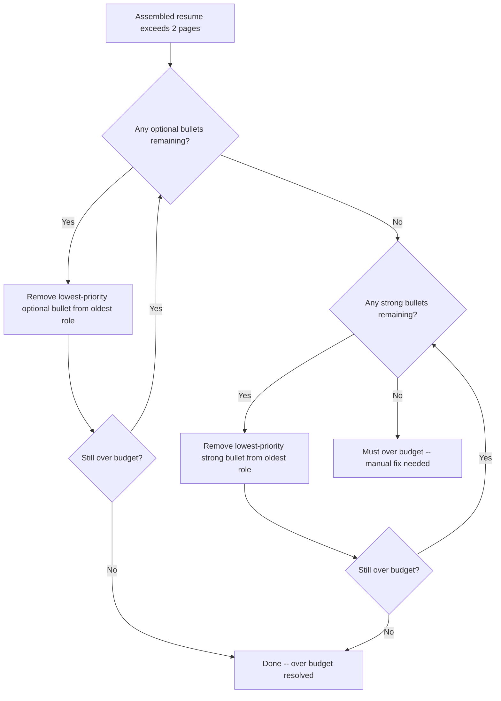

# Page Budget

## What You Will Learn

This guide explains how Facet enforces a target page count for your resume:

- What the page budget is and why it exists
- How pages and lines are estimated
- How to read the status bar indicators
- How auto-trimming decides which bullets to cut
- What each warning means and how to resolve it
- Strategies for staying within budget while keeping your strongest content

## Prerequisites

- A resume with components and at least one vector selected
- Familiarity with priority levels (`must`, `strong`, `optional`, `exclude`)
- Basic understanding of overrides and bullet ordering (see [NAVIGATOR.md](../NAVIGATOR.md) for related guides)

---

## What Is the Page Budget?

Facet targets a **two-page resume**. This is the standard expectation for senior engineering roles: long enough to demonstrate depth, short enough to respect a reader's time.

The page budget is not a hard cap that blocks you from adding content. Instead, it is an intelligent system that:

1. Estimates how many pages your assembled resume will occupy.
2. Warns you when you are approaching or exceeding the target.
3. Automatically trims lower-priority content to fit when possible.
4. Alerts you when automatic trimming is insufficient and manual intervention is required.

---

## How Page Estimation Works

The page budget engine estimates resume length using a line-counting heuristic rather than rendering the full document.

### Parameters

| Parameter         | Value          | Description                                    |
|-------------------|----------------|------------------------------------------------|
| Lines per page    | 58             | Maximum content lines that fit on one page     |
| Characters per line | 92           | Approximate characters before a line wraps     |

### Estimation Logic

Each element of the assembled resume is converted into an estimated line count:

- **Section headers** contribute a fixed number of lines (including spacing).
- **Bullet points** are measured by character count. A bullet with 92 or fewer characters counts as one line. Longer bullets are divided by the characters-per-line value and rounded up.
- **Role headers**, **education entries**, **skill groups**, and **target lines** each have fixed or semi-fixed line estimates based on their typical rendered height.

The total line count is divided by 58 to produce a page estimate. This estimate closely approximates the final Typst-rendered output, though minor discrepancies are possible due to font metrics and spacing nuances.

---

## Status Bar Indicators

The status bar at the bottom of the Facet window displays the current page budget state. There are four distinct states:

### Normal (Default)

- **Appearance:** Standard status bar, no highlight.
- **Meaning:** Your assembled resume is comfortably within the two-page target (estimated below 1.8 pages).
- **Action required:** None.

### Near Budget (Yellow)

- **Appearance:** Yellow background on the page indicator.
- **Trigger:** Estimated page count is **1.8 pages or higher** but not yet over 2.0 pages.
- **Meaning:** You are approaching the limit. Adding more content or switching to a vector with more included components may push you over budget.
- **Action required:** No immediate action, but be mindful when adding content. Consider reviewing lower-priority components.

### Over Budget (Red, Auto-Trimmed)

- **Appearance:** Red background on the page indicator.
- **Trigger:** Estimated page count exceeds 2.0 pages, but the system was able to trim enough `optional` or `strong` bullets to bring it back within budget.
- **Meaning:** Auto-trimming has removed some bullets from your resume. The preview reflects these removals.
- **Action required:** Review the assembled result. If important content was trimmed, consider manually excluding less important components or switching bullet text to shorter variants.

### Must Over Budget (Red, Manual Fix Needed)

- **Appearance:** Red background with a distinct warning message.
- **Trigger:** Even after trimming all `optional` and `strong` bullets, the `must`-priority content alone exceeds the two-page budget.
- **Meaning:** You have more `must`-priority content than can physically fit. The system cannot resolve this automatically because it never trims `must` bullets.
- **Action required:** Manual intervention is required. See [Fixing a Must Over Budget Warning](#fixing-a-must-over-budget-warning) below.

<!-- Screenshot placeholder: Status bar in each of the four states -->

---

## Auto-Trimming

When the assembled resume exceeds the page budget, Facet automatically trims bullets to fit. The trimming algorithm follows a strict priority order to preserve your most important content.

### Trimming Rules

### Key Principles

1. **Optional bullets are trimmed first.** These are your lowest-priority content and are removed before anything else.
2. **Strong bullets are trimmed second.** Only after all trimmable optional bullets have been removed.
3. **Must bullets are never trimmed.** The system treats `must` as inviolable. If must-only content exceeds the budget, the system reports an error instead of cutting.
4. **Oldest roles are trimmed first.** Within a given priority level, bullets are removed starting from the oldest (bottom-most) roles. This preserves detail in your most recent and presumably most relevant experience.
5. **Trimming happens per-assembly.** Each time the assembler runs (on any relevant state change), trimming is recalculated from scratch. There is no persistent "trimmed" state.

---

## Warning Meanings and Fixes

### Near Budget (Yellow)

**What happened:** Your content is approaching two pages.

**How to fix:**
- Review `optional` bullets across all roles. Set any that are not contributing to your vector narrative to `exclude`.
- Consider whether any roles have excessive bullet counts. Three to five bullets per role is typical.
- Check if shorter text variants exist for verbose bullets.

### Over Budget, Auto-Trimmed (Red)

**What happened:** The system removed some `optional` or `strong` bullets to fit.

**How to fix:**
- Open the assembled view and identify which bullets were trimmed.
- If trimmed bullets were important, elevate them to a higher priority or manually exclude less important content elsewhere.
- If the trimming is acceptable, no action is needed. The preview and PDF reflect the trimmed state accurately.

### Fixing a Must Over Budget Warning

**What happened:** Your `must`-priority content alone exceeds two pages.

**How to fix:**
1. **Audit must priorities.** Open each role and review which bullets are set to `must` for the active vector. Demote anything that is not genuinely essential to `strong` or `optional`.
2. **Use shorter variants.** If a `must` bullet has a concise text variant, switch to it.
3. **Consolidate roles.** If you have many roles each with `must` bullets, consider whether older roles can be reduced to fewer must-level points.
4. **Check non-bullet content.** Target lines, skill groups, and education entries also consume space. Ensure these are not inflated.

As a general rule, if more than 60% of your bullets for a given vector are set to `must`, you are likely being too aggressive with that priority level.

---

## Strategies for Staying Within Budget

### Be Selective with Must

Reserve `must` priority for content that is genuinely indispensable to a specific vector. A good test: if removing this bullet would make the resume misleading about your qualifications for this angle, it is `must`. Otherwise, `strong` is usually appropriate.

### Use Exclude Actively

The `exclude` priority is not just for irrelevant content. Use it to explicitly remove components that, while true, do not serve the current vector. A backend engineering vector does not need your mobile development bullets, even if they are technically accurate.

### Prefer Shorter Variants

Text variants let you express the same accomplishment at different lengths. For vectors where budget is tight, assign the concise variant. Save the detailed version for vectors where you have space to spare.

### Trim Older Roles First

Your most recent two to three roles should carry the most detail. Older roles can often be reduced to one or two `must` bullets each. The auto-trimmer follows this same philosophy by targeting oldest roles first.

### Monitor the Status Bar

Develop a habit of glancing at the status bar after each change. Catching a yellow warning early is easier to address than resolving a red warning after extensive editing.

---

## Interaction with Other Features

### Manual Overrides

Manual overrides (include/exclude) interact with the page budget. If you manually include a component that was auto-trimmed, the system will re-run trimming and may remove a different bullet to compensate. Conversely, manually excluding components frees up budget space.

### Bullet Ordering

Bullet order within a role does not affect whether a bullet is trimmed. Trimming is determined by priority level, not position. However, bullet order does affect visual presentation -- place your strongest points first regardless of trimming concerns.

### Text Variants

Switching to a shorter text variant for a bullet reduces its estimated line count. This can be enough to move from "over budget" back to "near budget" or "normal" without losing any content -- only verbosity.

### Presets

Presets capture your override and variant state for a given vector. If you have carefully tuned a vector to fit within budget, saving a preset preserves that work. Loading a different preset may change the budget state, so check the status bar after switching presets.

---

## Summary

The page budget system keeps your resume at an effective two-page length. It estimates pages using a 58-line, 92-character heuristic, warns you through four status bar states (normal, near budget, over budget, must over budget), and automatically trims lower-priority bullets starting from the oldest roles. Must-priority content is never auto-trimmed, so maintaining discipline with `must` assignments is the single most important factor in budget management.

## Next Steps

- [Preview and Export](./preview-and-export.md) -- verify your budget-optimized resume in the PDF preview before downloading
- [NAVIGATOR.md](../NAVIGATOR.md) -- find guides for vectors, overrides, and component management
