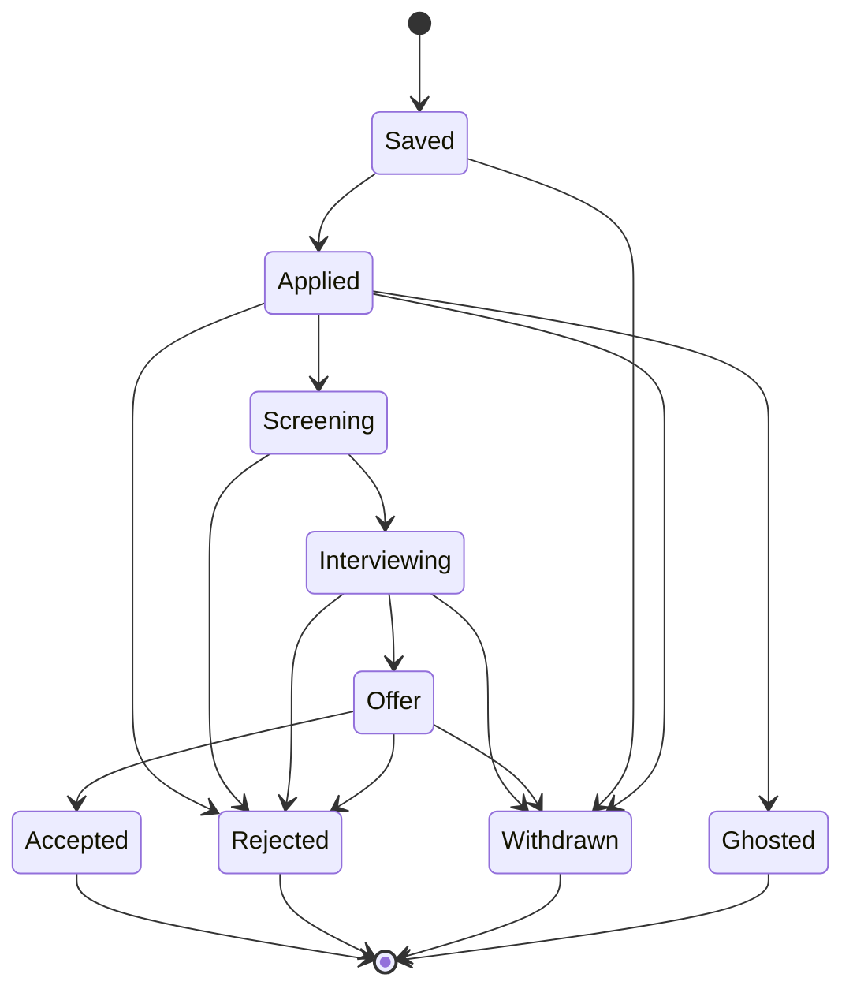
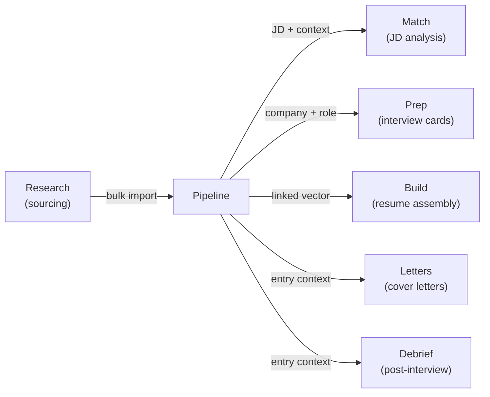

# Pipeline Workspace

The Pipeline workspace is the central hub for tracking every job opportunity in your search. It gives you a single view of all active targets, from initial discovery through final outcome, and connects each opportunity to the rest of Facet's workspaces.

## What You Will Learn

- Navigate the Pipeline workspace and understand its layout
- Add new opportunities manually and via JD paste
- Organize entries with the tier system
- Track entry status through the application lifecycle
- Filter, search, and sort your pipeline
- Expand entries to view and edit details
- Launch to other workspaces (Match, Prep, Build) from an entry
- Import and export pipeline data
- Use the analytics overlay to assess your search
- Understand how Pipeline connects to upstream and downstream workspaces

## Prerequisites

- Familiarity with the Facet app shell and sidebar navigation (see [Getting Started](./getting-started.md))
- A basic understanding of vectors (see [Vectors](./vectors.md))

---

## The Pipeline at a Glance

The Pipeline workspace lives at `/pipeline` and is accessible from the icon sidebar. It is organized into four visual regions stacked vertically:

1. **Header Actions** -- buttons to add an entry, paste a JD, import/export data, and open analytics
2. **Pipeline Stats** -- summary counts showing totals and breakdowns by tier and status
3. **Filter/Sort Bar** -- controls for narrowing and ordering the table
4. **Pipeline Table** -- the main list of entries with expandable rows

*Screenshot to be added*

---

## Adding Entries

There are two ways to add an opportunity to your pipeline: manual entry and JD paste.

### Manual Entry

1. Click the **Add Entry** button in the header.
2. The entry modal opens with empty fields for company, role, URL, tier, status, vector, notes, and the full job description.
3. Fill in at least the company and role.
4. Choose a tier and an initial status (defaults to **Saved**).
5. Optionally link the entry to an existing vector from the Build workspace.
6. Click **Save**.

The new entry appears immediately in the pipeline table.

### Paste JD Quick-Add

When you have a job description copied to your clipboard, the Paste JD flow extracts key fields automatically.

1. Click the **Paste JD** button in the header.
2. The Paste JD modal opens with a large text area.
3. Paste the full job posting text.
4. Click **Parse**. Facet sends the text to the AI proxy and extracts the company name, role title, and a match assessment.
5. Review the extracted fields. Edit anything the parser got wrong.
6. Click **Save** to add the entry.

> **Note:** JD parsing requires the AI proxy. If the proxy is unavailable, you can still paste the text and fill in the company and role manually.

---

## The Tier System

Tiers let you prioritize opportunities by how much effort they deserve. Every entry is assigned one of four tiers:

| Tier | Intent | When to Use |
|------|--------|-------------|
| **Tier 1** | Top priority | Dream roles that justify full customization -- tailored resume, cover letter, deep prep |
| **Tier 2** | Strong interest | Good fits worth solid effort but not full bespoke treatment |
| **Tier 3** | Opportunistic | Worth applying to but only with minimal extra work |
| **Watch** | Monitoring | Interesting companies or roles you are not ready to pursue yet |

Tiers affect how you allocate your time. A Tier 1 entry might warrant launching Match analysis, writing a targeted cover letter in Letters, and building interview prep cards, while a Tier 3 entry might only need a quick resume export.

You can change an entry's tier at any time from the entry modal.

---

## Status Tracking

Each entry carries a status that reflects where it stands in the application lifecycle. Statuses are updated inline or through the entry modal.

The available statuses are:

| Status | Meaning |
|--------|---------|
| **Saved** | Captured but not yet acted on |
| **Applied** | Application submitted |
| **Screening** | Initial recruiter screen scheduled or completed |
| **Interviewing** | Active interview loop |
| **Offer** | Offer received |
| **Accepted** | Offer accepted |
| **Rejected** | Rejected at any stage |
| **Withdrawn** | You withdrew your application |
| **Ghosted** | No response after a reasonable period |

The typical lifecycle flows through these statuses:

Statuses are not enforced in order. You can move an entry to any status at any time, which is useful when stages overlap or when you receive updates out of sequence.

---

## Filtering, Searching, and Sorting

The filter/sort bar sits between the stats row and the table. It provides three controls:

### Filter by Tier

Select one or more tiers to show only entries at those priority levels. When no tier filter is active, all tiers are shown.

### Filter by Status

Select one or more statuses to narrow the table. Combining status and tier filters is an intersection -- only entries matching both appear.

### Search

Type into the search field to filter by company name or role title. The search is case-insensitive and matches partial strings.

### Sort

Choose a sort field from the dropdown. Available sort options include:

- **Date Added** (newest first)
- **Company** (alphabetical)
- **Role** (alphabetical)
- **Tier** (highest priority first)
- **Status** (by lifecycle stage)

*Screenshot to be added*

---

## The Pipeline Table

The table is the primary view of your pipeline. Each row shows:

- **Company** and **Role** -- the opportunity identity
- **Tier** badge -- color-coded by priority
- **Status** badge -- color-coded by lifecycle stage
- **Date Added** -- when you created the entry
- **Action buttons** -- quick launchers for other workspaces

### Expanding a Row

Click a row to expand it and reveal the full entry details:

- **Job description** (if provided)
- **URL** to the original posting
- **Notes** you have added
- **Linked vector** for resume targeting
- **Edit** and **Delete** controls

From the expanded view, you can open the entry modal to edit all fields or delete the entry entirely.

### Inline Status Change

The status badge on each row is interactive. Click it to cycle through statuses or open a dropdown to jump to a specific status without opening the full modal.

### Action Buttons

Each row includes action buttons that launch directly into other workspaces with the entry's context pre-loaded:

| Button | Target Workspace | What Happens |
|--------|------------------|--------------|
| **Analyze** | Match | Opens Match with the entry's JD for analysis |
| **Prep** | Prep | Opens Prep with the entry's company and role pre-filled |
| **Build** | Build | Opens Build with the entry's linked vector selected |

These launchers eliminate context-switching. Instead of navigating to another workspace and manually selecting the right context, you jump straight there from the entry.

---

## Editing and Deleting Entries

To edit an entry:

1. Expand the row or click the **Edit** button.
2. The entry modal opens pre-filled with all current field values.
3. Modify any fields -- company, role, URL, tier, status, vector, notes, or JD.
4. Click **Save**.

To delete an entry:

1. Expand the row and click **Delete**.
2. Confirm the deletion when prompted.

Deletion is permanent within the current session. If you need to recover deleted entries, use the import feature with a previously exported JSON file.

---

## Import and Export

The Pipeline supports importing and exporting data to back up your search or move between devices.

### Export

Click the **Export** button in the header. Facet downloads a JSON file containing all pipeline entries with their full data.

### Import

Click the **Import** button in the header to open the import modal. Three import sources are available:

| Source | Description |
|--------|-------------|
| **JSON File** | Upload a previously exported JSON file. Entries are merged by ID -- existing entries are preserved, new entries are added. |
| **Legacy localStorage** | Migrate pipeline data from an older version of Facet that stored data under a different localStorage key. |
| **Sample Data** | Load a set of example entries to explore the workspace before adding your own data. |

> **Tip:** Import is additive. It never overwrites or removes existing entries. If an imported entry shares an ID with an existing one, the existing entry takes precedence.

---

## Analytics Overlay

Click the **Analytics** button in the header to open the analytics overlay. The overlay displays distribution charts that summarize your pipeline at a glance:

- **Distribution by Tier** -- how many entries fall into each priority tier
- **Distribution by Status** -- how many entries are at each lifecycle stage

These charts help you spot imbalances. For example, if most entries are Tier 3, you may want to invest more time sourcing higher-quality targets. If a large cluster sits at "Applied" with few advancing to "Screening," it may be time to revisit your resume positioning.

*Screenshot to be added*

---

## How Pipeline Connects to Other Workspaces

Pipeline is the central node in Facet's workspace graph. It receives data from upstream workspaces and feeds context to downstream ones.

### Upstream: Research

The Research workspace is where you source and evaluate potential opportunities. When you identify targets worth pursuing, you can bulk-import them into Pipeline.

### Downstream: Match

Launching **Analyze** from a pipeline entry opens the Match workspace with the entry's job description pre-loaded for AI analysis.

### Downstream: Prep

Launching **Prep** from a pipeline entry opens the Prep workspace with the company and role pre-filled for interview card generation.

### Downstream: Build

Launching **Build** from a pipeline entry opens the Build workspace with the entry's linked vector selected for resume assembly.

### Downstream: Letters and Debrief

Pipeline entries provide context to the Letters workspace (for generating tailored cover letters) and the Debrief workspace (for capturing post-interview notes and learnings).

---

## Summary

The Pipeline workspace is where opportunities are tracked from discovery to outcome. It provides:

- A structured table of all active and closed opportunities
- A tier system for prioritizing where to invest effort
- A status lifecycle for tracking progress through the application process
- Filtering, search, and sorting for managing large pipelines
- Direct launchers to Match, Prep, and Build for seamless context-switching
- Import/export for data portability and backup
- Analytics for understanding the shape of your search

Every workspace in Facet connects back to Pipeline. It is the single source of truth for what you are pursuing and where each opportunity stands.

---

## Next Steps

- [Getting Started](./getting-started.md) -- set up Facet and understand the app shell
- [Vectors](./vectors.md) -- learn how vectors shape resume assembly
- [Match](./match.md) -- analyze job descriptions against your identity
- [Research](./research.md) -- discover opportunities and bulk-import to Pipeline
