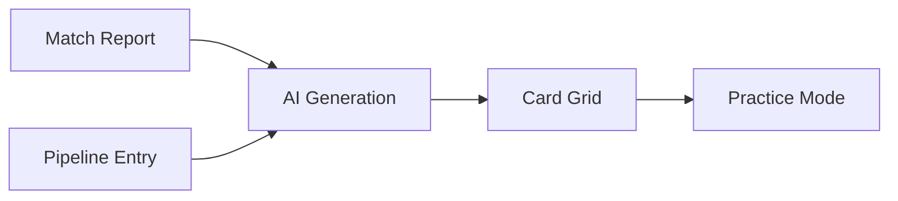
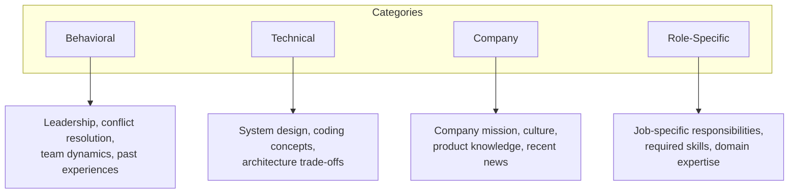

# Interview Prep

The Prep workspace turns job descriptions and match reports into structured interview preparation decks. Each deck contains categorized flashcards with talking points, technical prompts, and company-specific questions that you can practice in a timed, full-screen session.

## What You Will Learn

- Generate a prep deck from a match report or pipeline entry
- Understand the four card categories and when each applies
- Edit deck metadata and individual cards
- Organize cards with tags and filters
- Run a practice session with timer, answer reveal, and review marking
- Import and export decks for backup or sharing

## Prerequisites

- A resume loaded in the **Build** workspace with at least one vector defined
- At least one of the following:
  - A completed match report (generated in the Match workspace)
  - A pipeline entry with a job description (created in the Pipeline workspace)
- The AI proxy configured for deck generation

---

## Opening the Prep Workspace

Click the **Prep** icon in the sidebar to navigate to `/prep`. The workspace opens with two areas:

1. **Generator section** at the top, where you choose a source and generate decks
2. **Active deck section** below, where you view, edit, filter, and practice cards

If you have no decks yet, the active deck section displays an empty state prompting you to generate or import your first deck.

*Screenshot to be added*

---

## Deck Generation Flow

Prep decks are generated from two possible sources. The AI reads your resume data, the job context, and any company research you provide, then produces a categorized set of interview cards.

### Choosing a Source

At the top of the generator section, a **source toggle** lets you switch between two modes:

| Source | When to Use |
|---|---|
| **Match report** | You have already analyzed a job description in the Match workspace and have a current match report available. |
| **Pipeline entry** | You have added a role to the Pipeline workspace and want to prep from that entry's job description and metadata. |

When **Match report** is selected, the generator uses the active match context, including vector recommendations and priority adjustments.

When **Pipeline entry** is selected, a dropdown appears listing your pipeline entries. Select the entry you want to prep for, and the generator pulls in its job description, company, and role metadata.

### Adding Company Research

Before generating, paste any **company research notes** into the provided text area. This is optional but strongly recommended. The AI uses these notes to generate more specific company-culture and role-fit questions. Good material to include:

- Company mission and recent news
- Team structure or engineering blog posts
- Product details relevant to the role
- Technical stack specifics from the job posting
- Interview format details if publicly known

### Generating the Deck

Click **Generate Deck**. The AI processes your resume data, the selected source context, and your research notes, then returns a deck of categorized cards. Generation typically takes 10 to 20 seconds.

You can also click **Create Blank Deck** to start with an empty deck and add cards manually.

*Screenshot to be added*

---

## Card Categories

Every card belongs to one of four categories. The AI assigns categories during generation, and you can change them when editing a card.

| Category | What It Covers | Example Prompt |
|---|---|---|
| **Behavioral** | Leadership, collaboration, conflict resolution, and past-experience stories | "Describe a time you led a cross-team migration under a tight deadline." |
| **Technical** | System design, algorithms, architecture decisions, and coding concepts | "How would you design a real-time event pipeline that handles 50k events per second?" |
| **Company** | Mission alignment, product understanding, culture fit, and industry context | "What draws you to this company's approach to developer tooling?" |
| **Role-Specific** | Responsibilities called out in the job description, required domain knowledge, and expected impact | "The role mentions owning the CI/CD platform. Walk through how you would audit and improve an existing pipeline." |

---

## Deck Metadata

Each deck carries metadata that gives it context:

- **Title** -- a descriptive name (auto-generated from the source, editable)
- **Company** -- the target company
- **Role** -- the target role title
- **Vector** -- the resume vector used for context

To edit metadata, click the **edit** icon next to the deck title in the active deck header. Update any field and confirm. Metadata helps you identify decks later, especially when you accumulate multiple decks across your job search.

The deck header also displays two optional context fields:

- **Company Research** -- the research notes you provided during generation
- **Job Description** -- the full JD text pulled from the source

These fields are collapsible and serve as quick reference while you review cards.

---

## Working with Cards

### Card Anatomy

Each card in the grid displays:

- **Title** -- the question or prompt
- **Category** -- one of the four categories, shown as a colored label
- **Tags** -- vectors, companies, or skills associated with the card
- **Script / Talking Points** -- your prepared answer structure (hidden by default, revealed on click or in practice mode)
- **Notes** -- freeform notes for additional context

### Adding a Card

Click **Add Card** in the deck header. A blank card appears in the grid with editable fields for title, category, tags, script, and notes. Fill in the fields and the card saves automatically.

### Editing a Card

Click any card to expand it. All fields are inline-editable. Changes persist immediately.

### Duplicating a Card

Use the **duplicate** action on a card's context menu to create a copy. This is useful when you want to create a variation of an existing question, such as reframing a behavioral prompt for a different scenario.

### Removing a Card

Use the **delete** action on a card's context menu. Deleted cards cannot be recovered unless you re-import the deck.

*Screenshot to be added*

---

## Tags and Filters

Cards support a flexible tagging system. Tags can represent vectors, companies, skills, or any custom label you add.

### Filtering the Card Grid

Three filtering mechanisms sit above the card grid:

| Filter | Behavior |
|---|---|
| **Search** | Free-text query that matches against card titles, scripts, and notes |
| **Category filter** | Show only cards of a specific category (behavioral, technical, company, role-specific) |
| **Vector filter** | Show only cards tagged with a specific vector |

Filters combine with AND logic. Setting a category filter to "Technical" and a search query to "latency" shows only technical cards whose content mentions latency.

Clearing all filters restores the full card grid.

---

## Practice Mode

Practice mode transforms the card grid into a full-screen flashcard session optimized for focused rehearsal.

### Starting a Session

Toggle **Practice Mode** using the button in the deck header. The view switches from the card grid to a single-card display with navigation controls.

If you have active filters when entering practice mode, only the filtered cards are included in the session. This lets you focus a practice run on a specific category or topic.

### Session Controls

| Control | Action |
|---|---|
| **Timer** | A visible countdown or elapsed timer to simulate interview pacing. Helps you practice keeping answers within a target duration. |
| **Reveal Answer** | Click to show the card's script and talking points. Start by reading only the prompt, formulate your answer, then reveal to compare. |
| **Mark for Review** | Flag the current card so you can revisit it later. Marked cards appear highlighted when you return to the card grid. |
| **Next / Previous** | Navigate between cards in the session. |

### Ending a Session

Toggle Practice Mode off to return to the card grid. Cards you marked for review remain flagged, making it easy to identify weak areas for additional preparation.

*Screenshot to be added*

---

## Import and Export

### Exporting a Deck

Click **Export** in the deck header to download the current deck as a JSON file. The export includes all deck metadata, cards, tags, and review flags. Use exports to:

- Back up a deck before making major edits
- Share a deck template with someone else using Facet
- Archive a deck after completing an interview process

### Importing a Deck

Click **Import** in the deck header and select a previously exported JSON file. The imported deck appears as a new deck alongside any existing ones.

### Deleting a Deck

Click **Delete Set** in the deck header to permanently remove the active deck and all its cards. This action cannot be undone.

---

## Tips for Effective Prep

1. **Add company research before generating.** The more context the AI has, the more targeted and useful the generated cards will be. Even a few bullet points about the company's tech stack or recent product launches make a noticeable difference.

2. **Generate from match reports when possible.** Match reports include vector recommendations and priority adjustments from the JD analysis, which produces cards more tightly aligned to the specific role.

3. **Edit generated cards aggressively.** AI-generated talking points are a starting framework. Replace generic language with your actual project names, metrics, and outcomes.

4. **Use category filters during practice.** If you know the interview format (for example, a behavioral round followed by a system design round), filter to the relevant category and practice each round separately.

5. **Time yourself.** Use the practice mode timer to build a sense of pacing. Most behavioral answers should land between 90 seconds and 3 minutes. Technical walkthroughs vary but benefit from practiced structure.

6. **Review marked cards the day before.** After a practice session, return to the grid and filter for marked-for-review cards. These are your weak spots. Rewrite the talking points until you can answer confidently without revealing the script.

7. **Export before interviews.** Create a snapshot of your final deck so you can reference it on a phone or tablet during last-minute review.

---

## Summary

The Prep workspace closes the loop between resume tailoring and interview readiness. By generating categorized decks from match reports or pipeline entries, you transform job-specific context into structured practice material. The card system lets you refine AI-generated content with your own experiences, and practice mode provides a focused environment for rehearsal with timing and self-assessment.

---

## Next Steps

- [Getting Started](getting-started.md) -- set up your resume data and define your first vector
- [Vectors](vectors.md) -- understand how vectors shape both resume assembly and prep generation
- [Pipeline](pipeline.md) -- manage your job search pipeline, the other source for prep decks
- [Match](match.md) -- generate match reports that feed prep deck generation
