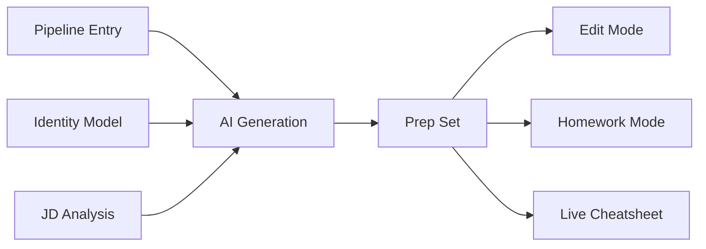
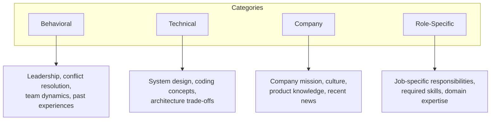

# Interview Prep

The Prep workspace turns Pipeline, JD analysis, and Identity context into
structured interview preparation sets. Each set can be edited, rehearsed as
homework, or opened as a live interview cheatsheet.

## What You Will Learn

- Generate a prep set from a pipeline entry or blank starting point
- Understand the four card categories and when each applies
- Edit deck metadata and individual cards
- Organize cards with tags and filters
- Use homework mode for structured recall practice
- Tune the live cheatsheet rules, don'ts, questions, and guidance
- Queue prep-discovered Identity gaps for review
- Import and export prep sets for portability

## Prerequisites

- A resume loaded in the **Build** workspace with at least one vector defined.
- A current Identity model for the best generation and gap-review loop.
- A pipeline entry with a job description when generating job-specific prep.
- The AI proxy configured for deck generation

---

## Opening the Prep Workspace

Click the **Prep** icon in the sidebar to navigate to `/prep`. The workspace
opens with a header, a mode switcher, a prep library, and the active set.

The main modes are:

| Mode | Use It For |
| --- | --- |
| **Edit** | Review and revise generated cards, deck metadata, live guidance, round notes, and context gaps. |
| **Homework** | Drill cards with reveal, grading, filtered queues, pushback prompts, and follow-up variants. |
| **Live Cheatsheet** | Open `/prep/live` for a focused in-room view of the active deck. |

If you have no prep sets yet, the empty state prompts you to generate a set,
start blank, or import JSON.

---

## Deck Generation Flow

Prep sets are generated from Pipeline context. The AI reads your resume data,
Identity context, the selected pipeline entry, any saved JD analysis, and
optional notes, then produces cards and live guidance.

```mermaid
flowchart LR
    P[Pipeline Entry] --> C[AI Generation]
    I[Identity Model] --> C
    J[JD Analysis] --> C
    C --> D[Prep Set]
    D --> E[Edit Mode]
    D --> H[Homework Mode]
    D --> L[Live Cheatsheet]
```

### Choosing a Source

Click **Generate** in the header. The generate drawer lets you choose a Pipeline
entry, vector, round details, and optional notes. Pipeline launchers can prefill
these fields when you start from an entry.

### Adding Company Research

Before generating, paste any **company research notes** into the provided text area. This is optional but strongly recommended. The AI uses these notes to generate more specific company-culture and role-fit questions. Good material to include:

- Company mission and recent news
- Team structure or engineering blog posts
- Product details relevant to the role
- Technical stack specifics from the job posting
- Interview format details if publicly known

### Generating the Deck

Click **Generate with AI**. The AI processes the selected Pipeline context,
Identity evidence, resume vector, and notes, then returns a categorized prep set.

You can also start from a blank prep set and add cards manually.

---

## Card Categories

Every card belongs to one of four categories. The AI assigns categories during generation, and you can change them when editing a card.

```mermaid
flowchart TB
    subgraph Categories
        BH[Behavioral]
        TC[Technical]
        CO[Company]
        RS[Role-Specific]
    end
    BH --> BH_DESC["Leadership, conflict resolution,\nteam dynamics, past experiences"]
    TC --> TC_DESC["System design, coding concepts,\narchitecture trade-offs"]
    CO --> CO_DESC["Company mission, culture,\nproduct knowledge, recent news"]
    RS --> RS_DESC["Job-specific responsibilities,\nrequired skills, domain expertise"]
```

| Category | What It Covers | Example Prompt |
|---|---|---|
| **Behavioral** | Leadership, collaboration, conflict resolution, and past-experience stories | "Describe a time you led a cross-team migration under a tight deadline." |
| **Technical** | System design, algorithms, architecture decisions, and coding concepts | "How would you design a real-time event pipeline that handles 50k events per second?" |
| **Company** | Mission alignment, product understanding, culture fit, and industry context | "What draws you to this company's approach to developer tooling?" |
| **Role-Specific** | Responsibilities called out in the job description, required domain knowledge, and expected impact | "The role mentions owning the CI/CD platform. Walk through how you would audit and improve an existing pipeline." |

---

## Deck Metadata

Each deck carries metadata that gives it context:

- **Title** -- a descriptive name (auto-generated from the source, editable)
- **Company** -- the target company
- **Role** -- the target role title
- **Vector** -- the resume vector used for context

To edit metadata, click the **edit** icon next to the deck title in the active deck header. Update any field and confirm. Metadata helps you identify decks later, especially when you accumulate multiple decks across your job search.

The deck header also displays two optional context fields:

- **Company Research** -- the research notes you provided during generation
- **Job Description** -- the full JD text pulled from the source

These fields are collapsible and serve as quick reference while you review cards.

---

## Working with Cards

### Card Anatomy

Each card in the grid displays:

- **Title** -- the question or prompt
- **Category** -- one of the four categories, shown as a colored label
- **Tags** -- vectors, companies, or skills associated with the card
- **Script / Talking Points** -- your prepared answer structure, available when a card is expanded or revealed in Homework mode
- **Notes** -- freeform notes for additional context

### Adding a Card

Click **Add Card** in the deck header. A blank card appears in the grid with editable fields for title, category, tags, script, and notes. Fill in the fields and the card saves automatically.

### Editing a Card

Click any card to expand it. All fields are inline-editable. Changes persist immediately.

### Duplicating a Card

Use the **duplicate** action on a card's context menu to create a copy. This is useful when you want to create a variation of an existing question, such as reframing a behavioral prompt for a different scenario.

### Removing a Card

Use the **delete** action on a card's context menu. Deleted cards cannot be recovered unless you re-import the deck.

*Screenshot to be added*

---

## Tags and Filters

Cards support a flexible tagging system. Tags can represent vectors, companies, skills, or any custom label you add.

### Filtering the Card Grid

Three filtering mechanisms sit above the card grid:

| Filter | Behavior |
|---|---|
| **Search** | Free-text query that matches against card titles, scripts, and notes |
| **Category filter** | Show only cards of a specific category (behavioral, technical, company, role-specific) |
| **Vector filter** | Show only cards tagged with a specific vector |

Filters combine with AND logic. Setting a category filter to "Technical" and a search query to "latency" shows only technical cards whose content mentions latency.

Clearing all filters restores the full card grid.

---

## Homework Mode

Homework mode turns the active set into a focused rehearsal queue.

### Starting a Session

Choose **Homework** from the mode switcher. Prep builds a queue from the active
cards and study progress.

Use filters such as all cards, openers, needs work, or unreviewed to focus the
round.

### Session Controls

| Control | Action |
|---|---|
| **Reveal** | Shows the answer structure after you attempt recall. |
| **Needs work / Good** | Grades the card and updates study progress. |
| **Filter chips** | Rebuild the queue around openers, weak cards, or unreviewed material. |
| **Shuffle / reset** | Starts another homework round from the eligible cards. |

Cards can also include conditional prompts, pushback scripts, and story variants.
Homework mode expands those into separate drill entries when present.

---

## Live Cheatsheet

The **Live Cheatsheet** button opens `/prep/live` for the active set. Use it as a
compact reference during final review or a live interview.

The live view renders the same active deck with quick-scan sections for cards,
rules, don'ts, questions to ask, interviewer context, and live guidance. Return
to `/prep` when you need to edit the deck, change modes, import/export, or
generate the next prep set. Edits are made in `/prep`; `/prep/live` is optimized
for reference while you are in the room.

Edit mode includes a **Live Guidance** section where you can tune:

- **Rules** -- short reminders that apply to the whole interview.
- **Don'ts** -- traps or habits to avoid.
- **Questions to Ask** -- prompts plus context for why each question matters.
- Category guidance and other live-facing notes.

These fields feed the live view without changing the card library itself.

---

## Identity and Round Feedback

Prep can expose context gaps after generation. Answer the gaps in the active set,
then either regenerate with those answers or choose **Queue for Identity Review**
when the answer belongs in the Identity model. Facet opens the Identity import
workbench with a draft so you can review before applying.

For multi-round interview loops, use the round section to set round number,
round type, per-round notes, and follow-up debrief details. Later generated sets
for the same pipeline entry can carry prior-round context forward.

---

## Import and Export

### Exporting a Deck

Click **Export** in the deck header to download the current deck as a JSON file. The export includes all deck metadata, cards, tags, and review flags. Use exports to:

- Save a route-level copy before making major edits
- Share a deck template with someone else using Facet
- Archive a deck after completing an interview process

### Importing a Deck

Click **Import** in the deck header and select a previously exported JSON file. The imported deck appears as a new deck alongside any existing ones.

### Deleting a Deck

Click **Delete Set** in the deck header to permanently remove the active deck and all its cards. This action cannot be undone.

---

## Tips for Effective Prep

1. **Add company research before generating.** The more context the AI has, the more targeted and useful the generated cards will be. Even a few bullet points about the company's tech stack or recent product launches make a noticeable difference.

2. **Generate from analyzed Pipeline entries when possible.** Saved JD analysis
   gives the generator sharper requirements, gaps, and positioning context.

3. **Edit generated cards aggressively.** AI-generated talking points are a starting framework. Replace generic language with your actual project names, metrics, and outcomes.

4. **Use category filters during rehearsal.** If you know the interview format (for example, a behavioral round followed by a system design round), filter to the relevant category and practice each round separately.

5. **Time yourself.** Use rehearsal rounds to build a sense of pacing. Most
   behavioral answers should land between 90 seconds and 3 minutes. Technical
   walkthroughs vary but benefit from practiced structure.

6. **Review weak cards the day before.** After a homework round, filter for
   cards that still need work. These are your weak spots. Rewrite the talking
   points until you can answer confidently without revealing the script.

7. **Tune the live view before interviews.** Rules, don'ts, and questions to ask
   should be short enough to scan quickly.

---

## Summary

The Prep workspace closes the loop between resume tailoring and interview
readiness. Generate a prep set from Pipeline context, edit the cards and live
guidance, rehearse weak answers in Homework mode, and queue durable discoveries
back to Identity when they belong in the source model.

---

## Next Steps

- [Getting Started](getting-started.md) -- set up your resume data and define your first vector
- [Vectors](vectors.md) -- understand how vectors shape both resume assembly and prep generation
- [Pipeline](pipeline.md) -- manage the job context that feeds prep generation
- [Identity](identity.md) -- review durable gaps discovered during prep
