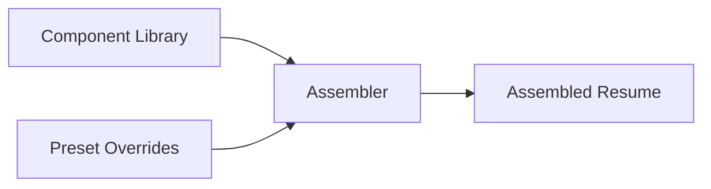
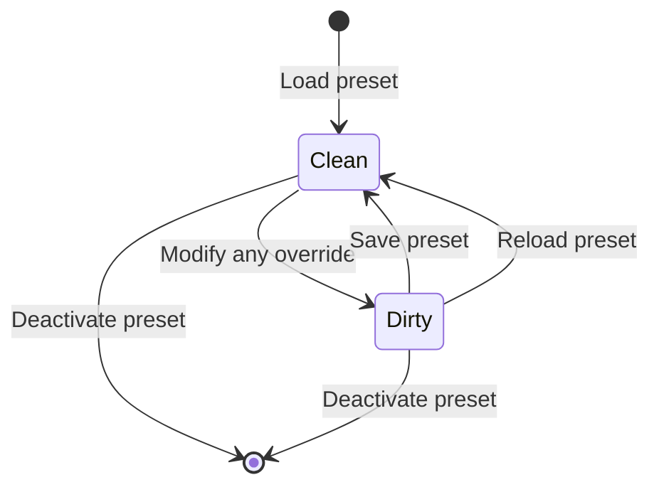
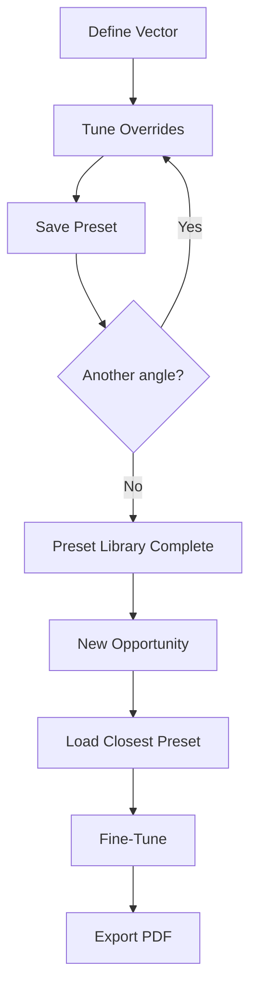

# Presets

Presets let you snapshot and recall the complete override state for a vector, making it easy to maintain multiple tailored resume configurations simultaneously.

## What You Will Learn

- What data a preset captures
- Common use cases for presets
- How to save, load, and delete presets
- How the dirty indicator tracks unsaved changes
- A recommended workflow for building a preset library
- How presets behave during JSON export and import

## Prerequisites

- At least one vector defined in the Vector Bar
- Familiarity with manual overrides (inclusion/exclusion toggles, variant selections)
- Familiarity with [bullet ordering](./bullet-ordering.md)

---

## What Presets Snapshot

A preset captures the full `PresetOverrides` state for a given vector at a point in time. This includes:

| Override Category | Description |
|---|---|
| **Manual overrides** | Per-component inclusion/exclusion toggles |
| **Variant overrides** | Text variant selections for components with multiple versions |
| **Bullet orders** | Custom drag-and-drop ordering per role |
| **Priority overrides** | Per-bullet priority adjustments for a specific vector |
| **Theme state** | Active theme preset and any fine-tuning overrides |
| **Target line** | Which target line is selected |
| **Profile** | Which profile summary is selected |
| **Skill group order** | Custom ordering of skill group sections |

Each preset also records metadata:

- **Name** -- a human-readable label you choose
- **Description** -- optional notes about the preset's purpose
- **Base vector** -- the vector this preset was created for
- **Created at / Updated at** -- ISO timestamps for tracking history

### The Override Model

Presets do not store the entire resume. They store only the *decisions* layered on top of the component library. Your base data (roles, bullets, skill groups, etc.) remains unchanged. Loading a preset replays a set of override decisions against whatever components currently exist.



This means you can update a bullet's text, add new components, or restructure roles, and your presets will still apply cleanly. Overrides that reference deleted components are silently ignored.

## Use Cases

### Targeting Specific Roles

Create a preset for each type of position you apply to. A "Backend Engineering" preset might prioritize systems design bullets and exclude frontend work, while a "Platform Engineering" preset emphasizes infrastructure and developer tooling.

### A/B Testing Resume Variants

When you are unsure whether to lead with a particular accomplishment or use a specific text variant, save two presets and compare the assembled output side by side. Switch between them to see which narrative reads more convincingly.

### Archiving Submissions

After submitting a resume for a specific opportunity, save a preset named after the company or role. This creates a retrievable record of exactly what you sent, even as you continue evolving your component library.

### Seasonal Updates

Maintain a "current default" preset per vector that represents your latest preferred configuration. When you update your resume quarterly, load the preset, make adjustments, and save over it.

## Saving a Preset

1. **Select a vector** in the Vector Bar.
2. **Configure your overrides**: toggle components in/out, select text variants, reorder bullets, adjust priorities, and set your preferred theme.
3. **Open the preset controls** in the interface.
4. **Enter a name** for the preset (required) and an optional description.
5. **Save**. The preset is created with the current override state and linked to the active vector.

The preset is stored in `ResumeData.presets` alongside your component library, meaning it persists across sessions through localStorage and is included in JSON exports.

### Updating an Existing Preset

If you modify overrides after loading a preset, you can save again to update it. The `updatedAt` timestamp reflects the latest save. The original `createdAt` is preserved.

## Loading a Preset

1. **Select the vector** the preset was created for (or any vector -- the overrides will apply regardless, though results are most meaningful on the original base vector).
2. **Choose the preset** from the preset list.
3. The override state is applied immediately: manual overrides, variant selections, bullet orders, theme, and all other captured state replace the current working configuration.

Loading a preset is non-destructive to your component data. It only changes the override layer.

## Deleting a Preset

Select the preset you want to remove and use the delete action. This removes the preset definition from `ResumeData.presets`. It does not affect any currently applied overrides or your component library.

Deletion is permanent within the current session. If you have a JSON export that includes the preset, you can recover it by re-importing that file.

## Dirty Indicator

The status bar at the bottom of the interface shows the active preset's name when one is loaded. If you modify any override after loading, a **dirty indicator** (`*`) appears next to the preset name:

```
Editing: Backend Senior *
```

This asterisk signals that the current override state has diverged from the saved preset snapshot. You have two options:

- **Save** to update the preset with your changes (the `*` disappears).
- **Reload** the preset to discard changes and return to the saved state.

Screen reader users receive the dirty state through an accessible label: "(unsaved changes)".



## Recommended Workflow

A systematic approach to building your preset library:

1. **Create a vector** that represents a positioning angle (e.g., "Staff Backend").
2. **Tune the resume**: adjust priorities, toggle components, select text variants, reorder bullets, choose a theme.
3. **Save a preset** with a descriptive name (e.g., "Staff Backend -- Systems Focus").
4. **Switch to another target** by selecting a different vector or adjusting overrides.
5. **Save another preset** (e.g., "Staff Backend -- API Platform Focus").
6. **Repeat** for each vector and positioning angle.

Over time, you accumulate a library of ready-to-use configurations. When a new opportunity appears, load the closest preset, make minor adjustments, and export.



## Export and Import

Presets are included in the JSON export/import cycle. When you export your resume data:

- All presets are serialized as part of `ResumeData.presets`.
- Override references (component IDs, vector IDs) are preserved as-is.

When you import a JSON file:

- Presets from the imported file are merged into the current data.
- If a preset references components or vectors that do not exist in the current library, those specific overrides are silently ignored during assembly.

This makes presets portable. You can share a JSON export with preset configurations intact, and the recipient can load them against their own component library.

## Summary

| Concept | Detail |
|---|---|
| Snapshot contents | Manual overrides, variants, bullet orders, priorities, theme, target line, profile, skill group order |
| Storage | `ResumeData.presets` (localStorage + JSON export) |
| Dirty indicator | `*` in status bar when overrides diverge from saved state |
| Scope | Each preset is linked to a base vector |
| Export/Import | Fully portable in JSON format |

## Next Steps

- [Bullet Ordering](./bullet-ordering.md) -- Fine-tune the ordering that presets capture
- [Design and Themes](./design-and-themes.md) -- Theme state is part of preset snapshots
- [Navigator](../NAVIGATOR.md) -- Documentation index
