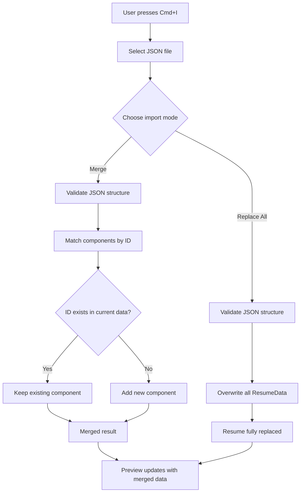

# Preview and Export

## What You Will Learn

This guide covers every way to view and export your assembled resume in Facet:

- Real-time PDF preview powered by the Typst rendering engine
- Live HTML view as an alternative preview mode
- Downloading a print-ready PDF
- Copying resume content to the clipboard in plain text or Markdown
- Exporting and importing your resume data as JSON for backup and portability

## Prerequisites

- A resume with at least one vector selected and components assigned
- Familiarity with vectors and the component library (see [NAVIGATOR.md](../NAVIGATOR.md) for related guides)

---

## PDF Preview

The right panel (approximately 55% of the viewport) renders a live PDF preview of your assembled resume. This preview is generated by the **Typst** typesetting engine, which runs entirely in the browser via a Web Worker.

### How It Works

1. When you select a vector or change any component, the assembler produces an `AssemblyResult`.
2. The Typst renderer converts that result into typeset output.
3. The preview panel displays the rendered pages as they would appear in a printed PDF.

The preview is **WYSIWYG** -- what you see matches what you will download. Fonts, spacing, margins, and line breaks are identical to the final export.

### Refresh Behavior

The preview updates in real time as you:

- Toggle components on or off
- Reorder bullets via drag-and-drop
- Switch between vectors
- Edit text variants
- Apply or remove overrides

There is no manual refresh button. The pipeline runs automatically on every relevant state change.

<!-- Screenshot placeholder: PDF preview panel showing a rendered resume -->

### Live HTML View

An alternative **Live HTML** toggle is available in the preview panel header. This renders the resume as styled HTML rather than a PDF page image. Use it when you want:

- Faster rendering feedback during rapid editing
- The ability to select and copy text directly from the preview
- A lighter-weight view when working on content rather than layout

Switch back to the PDF view before finalizing layout decisions, since the HTML view does not replicate exact page breaks or Typst-specific spacing.

---

## Downloading a PDF

To download a print-ready PDF of the currently assembled resume:

1. Press **Cmd+P** (macOS) or use the Download PDF button in the toolbar.
2. The browser will save a PDF file to your default downloads location.

### File Naming

The downloaded file is named to include the **active vector name**, making it easy to distinguish exports for different positioning angles. For example, if your selected vector is "Backend Engineering", the file will be named accordingly (e.g., `Resume-Backend-Engineering.pdf`).

This convention is especially useful when you maintain multiple vectors and need to send the right version to a specific opportunity.

### Tips for PDF Downloads

- Always verify the preview before downloading. The PDF output matches the preview exactly.
- Check the [page budget status bar](#related-guides) to confirm you are within your target page count before exporting.
- If the preview shows trimmed bullets (indicated by the status bar), the PDF will reflect that trimming.

---

## Copy to Clipboard

Facet supports copying your assembled resume content to the clipboard in two formats:

### Plain Text

Copies a clean, unformatted text version of the resume. Useful for:

- Pasting into application forms that strip formatting
- Email body content
- ATS (Applicant Tracking System) text fields

### Markdown

Copies a Markdown-formatted version with headers, bullet lists, and emphasis preserved. Useful for:

- Pasting into Markdown-aware editors
- README files or portfolio pages
- Any context where lightweight formatting is supported

Both copy operations pull from the same assembled result that drives the preview, so the content is always consistent.

---

## JSON Export

Press **Cmd+E** to export your entire resume configuration as a JSON file. This export includes:

- All components (roles, bullets, skills, education, target lines, etc.)
- All vectors and their priority mappings
- Presets (saved override snapshots)
- Metadata (name, contact information, theme settings)

### When to Export

- **Before major restructuring.** If you plan to reorganize roles, delete components, or rework your vector strategy, export first so you can roll back.
- **For backup.** JSON exports are your portable backup. They contain everything needed to reconstruct your resume in a fresh Facet instance.
- **For sharing.** You can send a JSON export to another Facet user as a starting point.

The exported file is a complete, self-contained snapshot of your `ResumeData`.

---

## JSON Import

Press **Cmd+I** to import a JSON file into Facet. The import dialog presents two modes:

### Replace All

Replaces your entire resume configuration with the contents of the imported file. Your current data is overwritten. Use this when:

- Restoring from a backup
- Loading a completely new resume configuration
- Starting fresh from a shared export

### Merge (Additive, by ID)

Merges the imported data into your existing configuration without removing anything. The merge logic works by component ID:

- **New IDs** in the import are added to your data.
- **Existing IDs** in your data are preserved as-is (the import does not overwrite them).
- No components are ever deleted during a merge.

Use Merge when you want to pull in additional components from another export (e.g., adding roles from a colleague's template) without disturbing your current setup.

### Import Flow

### Import Validation

The import process validates the JSON structure before applying changes. If the file does not match the expected `ResumeData` shape, the import is rejected with an error message. This protects against loading corrupted or incompatible files.

---

## Practical Tips

### Export Before Major Changes

Make it a habit to press **Cmd+E** before any significant editing session. JSON exports are small and fast to create. Having a recent backup eliminates the risk of losing work during large restructures.

### Verify in PDF Before Sending

Always switch to the PDF preview and confirm the final output before downloading or sharing. Check for:

- Correct vector selected
- Expected components included (no unintended overrides)
- Page count within budget (see [Page Budget guide](./page-budget.md))
- No awkward line breaks or orphaned section headers

### Use Naming to Stay Organized

Since downloaded PDFs include the vector name, you can maintain a clear file history. Consider a personal convention like keeping your last three exports per vector.

### Merge for Incremental Collaboration

If you maintain separate Facet instances for different career chapters (e.g., one for your current role, one for side projects), use JSON export and Merge import to combine them into a single unified configuration.

---

## Summary

Facet provides a tight feedback loop between editing and output. The real-time Typst preview ensures you always see the true layout. PDF downloads are named by vector for easy identification. Clipboard copy supports both plain text and Markdown. JSON export and import give you full control over backup, restoration, and data portability, with Replace All for clean swaps and Merge for additive combination.

## Next Steps

- [Page Budget](./page-budget.md) -- understand how Facet manages page limits and auto-trimming
- [NAVIGATOR.md](../NAVIGATOR.md) -- find guides for vectors, components, and overrides
