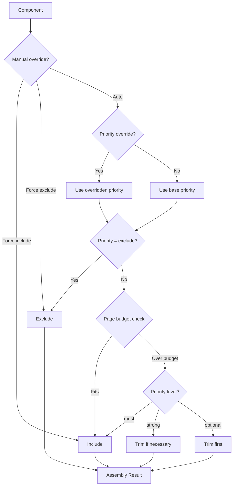
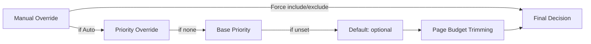

# Priorities and Overrides

## What You Will Learn

This guide explains how Facet determines which components appear on your assembled resume. You will learn:

- The four priority levels and what each means for assembly
- How to set and cycle priorities per vector
- How manual overrides (include/exclude) interact with priorities
- The hierarchical override key system and resolution order
- How priority overrides let you adjust effective priority without changing base data
- How to reset overrides back to automatic behavior

## Prerequisites

- A Facet project with at least one vector defined
- Familiarity with the component library panel (roles, bullets, skills, target lines)
- Basic understanding of vectors as positioning angles

---

## Priority Levels

Every component in Facet carries a priority that determines whether it is included in the assembled resume for a given vector. There are four levels, ranked from highest to lowest:

| Priority   | Meaning                                                                 |
|------------|-------------------------------------------------------------------------|
| `must`     | Always included. Cannot be removed by page budget trimming.             |
| `strong`   | Included by default. Only removed if the page budget is severely exceeded. |
| `optional` | Included if space permits. First to be trimmed when over budget.        |
| `exclude`  | Never included in this vector's assembly.                               |

Priorities are **per-vector**. A bullet marked `must` for your "Backend Engineering" vector can be `exclude` for "Engineering Management" and `optional` for "Security Platform". This is the core mechanism that lets a single component library produce multiple tailored resumes.

### Default Priority

Components that have no explicit priority set for a vector inherit the default priority of `optional`. This means new components appear on all vectors until you explicitly configure them.

---

## Setting Priorities

### Cycling the Priority Badge

Each component in the library panel displays a colored priority badge. Click the badge to cycle through priority levels:

`must` -> `strong` -> `optional` -> `exclude` -> `must`

The badge color changes to reflect the current level:

<!-- Screenshot: Priority badge cycling through four states -->

### Vector Matrix Dots

For a bird's-eye view, open the vector priority matrix. Each row is a component and each column is a vector. The intersection dot shows the priority level for that combination. Click a dot to cycle its priority.

This view is especially useful when you need to audit priorities across all vectors at once.

<!-- Screenshot: Vector matrix with dot indicators -->

---

## Assembly Resolution

When Facet assembles a resume for a selected vector, each component goes through a resolution pipeline to determine whether it is included and at what effective priority.



The key takeaway: manual overrides always win, then priority overrides, then base priority, and finally the page budget makes trimming decisions based on the resolved priority level.

---

## Manual Include/Exclude Overrides

### The Eye Icon

Each component has a visibility toggle represented by an eye icon. This toggle has three states:

| State         | Icon Appearance       | Behavior                                      |
|---------------|-----------------------|-----------------------------------------------|
| Auto          | Neutral eye           | Assembly decides based on priority and budget  |
| Force include | Eye open (highlighted)| Component is always included, regardless of priority |
| Force exclude | Eye with slash        | Component is never included, regardless of priority  |

Click the eye icon to cycle: **Auto** -> **Force include** -> **Force exclude** -> **Auto**.

### Per-Vector Independence

Manual overrides are stored **per vector**. Forcing a bullet to be included on your "Backend Engineering" vector has no effect on other vectors. Each vector maintains its own independent set of manual overrides in the UI store.

### When to Use Manual Overrides

- **Force include**: A component is `optional` or `strong` but you need it on this specific resume regardless of budget pressure.
- **Force exclude**: A component has a high base priority but is irrelevant for this particular vector, and you do not want to change the base priority (which would affect other contexts like presets).

---

## Override Hierarchy

Facet uses a hierarchical key system to resolve overrides. This allows overrides to be set at different levels of specificity, with the most specific key winning.

### Key Resolution Order

For a bullet within a role, the assembler generates multiple override keys and checks them in order from most specific to least specific:

1. `role:{roleId}:bullet:{bulletId}` -- Targets this exact bullet within this exact role
2. `role:{roleId}:{bulletId}` -- Shorthand for the same
3. `bullet:{bulletId}` -- Targets this bullet regardless of which role contains it
4. `{bulletId}` -- Bare ID fallback

The first key that has an override defined wins. If no key matches, the component falls through to automatic behavior.

### Example

Suppose you have a bullet with ID `perf-optimization` that appears under role `senior-eng`. The assembler checks:

```
role:senior-eng:bullet:perf-optimization  -->  override found? use it
role:senior-eng:perf-optimization          -->  override found? use it
bullet:perf-optimization                   -->  override found? use it
perf-optimization                          -->  override found? use it
(none found)                               -->  fall through to auto
```

This hierarchy means you can set a broad override on a bullet ID and then selectively override it for a specific role context.

### Other Component Types

Non-bullet components (target lines, skill groups, education entries) use simpler key chains since they do not nest inside roles. Their override keys typically resolve as:

1. `{componentType}:{componentId}`
2. `{componentId}`

---

## Priority Overrides

Priority overrides let you change the **effective priority** of a component for the current vector without modifying the base priority data. This is useful when:

- You want to temporarily promote or demote a component for one vector
- You are experimenting with different assembly configurations
- You do not want to alter the base data that other vectors or presets rely on

A priority override sits between the manual include/exclude toggle and the base priority in the resolution chain. If a manual override is set to "Auto," the assembler next checks for a priority override before falling back to the base priority.

### Setting a Priority Override

Priority overrides are available through the component's context menu or detail panel. Select the desired effective priority for the current vector. The component's badge will update to show the overridden priority with a visual indicator distinguishing it from the base priority.

<!-- Screenshot: Priority override indicator on a component badge -->

---

## Reset to Auto

The **Reset to Auto** action clears all overrides for the currently selected vector:

- All manual include/exclude toggles return to Auto
- All priority overrides are removed
- All variant text selections return to Auto (see [Text Variants](./text-variants.md))
- All bullet ordering customizations are cleared

This is a vector-scoped operation. Resetting one vector does not affect any other vector's overrides.

Use Reset to Auto when you want to return to a clean assembly based purely on your base priority data, or when you have been experimenting and want to start fresh.

---

## Complete Resolution Order

The following table summarizes the full resolution order that the assembler uses for every component, from highest precedence to lowest:

| Precedence | Source             | Effect                                         |
|------------|--------------------|-------------------------------------------------|
| 1 (highest)| Manual override    | Force include or force exclude, ignoring all else |
| 2          | Priority override  | Changes effective priority for this vector only  |
| 3          | Base priority      | The per-vector priority set on the component     |
| 4 (lowest) | Default            | `optional` if no priority is defined for the vector |

After the effective priority is resolved, the page budget engine makes final trimming decisions. Components with `must` priority are never trimmed. Components with `strong` priority are trimmed only as a last resort. Components with `optional` priority are trimmed first.



---

## Summary

- Four priority levels (`must`, `strong`, `optional`, `exclude`) control assembly inclusion and budget trimming order.
- Priorities are per-vector, enabling different resume configurations from the same component library.
- Manual overrides (force include/exclude) take absolute precedence over all priority logic.
- The hierarchical key system resolves overrides from most specific to least specific.
- Priority overrides adjust effective priority without altering base data.
- Reset to Auto clears all overrides for the current vector.

## Next Steps

- [Text Variants](./text-variants.md) -- Learn how to tailor component phrasing per vector
- [Documentation Navigator](../NAVIGATOR.md) -- Browse all available guides
