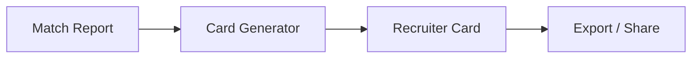

# Recruiter Cards

Recruiter cards are one-page cheat sheets that help recruiters pitch you to hiring managers. The Recruiter workspace generates these cards from your match reports, pulling together fit summaries, proof points, positioning angles, and gap-bridging strategies into a format a recruiter can use immediately.

## What You Will Learn

- Understand what recruiter cards are and when to use them
- Generate a card from an existing match report
- Navigate the card structure and understand each section
- Edit card fields to refine messaging
- Use concerns and gap bridges strategically
- Manage multiple cards across opportunities
- Export cards as plain text for sharing

## Prerequisites

- A completed **match report** in the [Match workspace](./match.md) for the target role
- An **identity profile** configured in the app (candidate name and title)

---

## What Are Recruiter Cards?

When a recruiter submits you for a role, they typically write a short summary explaining why you are a fit. Recruiter cards give them that summary pre-written, with the evidence to back it up.

Each card covers a single opportunity and includes:

- A high-level **summary** of your fit
- A **recruiter hook** (the one-sentence pitch)
- A **suggested introduction** for the hiring manager
- **Top reasons** you are a fit
- **Proof points** from your career that support those reasons
- **Skill highlights** relevant to the role
- **Positioning angles** the recruiter can emphasize
- **Likely concerns** the hiring manager may raise
- **Gap bridges** that preemptively address those concerns

The goal is to reduce friction. A recruiter who has your card does not need to guess how to position you.

---

## Generating a Card from a Match Report

The fastest way to create a recruiter card is to generate one from a match report.

1. Open the **Recruiter** workspace from the sidebar (`/recruiter`).
2. The generator panel shows the current match context. If you have an active match report, you will see its company and role displayed.
3. Click **Generate from Match**.
4. The card populates automatically, pulling data from the match report and your identity profile.

The generator maps match report data to card fields:

| Match Report Field | Recruiter Card Field |
| --- | --- |
| Summary / fit assessment | Summary |
| Key strengths | Top reasons |
| Evidence items | Proof points |
| Skill matches | Skill highlights |
| Recommended positioning | Positioning angles |
| Concerns / gaps | Likely concerns |
| Mitigation strategies | Gap bridges |

If no match report is available, the generator panel displays a helper message directing you to the Match workspace first. You can also create a blank card and fill it in manually.

*Screenshot to be added*

---

## Understanding the Card Structure

A recruiter card has two groups of fields: **header fields** and **narrative sections**.

### Header Fields

These identify the opportunity and the candidate:

- **Company** -- the target company name
- **Role** -- the specific position title
- **Candidate Name** -- your name (pulled from identity)
- **Candidate Title** -- your professional title (pulled from identity)

### Narrative Sections

These are the substantive content a recruiter will use:

| Section | Purpose | Format |
| --- | --- | --- |
| Summary | Two to three sentence overview of why you fit this role | Free text |
| Recruiter Hook | The single sentence a recruiter leads with | Free text |
| Suggested Intro | A paragraph the recruiter can use when presenting you | Free text |
| Top Reasons | The strongest arguments for your candidacy | Line-separated list |
| Proof Points | Specific achievements or metrics that support the reasons | Line-separated list |
| Skill Highlights | Technical or domain skills relevant to the role | Line-separated list |
| Positioning Angles | Different ways to frame your background for this role | Line-separated list |
| Likely Concerns | Objections the hiring manager might raise | Line-separated list |
| Gap Bridges | Responses that address each concern | Line-separated list |
| Notes | Internal notes (not part of the shared output) | Free text |

*Screenshot to be added*

---

## Editing Card Fields

Every field on a recruiter card is editable. Click into any field to modify it.

**Free text fields** (summary, hook, intro, notes) accept paragraph-style input.

**List fields** (reasons, proof points, highlights, angles, concerns, bridges) use a one-item-per-line format. Each line becomes a separate item. To add an item, type it on a new line. To remove one, delete the line.

Edits save automatically. There is no save button.

### Editing Tips

- **Recruiter hook**: Keep it under 20 words. This is what a recruiter says in the first five seconds of a pitch call.
- **Proof points**: Use numbers. "Reduced deploy time by 40%" is stronger than "Improved deployment process."
- **Notes**: Use this field to track internal context that should not be shared, like recruiter contact info or submission deadlines.

---

## Using Concerns and Gap Bridges Strategically

The **Likely Concerns** and **Gap Bridges** sections are the most strategically important parts of a recruiter card. They anticipate objections before they become rejections.

A concern is something the hiring manager might flag when reviewing your background. Common examples:

- Missing a specific technology from the job description
- Career level mismatch (too senior, too junior)
- Industry transition
- Employment gap

A gap bridge is the counterargument. It reframes the concern or provides evidence that neutralizes it.

**Example pair:**

| Concern | Gap Bridge |
| --- | --- |
| No production Kubernetes experience listed | Built and operated Docker-based deployment pipelines serving 50M requests/day; completed CKA certification in Q1 |

When you generate a card from a match report, the generator populates these from the match analysis. Review them carefully. The generated concerns will be accurate, but the bridges may need your personal context to be convincing.

Good practice: make sure every concern has a corresponding bridge. An unaddressed concern is a reason to pass on your candidacy.

---

## Managing Multiple Cards

The sidebar lists all saved recruiter cards. Each card is tied to a single opportunity.

- **Create a new card**: Click the **+** button in the sidebar header. You can generate from a match or start blank.
- **Switch between cards**: Click any card in the sidebar list.
- **Delete a card**: Click the trash icon on the selected card. This is permanent.

Cards are labeled by company and role in the sidebar. If those fields are empty, the card shows as untitled.

*Screenshot to be added*

---

## Exporting as Text

To share a recruiter card, export it as plain text.

1. Open the card you want to export.
2. Click the **Copy as Text** button in the card toolbar.
3. The formatted card text is copied to your clipboard.

The export includes all narrative sections in a clean, readable format. The **Notes** field is excluded from the export since it is intended for your internal use.

Paste the exported text into an email, a message to your recruiter, or a shared document.

---

## Tips for Using Recruiter Cards

**When to create a card**: Create one whenever a recruiter is actively submitting you for a role. Do not create cards speculatively; they are most useful when tied to a real opportunity with a real match report behind them.

**When to share**: Share the card before the recruiter writes their own summary. If you give them a polished pitch after they have already submitted you, it is too late.

**How to share**: Copy the card text and paste it directly in your communication with the recruiter. Frame it as "here is how I would position myself for this role" rather than "use this word-for-word." Recruiters will adapt it to their voice, but having the raw material saves them significant effort.

**Keep cards updated**: If the role requirements change during the interview process or you learn new information about the team's priorities, update the card. The concerns and bridges especially may need revision after each interview round.

---

## Summary

The Recruiter workspace turns match report analysis into actionable cheat sheets for recruiters. Generate a card from a match report to auto-populate all fields, then refine the messaging. Pay particular attention to concerns and gap bridges, as they directly influence whether a recruiter can get you past initial screening. Export cards as text to share before the recruiter writes their own summary.

## Next Steps

- [Match](./match.md) -- Generate the match reports that feed recruiter cards
- [Vectors](./vectors.md) -- Define positioning angles used across the app
- [Getting Started](./getting-started.md) -- Full onboarding walkthrough
