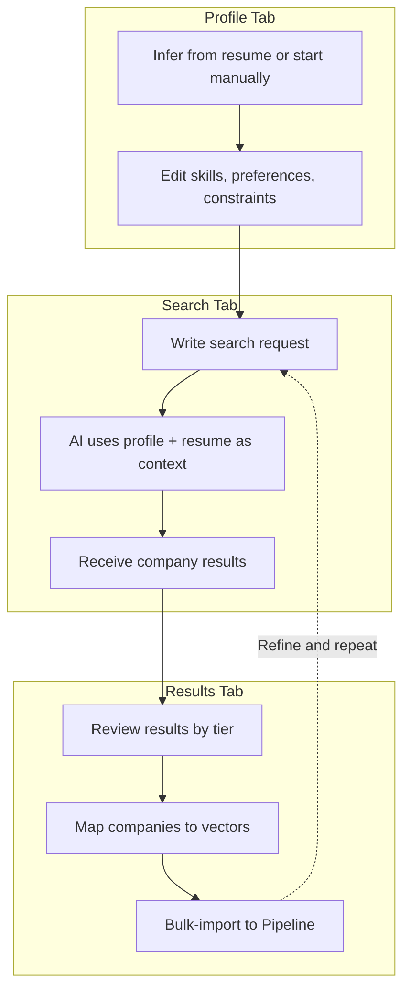
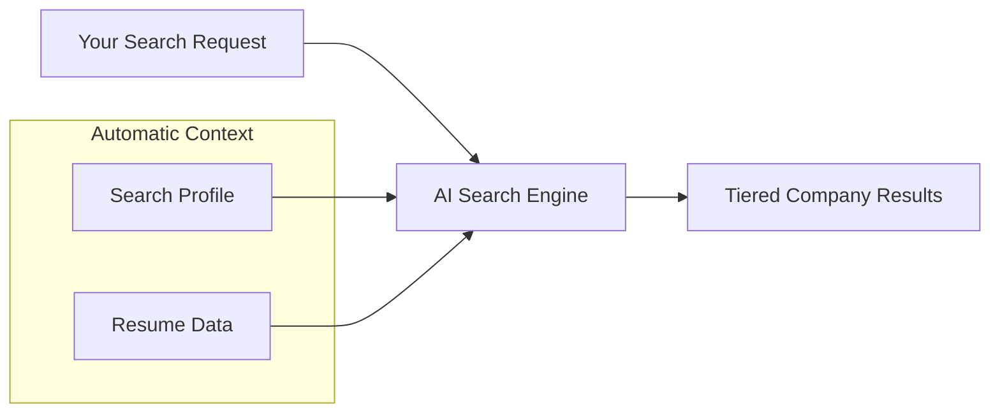
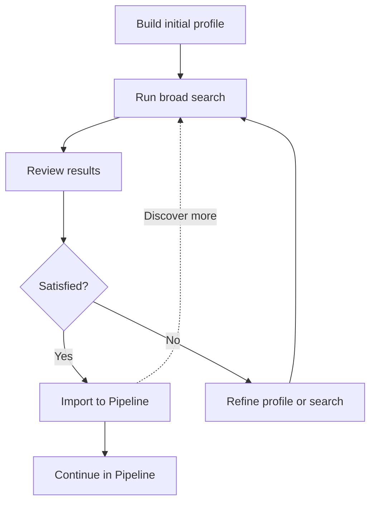

# Research

The Research workspace systematically discovers job opportunities by building an AI-powered search profile from your resume data. Instead of manually browsing job boards, you describe what you are looking for, and the AI returns classified, tiered company matches that you can import directly into [Pipeline](pipeline.md).

## What You Will Learn

- Understand how the Research workspace discovers job opportunities using AI
- Build a search profile by inferring from your resume or starting from scratch
- Manage an inferred skill catalog with proficiency and priority ratings
- Set search constraints for company size, salary range, and location
- Craft and execute AI-powered searches with full resume context
- Review search results grouped by tier
- Map results to relevant vectors and bulk-import to Pipeline

## Prerequisites

- Resume data loaded in Facet (the AI needs your resume to infer a profile)
- At least one vector defined (see [Vectors](vectors.md))
- An active AI proxy connection

---

## What is the Research Workspace?

Research sits at the beginning of your job search funnel. It takes your career library -- the same roles, skills, and vectors you defined in Build -- and uses that context to find companies and opportunities that align with your strengths and preferences.

---

## The Three-Tab Workflow

Research is organized into three sequential tabs, each building on the previous one:

| Tab | Icon | Purpose |
|-----|------|---------|
| **Profile** | User | Define who you are and what you want |
| **Search** | Search | Describe what you are looking for and run AI searches |
| **Results** | ListChecks | Review, classify, and import discovered companies |

You work through the tabs left to right: build your profile first, then search, then review results. You can return to earlier tabs at any time to refine your profile and run additional searches.

*Screenshot to be added*

---

## Building a Search Profile

The search profile captures your skills, preferences, and constraints. It serves as the persistent context that the AI uses when executing searches.

### Option A: Infer from Resume

The fastest way to get started:

1. Navigate to the **Research** workspace
2. On the **Profile** tab, click **Infer from Resume**
3. The AI analyzes your loaded resume data -- roles, bullets, skills, and vectors -- and generates a complete profile
4. Review and edit the inferred results

The AI extracts skills from your bullet points, suggests proficiency levels based on how prominently each skill appears, and sets initial priority ratings. It also populates your preferred vectors, company size, and location preferences based on patterns in your career history.

> **Tip**: You can re-infer at any time after updating your resume data. Click **Re-infer from Resume** in the profile editor header to refresh the profile with your latest changes.

### Option B: Start from Scratch

If you prefer full manual control:

1. On the **Profile** tab, click **Start from Scratch**
2. An empty profile is created with no skills, vectors, or constraints
3. Populate each section manually using the profile editor

This option is useful when you want a profile that diverges significantly from what your current resume describes -- for example, when exploring a career pivot.

*Screenshot to be added*

---

## Managing the Skill Catalog

The **Skills** section of your profile is a catalog of the technical and professional skills the AI considers when matching you to opportunities. Each skill has two attributes:

| Attribute | Options | Purpose |
|-----------|---------|---------|
| **Proficiency** | `learning`, `proficient`, `advanced`, `expert` | How skilled you are -- helps the AI match you to appropriate seniority levels |
| **Priority** | `must-have`, `preferred`, `nice-to-have` | How important this skill is to your search -- guides which opportunities surface |

### Editing Skills

1. Expand the **Skills** section (click the section header if collapsed)
2. Click the **edit icon** on any skill to enter edit mode
3. Modify the name, proficiency, or priority using the inline controls
4. Click the **save icon** to confirm changes

### Removing Skills

Click the **trash icon** on any skill to remove it from the catalog. This is useful for removing AI-inferred skills that are outdated or irrelevant to your current search.

### Adding Custom Skills

1. Click **Add Skill** below the skill list
2. Enter the skill name
3. Select a proficiency level and priority
4. Click **Add** to include it in the catalog

> **Note**: The skill catalog only affects what the AI considers during searches. It does not modify your resume data in the Build workspace.

*Screenshot to be added*

---

## Setting Search Preferences

The **Preferences** section controls which vectors the AI focuses on and your interview format preferences.

### Vectors to Focus

Your existing vectors from the Build workspace appear as selectable chips. Toggle vectors on or off to tell the AI which positioning angles matter for this search. For example, if you are only pursuing backend roles right now, select only your "Backend Engineering" vector.

### Interview Preferences

Check the interview formats you are comfortable with:

- **Take-home** -- Asynchronous coding exercises
- **Live coding** -- Real-time coding sessions
- **System design** -- Architecture and design discussions
- **Behavioral** -- Experience and culture-fit interviews
- **Pair programming** -- Collaborative coding with an interviewer

These preferences help the AI prioritize companies whose interview processes align with your strengths.

---

## Setting Search Constraints

The **Constraints** section defines hard boundaries for your search.

### Company Size

Select from:

| Option | Typical Range |
|--------|---------------|
| **Startup** | Early-stage, small teams |
| **Mid-market** | Growth-stage, hundreds of employees |
| **Enterprise** | Large organizations, thousands+ |
| **Any** | No size preference |

### Salary Range

Set minimum and maximum salary expectations with currency selection (USD, EUR, GBP, CAD). Leave both fields empty to express no salary constraint.

### Location Preference

Select your work arrangement preference:

- **Remote** -- Fully remote positions
- **Hybrid** -- Mix of remote and in-office
- **Onsite** -- Full-time in-office
- **Flexible** -- No preference

When you select **Hybrid** or **Onsite**, an additional field appears where you can enter preferred cities as a comma-separated list (e.g., "San Francisco, New York, Seattle").

---

## Crafting and Running Searches

Once your profile is complete, switch to the **Search** tab to execute AI-powered searches.

### How Search Context Works

The search engine automatically sends your full profile and resume data as context alongside your search request. You do not need to repeat information about your skills or background in every search -- the AI already knows.

The context indicator below the search button shows how much context is being sent: the number of skills and vectors from your profile.

### Writing a Search Request

1. Switch to the **Search** tab
2. In the text area, describe what you are looking for in plain language
3. Focus on criteria that go beyond your profile -- specific industries, company types, team culture, or technical interests

Effective search requests add specificity:

| Less Effective | More Effective |
|----------------|----------------|
| "Find me backend jobs" | "Find companies building developer tools or infrastructure platforms that value distributed systems expertise. Prefer Series B+ with strong engineering culture." |
| "Good companies" | "Companies with public engineering blogs, open-source contributions, and a track record of promoting from within. Focus on data infrastructure and observability." |

> **Tip**: Your profile already captures your skills, salary, and location preferences. Use the search request to express softer criteria: company culture, industry focus, growth stage, and specific technical domains.

### Executing a Search

1. Click **Run Search**
2. The AI processes your request with full context
3. Results appear in the search history below the input
4. The Results tab automatically receives the new results

The search history panel shows all previous searches with their result counts and timestamps.

*Screenshot to be added*

---

## Reviewing Results by Tier

Switch to the **Results** tab to review and act on search results.

### Selecting a Search Result

If you have run multiple searches, use the dropdown at the top to select which search result to review.

### Understanding Tiers

The AI classifies each company into one of four tiers:

| Tier | Label | Meaning |
|------|-------|---------|
| **1** | Top Match | Strong alignment with your skills, preferences, and constraints |
| **2** | Strong Fit | Good alignment with minor gaps or trade-offs |
| **3** | Worth Exploring | Partial alignment -- worth investigating further |
| **Watch** | Watch List | Interesting but not actionable now -- track for the future |

Results are displayed in collapsible tier groups, with Tiers 1, 2, and 3 expanded by default.

### Company Cards

Each result appears as a card showing:

- **Company name** with an optional external link
- **Rationale** -- the AI's explanation of why this company matches your profile
- **Relevant skills** -- skill tags showing which of your skills align with this company
- **Vector mapping** -- chips for assigning vectors to this company before import

*Screenshot to be added*

---

## Mapping Results to Vectors

Before importing companies to Pipeline, you can map each one to the vectors that best fit the opportunity.

1. On a company card, find the **Map to vectors** section
2. Click vector chips to toggle them on or off for that company
3. Selected vectors appear highlighted

Vector mappings carry through to Pipeline, where they connect the company entry to your resume positioning strategy.

> **Tip**: A company might fit multiple vectors. A developer tools company could be a match for both "Backend Engineering" and "Platform Architecture" vectors. Select all that apply.

---

## Bulk-Importing to Pipeline

Once you have reviewed results and mapped vectors, import your selected companies to the Pipeline workspace.

1. Check the **checkbox** on each company card you want to import
2. The **Import to Pipeline** button at the top updates to show the count of selected companies
3. Click **Import [N] to Pipeline**
4. Selected companies are created as Pipeline entries with:
   - The company name and URL
   - The AI rationale as notes
   - Mapped vectors
   - The tier classification
   - Source marked as "research"
5. Imported companies show a green **Imported** badge and their checkboxes become disabled

After import, switch to the [Pipeline](pipeline.md) workspace to continue tracking these opportunities.

---

## Iterating on Your Search

Research is designed for multiple rounds of discovery:

1. **Start broad** -- Run an initial search with general criteria to see what surfaces
2. **Review and learn** -- The results teach you what kinds of companies are out there
3. **Refine your profile** -- Return to the Profile tab to adjust skills, priorities, or constraints
4. **Search again** -- Run a more targeted search with refined criteria
5. **Import the best** -- Bulk-import your top picks to Pipeline
6. **Repeat** -- Continue refining and searching as your job search evolves

All search history is preserved, so you can revisit earlier results at any time from the Results tab dropdown.

---

## Summary

The Research workspace turns your resume data into an active discovery tool. By building a search profile -- either inferred from your resume or crafted manually -- you give the AI the context it needs to find companies that match your skills, preferences, and constraints. The three-tab workflow moves you from profile definition through search execution to tiered results that import directly into Pipeline, keeping your entire job search workflow inside Facet.

## Next Steps

- [Pipeline](pipeline.md) -- Track imported companies through your application process
- [Vectors](vectors.md) -- Create additional vectors to broaden your search focus
- [Identity](identity.md) -- Strengthen your identity model to improve profile inference
- [Getting Started](getting-started.md) -- Return to basics if you need to set up resume data first
