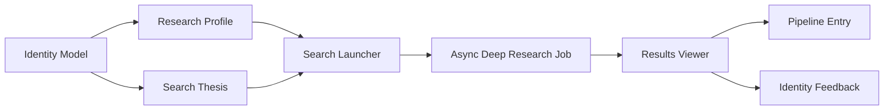

# Research

The Research workspace helps you turn Identity and Pipeline context into focused
company discovery. It builds a search profile, generates a search thesis from
your Identity model, launches async deep research, and lets you promote strong
matches into [Pipeline](pipeline.md).

## What You Will Learn

- Build or refresh a research profile from Identity or resume data.
- Generate and edit a Search Thesis before launching a run.
- Choose thesis lanes, overrides, and result quotas.
- Monitor async deep research jobs.
- Review tiered results with citations, search logs, and resume directives.
- Send individual matches to Pipeline.
- Feed result feedback back into Identity when a match is wrong.

## Prerequisites

- An Identity model for the full thesis-driven flow.
- Resume data as a fallback profile source if Identity is not loaded.
- At least one Build vector if you want Pipeline entries linked to resume
  positioning.
- An active AI proxy connection for thesis generation and deep research.

---

## Workspace Shape

Research currently has two sections:

| Section | Purpose |
| --- | --- |
| **Search Launcher** | Build profile context, generate or edit the Search Thesis, choose lanes and run settings, then launch deep research. |
| **Results Viewer** | Watch async research progress, inspect completed runs, review tiered matches, and add selected matches to Pipeline. |

The readiness card above those sections shows the active profile source,
freshness, lane count, latest run count, and deep research budget status.

```mermaid
flowchart LR
    ID[Identity Model] --> P[Research Profile]
    ID --> T[Search Thesis]
    P --> L[Search Launcher]
    T --> L
    L --> J[Async Deep Research Job]
    J --> R[Results Viewer]
    R --> PL[Pipeline Entry]
    R --> FB[Identity Feedback]
```

---

## Search Profiles

Research uses a profile as the durable search context for skills, constraints,
work summary, filters, and interview preferences.

### Identity-Backed Profile

When Identity is loaded, Research derives the profile from the current Identity
model. The readiness card labels this source as **Identity model**. Use
**Refresh from Identity** after meaningful Identity changes.

The Identity-backed profile is the preferred path because Research can use the
same skill depths, preferences, search vectors, Self Model, and avoid signals
that drive the rest of Facet.

### Resume Fallback Profile

If Identity is not loaded, Research can still infer a profile from the current
resume workspace. This is labeled **Resume fallback**. If the resume changes
after inference, the readiness card marks the profile stale so you know to
refresh before launching a new search.

### No Profile Yet

If no profile exists, the Search Launcher shows an empty state. Use the primary
header action to create one before launching search.

---

## Search Thesis

The Search Thesis is the strategic input for deep research. It is generated from
Identity, then saved as a snapshot so a search run can be retried or refreshed
against the same strategy later.

A thesis includes:

- Assumptions the model made and can be corrected.
- Competitive moat and advantage snapshots from the Self Model.
- Search lanes to pursue.
- Avoid signals that should steer results away from poor fits.
- Skill-depth calibration used by the search.
- Optional timeline guidance.

### Generate or Regenerate

1. Open **Search Launcher**.
2. Click **Generate Thesis**.
3. Review the generated lanes, avoid list, and skill-depth map.
4. Edit fields that need correction.
5. Click **Save thesis edits** before launching search.

If Opus is unavailable, Research may offer a Sonnet fallback for the thesis. The
fallback is marked as draft quality and can be regenerated with Opus later.

### Regeneration Guidance

Open **Regeneration guidance** when the next thesis generation needs extra
direction. Use:

- **Corrections** for things the previous thesis got wrong.
- **Custom search direction** for an angle Identity would not infer on its own.

The custom direction persists across regenerations.

---

## Identity Writeback and Staleness Review

Research can write selected thesis corrections back into Identity.

For skill-depth corrections, click **Apply to Identity** from the skill-depth map
after reviewing the confirmation. Research shows any downstream artifacts that
may be affected before it writes the change.

If Identity changes after generated artifacts exist, Research can open a
**Batch staleness review**. From that panel you can:

- Refresh a thesis, search run, prep deck, or cover letter against the latest
  Identity context.
- Save an "accept current" decision on an artifact.
- Save a "not stale" decision when no refresh is needed.

Refreshing a search run starts a new deep research job and asks for cost
confirmation first.

---

## Launching Search

Search launch requires:

- A profile.
- A saved thesis.
- At least one selected thesis lane.

In **Search Launcher**, choose:

- **Focus lanes** from the active thesis.
- Optional **company size override**.
- Optional **salary anchor override**.
- Optional **custom keywords**.
- Whether to expand geography beyond preferred locations.
- Tier 1, Tier 2, and Tier 3 result quotas.

Closed Pipeline companies are automatically excluded when their status is
rejected, withdrawn, or closed. The **Search Context** card lists those
auto-exclusions and your most recent requests.

Click **Launch Search**. Research creates a run, switches to **Results Viewer**,
and starts an async deep research job.

---

## Async Deep Research

Deep research runs server-side. The Results Viewer shows progress while the job
is active:

- elapsed time
- transport mode
- query count
- finding count
- recent stream events

Active jobs can be canceled from the progress panel. If the browser tab closes
or loses focus, the job keeps running server-side and Research resumes polling
when the app is visible again.

Completed runs keep their preserved thesis snapshot, request settings, search
log, narrative, citations, and tiered results.

---

## Reviewing Results

The Results Viewer groups matches into Tier 1, Tier 2, and Tier 3 sections.
Each result card can include:

- company, title, location, compensation, source, and match score
- match rationale with citations
- vector alignment
- candidate edge
- company intelligence
- interview process notes
- resume directives such as recommended variant, bullet edits, and keywords
- risks

Open **Search log** to inspect the query trail returned by the research job.

If a run failed or looks stale, use **Retry preserved thesis** or **Rerun with
current Identity** when those actions are available.

---

## Adding Matches to Pipeline

Research promotion is per result.

1. In **Results Viewer**, open a result card.
2. Choose the Build vector to attach from the result action row.
3. Click **Add to Pipeline**.

Facet creates a Pipeline entry with the result's company, role, URL, research
summary, tier, and selected vector context. Continue the application workflow in
[Pipeline](pipeline.md).

---

## Result Feedback

Each result asks **How did this match feel?**

- **Good fit** records positive feedback for future thesis regeneration.
- **Wrong fit** records negative feedback.
- For wrong fits, you can also add an avoid rule to Identity.

Feedback written back to Identity is marked **Applied** on the result. Future
thesis regeneration can incorporate unreflected feedback so the same mismatch
does not keep recurring.

---

## Summary

Research is now thesis-driven. Start with Identity-backed profile context,
generate and review a Search Thesis, launch async deep research from selected
lanes, inspect cited tiered results, and add individual matches to Pipeline.

## Next Steps

- [Pipeline](pipeline.md) -- Track promoted opportunities through the application process.
- [Identity](identity.md) -- Maintain the source model that drives search strategy.
- [Vectors](vectors.md) -- Create resume positioning angles to attach to promoted matches.
- [Getting Started](getting-started.md) -- Set up the baseline workspace first.
