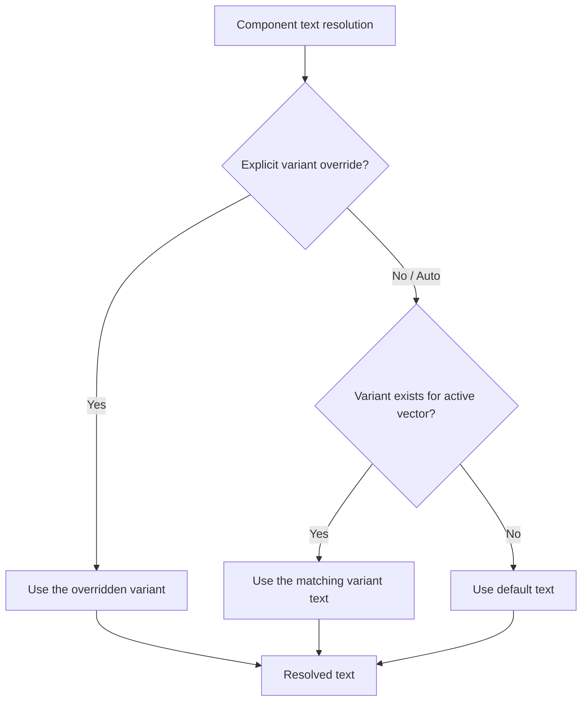

# Text Variants

## What You Will Learn

This guide explains how Facet's text variant system lets you tailor component phrasing for different vectors without duplicating components. You will learn:

- Why text variants exist and when to use them
- How to create variant text for components
- How the variant dropdown works (Auto, Default, and specific vectors)
- How auto-selection resolves which text to display
- How variant overrides integrate with the broader override system
- The complete variant resolution reference

## Prerequisites

- A Facet project with at least two vectors defined
- Familiarity with the component library and how priorities work (see [Priorities and Overrides](./priorities-and-overrides.md))
- Understanding that each vector represents a different positioning angle for your resume

---

## Why Variants

A senior engineer's accomplishments can be framed in different ways depending on the target role. Consider a bullet about building a distributed caching layer:

| Vector                  | Phrasing Emphasis                                          |
|-------------------------|------------------------------------------------------------|
| Backend Engineering     | "Designed and implemented a distributed caching layer that reduced P99 latency by 40%" |
| Engineering Management  | "Led a cross-team initiative to build a caching platform, coordinating 3 teams over 2 quarters" |
| Security Platform       | "Architected a caching layer with end-to-end encryption and key rotation, meeting SOC 2 compliance requirements" |

Without variants, you would need three separate bullet components -- one per vector -- each with its own priority configuration. With variants, a single bullet component carries multiple phrasings. The assembler selects the appropriate text based on the active vector.

This keeps your component library compact and your priority configuration centralized. Change a bullet's priority once, and it applies across all its text variants.

---

## Creating Variant Text

### Adding a Variant to a Component

Any text-bearing component (bullets, target lines, skill group labels) supports variants. To add variant text:

1. Select the component in the library panel.
2. Open the variant editor (accessible from the component's detail view or context menu).
3. Choose the target vector from the dropdown.
4. Enter the variant phrasing for that vector.
5. Save.

The component now carries a `TextVariantMap` -- a mapping from vector IDs to alternative text strings. The original text remains as the **default** and is used whenever no variant matches the active vector.

<!-- Screenshot: Variant editor showing default text and two vector-specific variants -->

### Editing and Removing Variants

To edit an existing variant, open the variant editor and modify the text for the desired vector. To remove a variant, clear the text field for that vector. The component will fall back to default text for that vector.

### Data Structure

Under the hood, variant text is stored as a partial map keyed by vector ID:

```
TextVariantMap = Partial<Record<VectorId, string>>
```

Only vectors with explicitly defined variant text appear in the map. Vectors without entries use the default text.

---

## The Variant Dropdown

When viewing or editing a component, the variant dropdown controls which text version is displayed and which version the assembler will use for the active vector. The dropdown has three categories of options:

### Auto

The default selection. The assembler automatically picks the best variant for the active vector using the resolution logic described below. This is the recommended setting for most workflows.

### Default

Forces the component to use its original default text for the current vector, even if a matching variant exists. Use this when you want to override auto-selection and explicitly use the base phrasing.

### Specific Vector

Selecting a specific vector name forces the component to use the variant text written for that vector. This is an advanced override -- it lets you use one vector's phrasing in a different vector's assembly.

For example, if your "Backend Engineering" variant has particularly strong phrasing, you might force it onto your "Full-Stack" vector as well.

---

## Auto-Selection Logic

When the variant dropdown is set to Auto (the default), the assembler resolves text using the following logic:



### Step-by-Step Resolution

1. **Check for explicit override**: If the user has selected a specific variant (Default or a named vector) in the variant dropdown for this component on the current vector, use that selection.
2. **Check for auto-match**: If the component's `TextVariantMap` contains an entry keyed to the currently active vector ID, use that variant text.
3. **Fall back to default**: Use the component's original default text.

This means that if you create a variant for "Backend Engineering" and then switch to that vector, the variant text appears automatically without any manual selection. Switch to a vector with no variant defined, and the default text appears.

---

## Per-Vector Independence

Variant override selections (the dropdown choice) are stored per vector in the UI store, just like manual include/exclude overrides. This means:

- Setting the variant dropdown to "Default" on your "Backend Engineering" vector does not affect what appears on your "Engineering Management" vector.
- Each vector independently remembers its variant override selections.
- Switching between vectors restores each vector's configured variant choices.

This per-vector independence is a core design principle across all of Facet's override systems. Your configuration for one vector never leaks into another.

---

## Integration with the Override System

Text variants do not exist in isolation. They interact with several other Facet systems.

### Reset to Auto

The **Reset to Auto** action (described in [Priorities and Overrides](./priorities-and-overrides.md)) clears variant overrides along with all other overrides for the current vector. After a reset:

- All variant dropdowns return to Auto
- The assembler resumes auto-selecting variants based on vector matching
- Manual include/exclude toggles also return to Auto
- Priority overrides are also cleared

This is useful when you want to return to a clean state after experimenting with different variant selections.

### Presets

Presets capture the complete override state for a vector, including variant selections. When you save a preset, it records:

- Manual include/exclude overrides
- Priority overrides
- Variant override selections (the dropdown choices)
- Bullet ordering customizations

Loading a preset restores all of these, including which variants are selected for each component. This lets you save and switch between different variant configurations without manually re-selecting each one.

### Priority Interaction

Variants affect **text only**, not inclusion logic. A component's priority and manual override state determine whether it appears on the resume. The variant system then determines which text is displayed for included components. These are independent decisions:

```
Inclusion decision:  manual override > priority override > base priority
Text decision:       variant override > auto-match > default text
```

Changing a variant selection never changes whether a component is included or excluded.

---

## Complete Resolution Reference

The following table provides a complete reference for how the assembler resolves the displayed text for any component:

| Precedence | Condition                                      | Result                          |
|------------|------------------------------------------------|---------------------------------|
| 1 (highest)| Variant dropdown set to a specific vector name | Use that vector's variant text  |
| 2          | Variant dropdown set to "Default"              | Use the component's default text|
| 3          | Variant dropdown set to "Auto" and a variant exists for the active vector | Use the matching variant text |
| 4 (lowest) | Variant dropdown set to "Auto" and no variant exists for the active vector | Use the component's default text |

### Edge Cases

- **Variant selected but text is empty**: If a variant entry exists but contains empty text, the assembler treats it as if no variant exists and falls back to default text.
- **Vector deleted after variant created**: If a vector is removed, variant entries keyed to that vector ID become orphaned. They remain in the data but are never auto-matched. You can clean these up manually in the variant editor.
- **Multiple components sharing text**: Variants are per-component. Two bullets with similar default text maintain independent variant maps. Editing one does not affect the other.

---

## Workflow Recommendations

### Start with Default Text

Write your strongest, most general phrasing as the default text. This ensures every vector has reasonable content even before you add any variants.

### Add Variants Selectively

You do not need a variant for every vector on every component. Focus on high-priority bullets where phrasing differences meaningfully change how the reader perceives your experience. Many components work fine with a single default phrasing across all vectors.

### Use Auto Selection

Keep the variant dropdown on Auto unless you have a specific reason to override it. Auto-selection is predictable (it matches by vector ID) and requires no ongoing maintenance as you add or remove vectors.

### Review with Live Preview

After creating variants, switch between vectors in the live preview to verify that the correct text appears for each one. This is the fastest way to catch missing variants or unexpected fallbacks.

<!-- Screenshot: Live preview showing different text for the same bullet across two vectors -->

---

## Summary

- Text variants let a single component carry multiple phrasings, one per vector.
- The `TextVariantMap` maps vector IDs to alternative text strings; the original text serves as the default.
- The variant dropdown offers Auto (recommended), Default, and specific vector selections.
- Auto-selection picks the variant matching the active vector, falling back to default text.
- Variant overrides are per-vector and independent of each other.
- Reset to Auto clears variant selections along with all other overrides.
- Presets capture and restore variant selections.
- Variants affect text only; inclusion logic is handled independently by priorities and manual overrides.

## Next Steps

- [Priorities and Overrides](./priorities-and-overrides.md) -- Understand the inclusion and priority system that works alongside variants
- [Documentation Navigator](../NAVIGATOR.md) -- Browse all available guides
