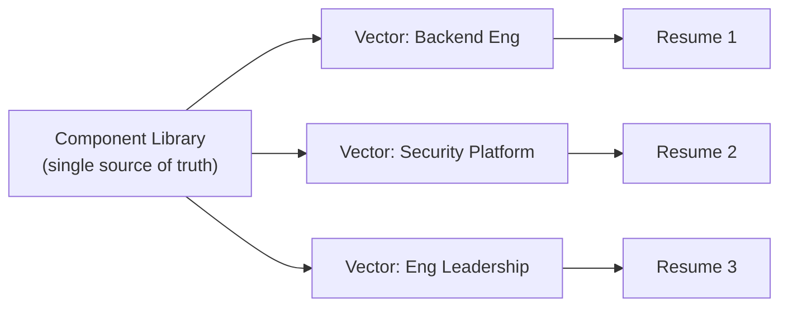
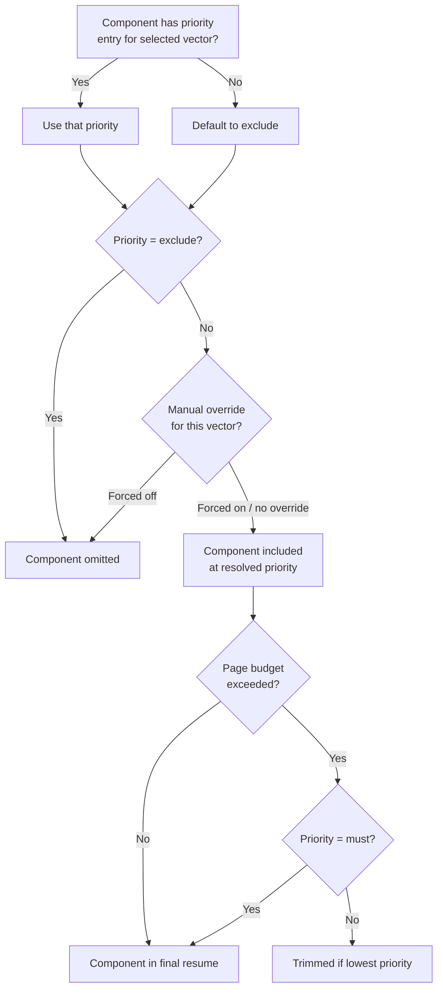

# Vectors

Vectors are the central organizing concept in Facet. A vector represents a positioning
angle for your resume -- a strategic direction such as "Backend Engineering," "Security
Platform," or "Engineering Leadership." By defining multiple vectors, you produce multiple
tailored resumes from a single component library without duplicating any content.

## What You Will Learn

- What vectors are and why they matter.
- How the All view differs from a specific vector view.
- How to create, rename, and delete vectors.
- How to switch between vectors efficiently.
- How vectors drive the assembly pipeline and priority resolution.

## Prerequisites

- Familiarity with the [Facet interface](getting-started.md).
- At least one vector defined (the default data includes several).

---

## Why Vectors Matter

Most senior engineers target roles across several domains. A platform engineer might apply
to backend infrastructure roles, developer experience roles, and security-focused roles
in the same job search. Each of these demands a different emphasis:

- Different target lines and profile summaries.
- Different bullet points highlighted or suppressed.
- Different skill groups foregrounded.
- Different ordering of content.

Without vectors, you would maintain separate resume documents for each angle and manually
synchronize changes across all of them. With Facet, you maintain one component library
and let vectors control which parts surface and at what priority.

Each vector produces a distinct resume from the same underlying data. When you update a
bullet or add a new role, the change is immediately reflected in every vector's assembly.

---

## The All View

The **All** view is a special mode that displays every component regardless of its
per-vector priority. It is not a vector itself; it is a diagnostic view.

Use the All view to:

- See the complete component library at a glance.
- Identify components that have not been assigned to any vector.
- Edit component text without worrying about vector context.
- Review the full scope of your resume content.

When All is selected:

- Priority badges show a neutral state since there is no single vector to resolve against.
- Manual overrides apply to the All view independently; they do not carry over to
  individual vectors.
- The live preview renders all components in their default order.

Switch to the All view by clicking the **All** pill on the vector bar or pressing **0**.

---

## Creating a Vector

1. Click the **+ New Vector** button on the right side of the vector bar.
2. Enter a label in the prompt that appears. Choose a name that describes the positioning
   angle concisely (e.g., "Platform Eng" or "Security").
3. The vector is created with an automatically assigned color from the fallback palette.

Once created, the new vector pill appears in the vector bar. Facet auto-generates missing
vector entries from component references, so if you import data that references a vector
ID not yet defined, Facet creates it automatically.

*Screenshot to be added*

---

## Renaming a Vector

To rename a vector:

1. Right-click or use the context menu on the vector pill.
2. Select **Rename** and enter the new label.
3. The vector ID remains the same internally; only the display label changes.

All component priority mappings continue to work because they reference the vector ID,
not the label.

---

## Deleting a Vector

To delete a vector:

1. Right-click or use the context menu on the vector pill.
2. Select **Delete** and confirm.
3. The vector is removed from the vector bar and from all component priority maps.

Deleting a vector does not delete any components. It only removes the vector's priority
assignments from each component. If a component was set to "must" for the deleted vector,
that priority entry is simply discarded.

---

## Switching Vectors

There are two ways to switch the active vector:

### Click

Click any vector pill in the vector bar. The selected pill is highlighted, and the
Component Library and Live Preview update immediately to reflect the new vector context.

### Keyboard

Press a number key to switch vectors:

| Key | Action |
|-----|--------|
| `0` | Select All view |
| `1` | Select first vector |
| `2` | Select second vector |
| ... | ... |
| `9` | Select ninth vector |

The number corresponds to the vector's position in the bar (left to right). Hover over
a vector pill to see its keyboard shortcut in the tooltip.

---

## How Vectors Control Assembly

When you select a vector, the assembly engine resolves every component's effective
priority for that vector. The resolution follows this logic:

### Priority Levels

Each component carries a `PriorityByVector` map -- a record of vector IDs to priority
values:

| Priority | Meaning | Trimming behavior |
|----------|---------|-------------------|
| `must` | Always included | Never trimmed |
| `strong` | Included by default | Trimmed only after all optional items |
| `optional` | Included if space permits | Trimmed first when over budget |
| `exclude` | Omitted entirely | Not assembled |

If a component has no entry for the selected vector, it defaults to `exclude` and does
not appear in the assembled resume.

### Manual Overrides

After assembly resolves priorities, manual overrides can force a component in or out.
Each vector maintains its own independent set of manual overrides. Toggling a component's
eye icon in the Component Library sets an override for the currently active vector only.

Click **Reset to Auto** in the vector bar to clear all manual overrides for the active
vector and return to priority-driven assembly.

### Page Budget Trimming

The page budget engine estimates resume length using a heuristic (characters per line,
lines per page). When the assembled content exceeds the target page count:

1. Optional-priority bullets are trimmed first, starting from the bottom of the last role.
2. Strong-priority bullets are trimmed next if still over budget.
3. Must-priority content is never trimmed. If must-only content exceeds the budget, a
   warning appears in the status bar.

---

## Per-Vector Text Variants

Components can carry per-vector text variants -- alternate wording tailored to a specific
vector. For example, a bullet about building a CI/CD pipeline might emphasize
"infrastructure automation" for a Platform Eng vector and "developer velocity" for a DX
vector.

When a variant exists for the active vector, it replaces the component's default text in
the assembled output. See [Components](components.md) for details on the variant
dropdown.

---

## Vector Colors

Each vector is assigned a color that appears throughout the interface:

- The vector pill in the bar.
- The priority strip on component cards when that vector is active.
- Vector matrix dots on component cards.

Colors are assigned automatically from a fallback palette when a vector is created. The
color helps you visually distinguish which vector is active at a glance.

---

## Summary

Vectors let you maintain one component library and produce multiple strategically
distinct resumes. Each vector controls which components are included, at what priority,
and with what text variants. The assembly engine resolves priorities per vector, applies
manual overrides, and trims to fit the page budget.

## Next Steps

- [Components](components.md) -- understand all component types and their per-vector
  priority controls.
- [Getting Started](getting-started.md) -- return to the setup and first-use guide.
- [NAVIGATOR](../NAVIGATOR.md) -- return to the documentation index.
